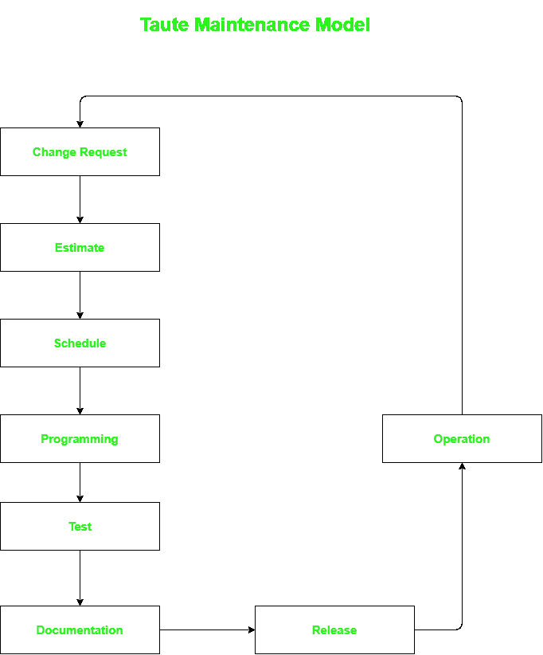

# 陶特软件维护模型

> 原文:[https://www . geesforgeks . org/taut-software-maintenance-model/](https://www.geeksforgeeks.org/taute-software-maintenance-model/)

1983 年，B.J .陶特介绍了他的软件维护模型。它非常容易理解，并且不需要实现。该模型将[软件维护过程](https://www.geeksforgeeks.org/components-of-software-maintenance-process/)刻画为闭环循环。开发人员在执行软件之后使用该模型来更新和执行软件中的修改。

**陶特模型**是典型的维护模型，有八个周期阶段。

相位描述如下:

1.  **Change Request Phase –**
    In this phase, customer makes request in prescribed format to maintenance team to apply change to software.
    This change may belong to any of the following [four category of maintenance activities](https://www.geeksforgeeks.org/software-engineering-software-maintenance/) :
    *   **(i)** 纠正软件维护。
    *   **(ii)** 自适应软件维护。
    *   **(三)**完善软件维护。
    *   **(iv)** 预防性软件维护。

    在检测到软件维护的类别后，维护团队为请求分配唯一的标识号。

2.  **评估阶段–**
    维护团队将此阶段用于评估应用请求的变更所需的时间和精力。此外，为了最大限度地减少系统变更带来的连锁反应，还对现有系统进行了影响分析。
3.  **计划阶段–**
    在此阶段，团队确定下一个计划版本的变更请求，并可能准备计划所需的文档。
4.  **编程阶段–**
    在此阶段，维护团队修改软件源代码，以实现客户要求的变更，并更新所有相关文档，如设计文档、手册等。因此。这个阶段的最终输出是源代码的测试版本。
5.  **测试阶段–**
    在此阶段，维护团队确保软件中请求的修改得到正确实施。然后用已经可用的测试用例测试源代码。新的测试用例也可以被设计来进一步测试软件。这种测试被称为[回归测试](https://www.geeksforgeeks.org/software-engineering-regression-testing/)。
6.  **文档阶段–**
    回归测试后，团队在软件发布前更新系统和用户文档。这有助于维护源代码和文档之间的关系。
7.  **发布阶段–**
    在此阶段，修改后的软件产品连同更新后的文档一起交付给客户。验收测试由系统用户执行。
8.  **运行阶段–**
    验收测试成功完成后，软件进入正常运行。在使用过程中，当发现另一个问题或感觉到新的功能需求或需要增强现有功能时，客户可以再次启动“变更请求”流程。同样，所有阶段都将重复进行，以实现这一新的变化。