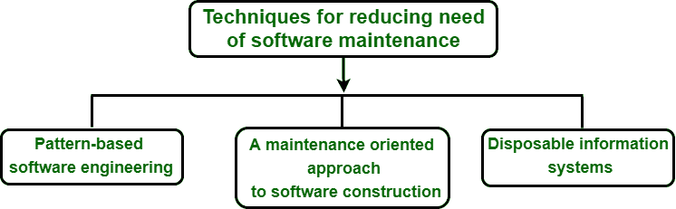

# 减少软件维护需求的技术

> 原文:[https://www . geeksforgeeks . org/减少软件维护需求的技术/](https://www.geeksforgeeks.org/techniques-for-reducing-need-of-software-maintenance/)

[软件维护](https://www.geeksforgeeks.org/software-engineering-software-maintenance/)是软件产品交付后的修改，目的是纠正故障、提高性能或其他属性，或者使产品适应修改后的环境。以下是如下图所示的软件维护需要的三种技术:

**基于模式的软件再造:**
基于模式的软件再造方法主要旨在提高软件遗留系统的可维护性。大多数系统都是用命令式语言和传统的设计方法开发的。命令式编程语言具有以下特征:

*   强调数据类型、值和运算符。
*   强调可执行语句。
*   强调函数和子程序。

我们的想法是使用好的设计架构来设计这些系统，以使它们更容易理解，更容易重用和维护，而不是继续在它们的原始架构中维护这些系统。

重新设计这些系统的一种方法是使用设计模式。设计模式基本上是将成功的和既定的设计实践以及专家的经验结合成一组组件的设计技术，这些组件以更好的结构展示已知的行为。Ab=n 一个例子是面向对象的技术，它被认为可以提高软件开发的成本节约和质量。

**面向维护的软件构建方法:**
在这里，不仅在软件产品已经交付给客户时，而且在产品的实际构建过程中，都要执行维护。事实上，产品需求在开发过程中经常变化，因此需要重构迄今为止已经开发的工件。

因此，通过采用一种在产品生命周期的任何阶段都容易增加、删除或修改需求和工件的方法，实际上是在提高软件的可维护性。

**一次性信息系统:**
这是指使用 COTS 软件。COTS 描述了从其他地方获得的任何软件，通常以可执行格式交付，而不是源代码格式，即公司现在购买使用软件系统的权利，而不是实际构建它。这种技术有几个优点，例如:

1.  **生产力提升–**
    即时生产力提升，因为在测试和调试数千行代码时节省了精力。
2.  **上市时间–**
    由于软件生产速度加快，公司能够率先进入市场并击败竞争对手。
3.  **成本–**
    使用 COTS 软件作为编程手段比从头开始编码要便宜得多。
4.  **哲学–**
    有一种观点认为，软件系统应该像硬件系统一样构建，即从一组可以从编目员那里选择和获取的组件中构建。