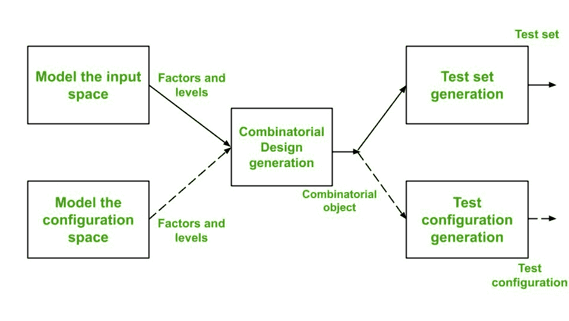
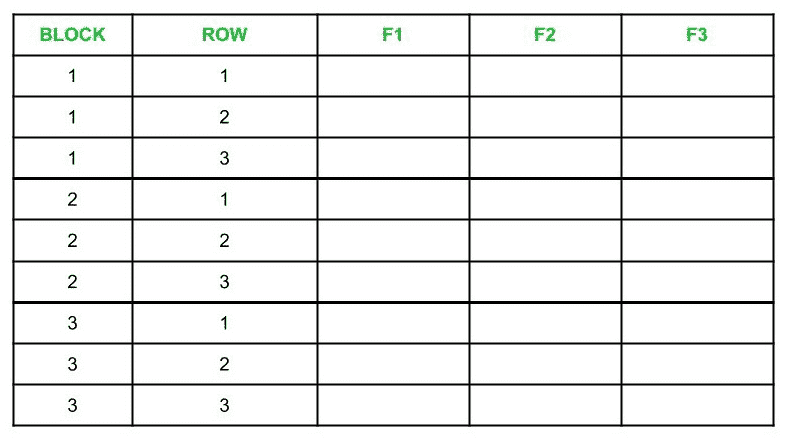
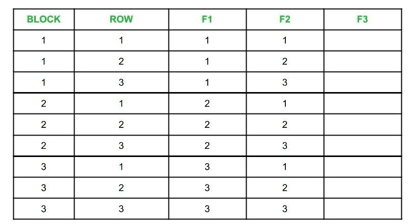
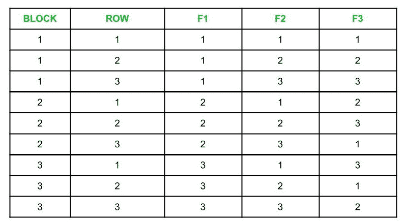

# 组合测试中的测试配置生成

> 原文:[https://www . geeksforgeeks . org/test-configuration-generation-in-United-testing/](https://www.geeksforgeeks.org/test-configuration-generation-in-combinatorial-testing/)

测试配置生成是组合测试设计过程的重要组成部分。组合设计流程如下图所示:



从上图可以看出，组合测试设计过程有 3 个主要步骤:

*   输入空间和配置空间的建模。
*   借助组合设计程序生成组合对象。得到的组合对象是一系列因素和层次。
*   使用组合对象生成测试集或测试配置。

**注:**
输入变量称为**因子**，可分配给因子的值称为**级**。

**测试设计算法:**
为了设计测试配置，我们使用了测试设计算法。该算法将 n 个因子(输入变量)作为输入，并输出一组因子组合，从而覆盖所有级别对。测试设计算法有以下步骤:

1.  **重新标记因子:**
    给定的因子必须首先重新标记为 F1、F2、F3、…..Fn 这样:

    ```
    |F1| >= |F2| >= |F3| >= .........|Fn-1| >= |Fn| 

    Let b = |F1| and k = |F2|

    Here, |Fi| is the number of levels in Factor Fi

    ```

2.  **Prepare a Table :**
    Create a table containing n number of columns labeled as F1, F2, F3, …..Fn, and (b x k) number of rows divided into b number of blocks. Here, each block contains k number of rows. A sample table is shown below for n = b = k = 3 :

    

3.  **Fill the columns F1 and F2 :**
    We fill the column F1 with 1s in Block 1, 2s in Block 2, and similarly for other blocks. For column F2, we fill the block 1 with the sequence 1, 2, 3 …. k in rows 1 through k and repeat this for the rest of the blocks. A sample table is shown below :

    

4.  **Find MOLS of order k and fill the rest of the columns :**
    Before filling the columns, we must first understand MOLS and how to find them.

    MOLS(相互正交的拉丁方)用于从一个完整的集合中选择因子组合的子集。n 阶拉丁方**是一个 n×n 矩阵，其中没有一个元素在行和列中出现超过一次。**

     ****例-1 :**
    如果 S = {X，Y}，那么 2 阶拉丁方将为:

    ```
    X  Y
    Y  X

    and

    Y  X
    X  Y    

    ```

    **示例-2 :**
    如果 S = {1，2，3}，则 3 阶拉丁方将为:

    ```
    1  2  3
    2  3  1
    3  1  2

    and 

    2  3  1
    1  2  3
    3  1  2

    and

    2  1  3
    3  2  1
    1  3  2

    ```

    要构建拉丁方，创建第一行 n 个不同的元素，并通过置换第一行来填充其他行。例如，

    如果 S = {1，2，3，4}，那么拉丁方可以是:

    ```
    1  2  3  4
    2  3  4  1
    3  4  1  2
    4  1  2  3

    ```

    要创建 **MOLS** ，让 M1 和 M2 成为两个拉丁方块，每个都是 n 阶

    让 M1 ( i，j)和 M2 ( i，j)分别表示拉丁方 M1 和 M2 中第 I 行和第 jth 列的元素。现在，我们从 M1 和 M2 创建一个 n×n 矩阵 L，这样 L ( i，j)就是 M1 ( i，j ) M2 ( i，j)，也就是说，我们将 M1 和 M2 的相应元素并置。

    如果 L 中的每个元素恰好出现一次，即它是唯一的，那么 M1 和 M2 被称为 n 阶相互正交的拉丁方

    例如，

    ```
                    1  2  3                2  3  1            
    Consider M1 =   2  3  1    and, M2 =   1  2  3
                    3  1  2                3  1  2

    ```

    所以，L 的构造如下:

    ```
            12  23  31
    L =     21  32  13
            33  11  22

    ```

    因为 L 中的元素是唯一的，所以，M1 和 M2 是 3 阶的 MOLS。

    **注:**
    当 n 为素数或素数的幂时，则 MOLS(n)包含 n -1 个 MOLS。
    同样，对于 n = 2 和 n = 6，MOLS 不存在，但是，对于大于 2 的所有其他值，它们存在。

    现在，为了填充剩余的列，我们可以找到 k 阶的 MOLS。将这些 MOLS 编号为 M1、M2 等等。
    这里，s < k 代表 k > 1，其中 s =阶的 MOLS 数，用 M1 第 1 列的元素填充 F3 列的第 1 块，用 M1 第 2 列的元素填充第 2 块，以此类推。

    如果 b > k，则重用 M1 列来填充剩余(b-k)块中的行。使用 MOLS·M2 至 Ms，对 F4 至 Fn 列重复此过程。如果 s < n–2，则我们可以通过随机选择因子值来填充剩余列。

    例如，

    ```
    If n = k = 3

    ```

    那么三阶 MOLS 是:

    ```
             1  2  3                 1  2  3
    M1 =     2  3  1    and, M2 =    3  1  2
             3  1  2                 2  3  1

    ```

    我们可以使用这些 MOLS 填充表格的剩余列。为了更好地理解，请参考下表。

    ** 
5.  ****Check if constraints are satisfied :**
    If there are no constraints given, then Step 5 and 6 should be skipped. Otherwise, entries in rows should be marked with a box if they do not satisfy constraints given. Constraints could be given like :

    *   Safari 浏览器只支持 Mac OS。
    *   火狐浏览器在 Windows、Linux 上工作。
    *   Windows 操作系统只支持局域网和 PPP 协议。** 
6.  ****删除不满足给定约束的配置:**
    必须删除表中用方框突出显示的配置。这是通过以下两步过程来完成的，即删除它们并保持成对覆盖:**
 **1.  修改高亮显示的行，以保持约束。
2.  添加新的配置，覆盖在替换突出显示的行时未覆盖的对。

*   **Replace numbers in columns with given factor values :**
    In this step, we finally obtain test configurations by replacing values in columns of table with the actual values for factors. For example,

    如果 F1 是一个叫做操作系统的因素，F1 的级别包括{MacOs、Windows、Linux}

    那么如果列 F1 具有如下值:

    ```
    2
    3
    1 
    ```

    然后，它们应该被替换如下:

    ```
    Windows
    Linux
    MacOS

    ```

    其中 Windows、Linux 和 MacOS 分别代表 2、3 和 1。** 

**对所有列执行此步骤后，获得的表将包含最终测试配置。**