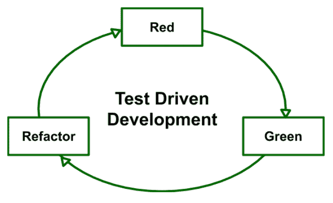

# 测试驱动开发(TDD)

> 原文:[https://www.geeksforgeeks.org/test-driven-development-tdd/](https://www.geeksforgeeks.org/test-driven-development-tdd/)

**测试驱动开发**是在验证测试用例的代码之前编写测试用例的过程。这取决于非常短的开发周期的重复。测试驱动开发是一种技术，在这种技术中，自动化单元测试被用来驱动设计和依赖关系的自由解耦。

通常遵循以下步骤顺序:

1.  添加一个测试——写一个完整描述功能的测试用例。为了制作测试用例，开发人员必须理解使用用户故事和用例的特性和需求。
2.  运行所有的测试用例，确保新的测试用例失败。
3.  编写通过测试用例的代码
4.  运行测试用例
5.  重构代码——这样做是为了消除代码的重复。
6.  反复重复上述步骤

**TDD 座右铭:**

1.  **红色–**创建一个测试用例并使其失败
2.  **绿色–**无论如何让测试用例通过。
3.  **重构–**更改代码以消除重复/冗余。

**优势:**

*   单元测试提供关于功能的持续反馈。
*   设计质量提高，这进一步有助于适当的维护。
*   测试驱动的开发充当了一个对抗 bug 的安全网。
*   TDD 确保您的应用程序实际上满足为其定义的需求。
*   TDD 的开发周期非常短。