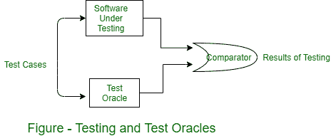

# 测试神谕

> 原文:[https://www.geeksforgeeks.org/test-oracles/](https://www.geeksforgeeks.org/test-oracles/)

**Test Oracle** 是一种不同于程序本身的机制，可以用来测试程序输出的测试用例的准确性。从概念上讲，我们可以考虑测试一个过程，在这个过程中，为测试和被测试的程序给出测试用例。然后将两者的输出进行比较，以确定程序对于测试用例的行为是否正确。如图所示。

**测试神谕**需要测试。理想情况下，我们需要一个自动化的甲骨文，它总是给出正确的答案。然而，神谕往往是人类，他们大多用手计算程序的输出应该是什么。由于通常很难确定行为是否符合预期行为，我们的“人类神灵”可能会犯错误。因此，当程序和结果之间存在不一致时，我们必须在声明结果中存在缺陷之前验证神谕产生的结果。

人类先知通常使用程序的规范来决定程序的正确行为应该是什么。为了帮助 oracle 确定正确的行为，明确指定系统或组件的行为以及规范本身没有错误是非常重要的。换句话说，实际指定真实和正确的行为。

在一些系统中，预言是根据程序或模块的规格自动生成的。有了这样的神谕，我们确信神谕的输出符合规范。然而，即使这种方法也不能解决我们所有的问题，因为规范中可能存在错误。因此，如果规范是正确的，那么由规范生成的神谕将会纠正结果，并且在出现错误的情况下，该规范将是不可靠的。此外，根据规范生成预言的系统需要正式的规范，而这些规范通常不会在设计过程中生成。