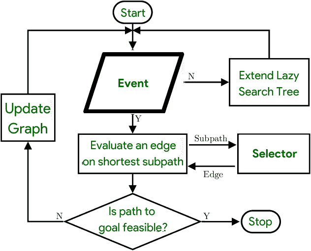

# 懒惰代码运动问题

> 原文:[https://www.geeksforgeeks.org/the-lazy-code-motion-problem/](https://www.geeksforgeeks.org/the-lazy-code-motion-problem/)

**懒惰代码移动问题:**
为了避免冗余计算、减少代码大小或节省资源，代码移动性优化在控制流图中移动计算。例如，循环不变代码运动识别在一次又一次迭代中具有相同值的循环中计算的表达式，并将它们从循环中取出，以便它们只被计算一次。不是在表达式 f(e)和 g(e) 中计算两次**子表达式“e”，而是计算一次并将其存储在临时寄存器中。**

```
main {
  one: int = const 1;
  do_nothing
compute:
  y: int = add x one;
  gfgdone;
do_nothing:
  gfgdone;
done:
  z: int = add x one;
  ret;
}
```

程序中的所有路径现在只包括**一个 x+1 计算**。这是最佳代码，至少在这个维度上，并且是部分冗余移除或惰性代码运动的合理结果。那么，是什么将懒惰代码运动与急切的替代方案区分开来呢？

**记下压力:**
在寄存器数量有限且固定的架构中，编译器在将 IR 代码简化为汇编时，必须为数量有限但不限的变量分配存储空间。如果变量比寄存器多，一些变量会出现在堆栈上。内存比寄存器慢，因此“溢出”到堆栈是昂贵的。
编译器的目标应该是减少在早期过程中寄存器分配期间引入的溢出量。引入到程序中的溢出的确切数量是由使用的寄存器分配技术决定的，这使得针对这一统计数据的优化成为徒劳。

急切的代码运动使变量定义(计算)远离了它们的用途，延长了它们的生命周期。由于伴随的寄存器压力，代码运动带来的任何性能优势都很容易被抵消。懒惰的代码运动，而不是尽可能早地进行计算，将它们向下转移到稍后的程序点，避免不必要的处理。事实上，一项研究表明，惰性代码运动会“尽可能晚地”进行计算，尽管这个短语脱离上下文会产生误导。在选择最近的可能性之前，系统进行静态分析，以发现潜在的安全移动。



懒惰的代码问题

**限制:**
根据优化，词汇上相等的表达式应该总是放在**相同的伪寄存器**中。以后的研究可能会改变数据流分析，以削弱这一假设。这会导致多余的移动指令从临时寄存器中获取计算值，从而增加寄存器压力。一个更智能的重写通行证可能能够减少这些费用。

计算布局算法在优化范围的另一端是低效的。惰性代码运动将计算移动到 CFG 的边缘，需要将新的基本块缝合到边缘。虽然它们在大多数情况下是必需的，但是插入的基本块可以在许多边上安全地与其前身或后继块合并。因为跳跃的数量会减少，这可能会提高性能。类似地，CFGs 的漂亮打印机也没有忽略掉会发生故障的地方——这看起来可能是一件小事，但它可能会影响性能或代码大小。这两个问题都可以通过在惰性代码移动后运行简化过程来解决。

**结论:**
优化后计算量永远不会上升，因为懒惰的代码运动是为了避免冗余的表达式计算。谨慎的临时分配技术和基本块插入的成本似乎通过增加移动和跳跃对计算总数有不利影响。由于计算是从循环中提升出来的，循环基准(基本的，通过循环提升)显示出相当大的加速。