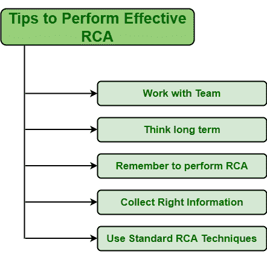

# 执行有效 RCA 的提示

> 原文:[https://www . geesforgeks . org/tips-to-performance-RCA/](https://www.geeksforgeeks.org/tips-to-perform-effective-rca/)

**先决条件–**[根本原因分析(RCA)](https://www.geeksforgeeks.org/basic-principle-of-root-cause-analysis/)

不同的组织希望实施有效的 RCA 计划。但是开发有效的 RCA 并不容易。当 RCA 被有效且高效地执行时，它只是通过减少未来可能出现的问题来提高软件质量。它提高了安全性，降低了总风险成本。为了执行有效和高效的 RCA，下面给出了一些提示–

*   **与团队合作:**
    是的，一个人想要独自处理所有的情况，想要变得负责任。但是，在某些情况下，其他人需要过于简单地处理情况。无论是合作伙伴还是整个团队，与团队合作都不会造成任何伤害。这将导致更快地解决问题。更多的将是人数；解决问题所需的时间会更少，因为会有更多的人来指导团队的工作。但是团队领导必须管理整个团队成员，以实现有效的 RCA。
*   **想得长远:**
    我们知道，在组织中，成员总是有尽快执行任务的压力，因此他们有时会找出短期的解决方案。出现的任何问题都应该永久解决。如果长期的解决方案没有得到实施和较少的关注，那么它将导致问题在一段时间后不断重复出现。这将降低软件质量，并对组织绩效产生负面影响。因此，应该选择一种最有效的 RCA 方法，这种方法对特定的业务需求和环境更有效。

*   **记得执行 RCA :**
    在组织中，RCA 通常被实施并用于识别出现问题的根本原因。RCA 仅用于识别问题。但是 RCA 也可以用于其他识别。导致一个组织成功的原因有几个。RCA 被认为是确定成功根本原因的最佳方法和有效途径。这是非常重要的，因为一个人可以在其他领域使用同样的事业，也可以在其他领域获得成功。*   **收集正确信息:**
    收集正确、正确的信息或数据，会有好的分析。进行正确和直接的观察是收集问题信息的最简单和好的方法。有时，我们根据收集的信息执行任务。收集的数据或信息可以引导我们朝着正确的方向前进。因此，收集关于该问题的准确、正确和一致的信息是更好和必要的。*   **使用有效的 RCA 技巧:**
    要获得有效的 RCA 表现，需要选择有效的 RCA 技巧。现在有几种 RCA 技术可用。每种技术都有几个优点和缺点。因此，选择正确的 RCA 技术对于更好的结果是重要和必要的。