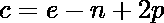

# 软件工程面试 50 大问答

> 原文:[https://www . geesforgeks . org/top-50-软件-工程-面试-问答/](https://www.geeksforgeeks.org/top-50-software-engineering-interview-questions-and-answers/)

**软件工程**对于每一个渴望**成为软件工程师**、**软件开发人员**等成功职业的人来说，确实是必去的领域。在 IT 行业。简单地说，它是关于软件系统的设计、开发、操作和维护的系统而全面的研究。在几乎每一家知名科技公司的技术面试中，招聘人员都会从软件开发模型&架构、软件项目管理(SPM)、测试和调试等软件工程概念中提出各种问题。评估候选人。因此，你必须准备好所有这样的**软件工程面试问题**来赢得面试。


我们知道软件工程本身是一个广阔的领域，要找出并准备好面试的所有重要概念或问题并不是一件容易的工作。因此，为了让您更轻松、更方便，在这里，我们为您提供了招聘人员经常询问的大量**常见软件工程面试问题**。请务必从下面查看所有这些问题:

**1。什么是软件再工程？**

软件再工程是以一种新的方式扫描、修改和重新配置系统的过程。应用于软件开发过程的再造原理称为软件再造。它对软件成本、质量、客户服务和运输速度都有积极的影响。软件再工程改进软件，以更有效地创建软件。

更多详情请参考[什么是软件再工程？。](https://www.geeksforgeeks.org/software-re-engineering/)

**2。软件有什么特点？**

软件有各种特征:

*   **软件开发或工程化；不是经典意义上的制造:**
    *   虽然软件开发和硬件制造之间存在一些相似之处，但很少有活动是根本不同的。
    *   在这两种活动中，高质量是通过良好的设计实现的，但是硬件的制造阶段会比软件引入质量问题。

*   **软件不会“磨损”:**
    *   硬件组件受到许多其他环境因素越来越大的影响。简单地说，硬件开始磨损。
    *   软件不容易受到导致硬件磨损的环境疾病的影响。
    *   当一个硬件组件磨损时，它会被一个备件替换。
    *   没有软件备件。
    *   每一个软件故障都表明设计中的一个错误，或者是设计被翻译成机器可执行代码的过程中的一个错误。因此，适应变更请求的软件维护任务比硬件维护复杂得多。然而，言外之意很明显——软件不会磨损。但它确实恶化了。

*   **软件继续定制:**
    *   一个软件部分应该以在各种项目中重用为目标来计划和执行。
    *   当前的可重用片段封装了这两个信息以及应用于信息的准备工作，使程序员能够从可重用的部分中创建新的应用程序。
    *   在硬件领域，组件重用是工程过程中自然的一部分

更多详情请参考以下文章[软件工程特性](https://www.geeksforgeeks.org/software-engineering-software-characteristics/)。

**3。什么活动**T2 来 T4 来 T6】下 T8】伞 T10】活动？

软件工程过程框架的活动由各种更高级别的活动来补充。伞式活动通常适用于整个软件项目，并帮助软件团队管理和控制进度、质量、变更和风险。常见的顶级活动包括软件项目跟踪和控制风险管理、软件质量保证技术审查测量软件配置管理可重用性管理工作产品准备和生产等。

**4。什么是内聚和耦合？**

内聚性表示模块的相对功能容量。聚合模块需要与程序其他部分的其他部分进行较少的交互来执行单个任务。可以说只需要运行一个混凝模块(理想情况下)。内聚性是对模块功能强度的度量。高内聚、低耦合的模块在功能上独立于其他模块。这里，功能独立意味着内聚模块执行单一操作或功能。耦合意味着模块之间的整体关联。

耦合依赖于通过接口传递的信息以及模块之间接口的复杂性，在该接口中创建了对部分或模块的引用。高耦合支持低耦合模块假设实际上没有其他模块。当两个模块交换大量信息时，这一点非常重要。两个模块之间的耦合程度取决于接口的复杂性。

更多细节请参考以下文章[耦合与衔接。](https://www.geeksforgeeks.org/software-engineering-coupling-and-cohesion/)

**5。SDLC 的各个阶段是什么？**

**SDLC 相位:**

*   需求收集和分析
*   设计
*   实现和编码
*   测试
*   部署
*   维护

更多详情请参考以下文章[软件开发生命周期。](https://www.geeksforgeeks.org/software-development-life-cycle-sdlc/)

**6。** **是什么** **各种 CASE 工具的名字？**

*   需求分析工具
*   结构分析工具
*   软件设计工具
*   代码生成工具
*   测试用例生成工具
*   文件制作工具
*   逆向工程工具

更多详情请参考以下文章[计算机辅助软件工程(CASE)。](https://www.geeksforgeeks.org/computer-aided-software-engineering-case/)

**7。什么是黑盒测试？**

黑盒测试(也称为传导测试封闭盒测试不透明盒测试)围绕软件有用的先决条件。换句话说，可以猜测一组信息条件，通过尝试发现并完美地满足所有需求来帮助程序。没有选择黑盒测试白盒的程序。也许这是一种互补的方法论，也许白盒方法会揭示其他类的错误。

更多详情请参考[以下文章软件工程-黑盒测试。](https://www.geeksforgeeks.org/software-engineering-black-box-testing/)

**8。什么是白盒测试？**

白盒测试是一种分析软件内部结构、使用的数据结构、内部设计、代码结构和行为以及黑盒测试等功能的方法。也称为玻璃箱试验或透明箱试验或结构试验。

更多详情请参考以下文章[软件工程-白盒测试。](https://www.geeksforgeeks.org/software-engineering-white-box-testing/)

**9。什么是可行性研究？**

软件工程中的可行性研究是一项评估提议的项目和系统的充分性的研究。可行性研究是从有效性分析或实践的角度来衡量软件产品的产品开发如何使组织受益。可行性研究是为了多种目的进行的，目的是从开发、移植、组织项目的贡献等方面分析软件产品的正确性。

更多详情请参考以下文章【软件项目开发中的可行性研究类型】。

**10。质量保证和质量控制有什么区别？**

<figure class="table">

| 

质量保证

 | 

质量控制

 |
| --- | --- |
| 它的重点是保证达到要求的质量。 | 它侧重于满足质量要求。 |
| 这是管理质量的技巧。 | 这是检验质量的技术。 |
| 它不包括程序的执行。 | 它总是包括程序的执行。 |
| 它是一种管理工具。 | 这是一个纠正工具。 |
| 它是面向过程的。 | 它是面向产品的。 |
| 质量保证的目的是防止缺陷。 | 质量控制的目的是识别和改进缺陷。 |
| 这是一种预防技术。 | 这是一种矫正技术。 |
| 这是一项积极的措施。 | 这是一种被动措施。 |
| 它负责整个软件开发生命周期。 | 它负责软件测试生命周期。 |
| 示例:验证 | 示例:验证 |

**11 时。验证和确认有什么区别？**

<figure class="table">

| 

确认

 | 

确认

 |
| --- | --- |
| 验证是验证文档、设计、代码、黑盒和程序的静态实践。 | 验证是验证和测试实际产品的动态机制。 |
| 它不涉及执行代码。 | 它总是涉及执行代码。 |
| 它是对文档和文件的人工检查。 | 它是基于计算机的程序执行。 |
| 验证使用检查、审核、巡查和桌面检查等方法。 | 验证使用黑盒(功能)测试、灰盒测试和白盒(结构)测试等方法。 |
| 验证是检查软件是否符合规范。 | 验证是检查软件是否满足客户的期望和要求。 |
| 它可以捕获验证无法捕获的错误。 | 它可以捕获验证无法捕获的错误。 |
| 目标是需求规范、应用和软件架构、高层次、完整的设计以及数据库设计等。 | 目标是一个实际产品——一个单元、一个模块、一组集成模块和一个有效的最终产品。 |
| 由质量保证团队进行验证，以确保软件符合安全报告文件中的规范。 | 在测试团队的参与下进行验证 |
| 它通常在验证之前先完成。 | 一般都是核实后再跟进。 |
| 是低级的锻炼。 | 这是一个高水平的练习。 |

更多详情请参考以下文章[软件工程-验证和确认。](https://www.geeksforgeeks.org/software-engineering-verification-and-validation/)

**12 时。** **什么是逆向工程？**

**软件逆向工程**是从对产品代码的分析中恢复产品的设计、需求规格和功能的过程。它建立一个程序数据库，并由此产生信息。逆向工程的目的是通过提高系统的可理解性和为遗留系统生成必要的文档来促进维护工作。

**逆向工程目标:**

*   应对复杂性。
*   恢复丢失的信息。
*   检测副作用。
*   综合更高的抽象。
*   促进重用。

更多详情请参考以下文章[软件工程-逆向工程。](https://www.geeksforgeeks.org/software-engineering-reverse-engineering/)

**13。什么是 SRS？**

**软件需求规范(SRS)格式**是软件系统成功开发需要满足的软件需求的完整规范和描述。根据需求的类型，这些需求可以是功能性的，也可以是非需求性的。不同客户和承包商之间的互动是因为有必要充分了解客户的需求。更多细节请参考[软件需求规格格式文章。](https://www.geeksforgeeks.org/software-requirement-specification-srs-format/)

**14。区分阿尔法测试和贝塔测试。**

<figure class="table">

| 

阿尔法测试

 | 

Beta 测试

 |
| --- | --- |
| 阿尔法测试包括白盒测试和黑盒测试。 | Beta 测试通常使用黑盒测试。 |
| 阿尔法测试是由测试人员执行的，他们通常是组织内部的黑箱员工。 | Beta 测试由不属于组织的客户执行。 |
| 阿尔法测试在开发人员的现场进行。 | 测试是在产品的最终用户处进行的。 |
| 可靠性和安全性测试不在 alpha 测试中检查。 | 可靠性、安全性和健壮性在测试期间被检查。 |
| Alpha 测试确保了产品的质量，然后再将其转发给 beta 测试。 | Beta 测试也关注产品的质量，但收集用户对产品的长时间输入，并确保产品为实时用户做好准备。 |
| 阿尔法测试需要测试环境或实验室。 | Beta 测试不需要测试环境或实验室。 |
| Alpha 测试可能需要一个实时的长执行周期。 | Beta 测试只需要几周的执行时间。 |
| 开发人员可以立即解决 alpha 测试中的关键问题或修复。 | 从测试中收集的大多数问题或反馈将在产品的未来版本中实施 |

更多详情请参考以下文章[阿尔法测试](https://www.geeksforgeeks.org/alpha-testing-software-testing/)[贝塔测试](https://www.geeksforgeeks.org/beta-testing-software-testing/)。

**15。系统模型构建需要考虑哪些因素？**

The type and size of the software, the experience of use for reference to predecessors, difficulty level to obtain users’ needs, development techniques and tools, the situation of the development team, development risks, the software development methods should be kept in mind. It is an important prerequisite to ensure the success of software development that designing a reasonable and suitable software development plan.

**16。** **什么是 CASE 工具？**

CASE 代表计算机辅助软件工程。CASE 工具是一组自动化软件应用程序，用于支持、加速和平滑 SDLC 活动。

**17。******RAD 模型的局限性是什么？****

*   **对于大型但可扩展的项目，RAD 需要足够的人力资源。**
*   **如果开发人员和客户没有在很短的时间内投入，项目就会失败。**
*   **如果一个系统不能被模块化，就会出现问题**

**更多详情请参考以下文章[软件工程-快速应用开发模型(RAD)](https://www.geeksforgeeks.org/software-engineering-rapid-application-development-model-rad/) 。**

****18。螺旋模型的缺点是什么？****

*   **使用起来可能是一个昂贵的模型。**
*   **风险分析需要高度具体的专业知识。**
*   **项目的成功高度依赖于风险分析阶段。**
*   **不适用于较小的项目**

**更多详情请参考以下文章[软件工程-螺旋模型](https://www.geeksforgeeks.org/software-engineering-spiral-model/)。**

****19。什么是 COCOMO 模式？****

**COCOMO 模型代表建设性成本模型。与所有评估模型一样，它需要规模信息，并以三种形式接受:**

*   **目标点**
*   **功能点**
*   **源代码行**

**更多详情请参考以下文章[软件工程 COCOMO 模型](https://www.geeksforgeeks.org/software-engineering-cocomo-model/)。**

****20。在******基本 COCOMO 模型中定义有机软件的软件开发工作评估？******

****在基本 COCOMO 模型中，有机软件的软件开发工作的评估定义为****

```
**Organic: Effort = 2.4(KLOC) 1.05 PM**
```

******21。******敏捷软件开发模式是什么？********

****敏捷软件开发生命周期模型是迭代和增量过程模型的结合，通过快速交付工作软件产品来关注过程适应性和客户满意度。敏捷方法将产品分解成小的增量构建。每一次迭代都包括跨职能团队同时在不同的领域工作，如规划、需求分析、设计、编码、单元测试和验收测试。****

******优势:******

*   ****通过快速、持续交付有用的软件来满足客户的需求。****
*   ****客户、开发人员和测试人员不断地相互交流。****
*   ****业务人员和开发人员之间密切的日常合作。****
*   ****持续关注卓越的技术和良好的设计。****
*   ****定期适应不断变化的环境。****
*   ****即使是后期的需求变更也是受欢迎的。****

****更多详情请参考以下文章[软件工程-敏捷开发模型](https://www.geeksforgeeks.org/software-engineering-agile-development-models/)。****

******22。** **如果******用户参与了 SDLC 的所有阶段，可以选择哪个型号？********

****如果用户参与了 SDLC 的所有阶段，则可以选择 RAD 模型。****

******23。软件项目评估技术有哪些？******

****有一些可用的软件项目评估技术:****

*   ****活泼性感的****
*   ****工作细目结构（work breakdown structure 的缩写）****
*   ****德尔菲法****
*   ****用户案例点****

******24。什么是 0 级 DFD？******

****最高的抽象层次被称为 DFD 的 0 级。它也被称为上下文级 DFD。它将整个信息系统描绘成一张图表。****

****更多详情请参考以下文章 [DFD](https://www.geeksforgeeks.org/what-is-dfddata-flow-diagram/) 。****

******25。什么是物理 DFD？******

****物理 DFD 关注系统是如何实现的。创建逻辑 DFD 后要绘制的下一个图表是物理 DFD。它解释了实现系统业务活动的最佳方法。此外，它涉及业务流程所需的设备和文件的物理实现。换句话说，物理 DFD 包含植入相关的细节，如硬件、人员和运行业务流程所需的其他外部组件。****

******26。DFD 的黑洞概念是什么？******

****数据流图中的块孔概念可以定义为“一个处理步骤可能有输入流，但没有输出流”。在黑洞中，数据只能存储入站流。****

******27。提到计算程序圈复杂度的公式？******

****计算程序圈复杂度的公式是:****

********

```
**e = number of edges
n = number of vertices
p = predicates**
```

****更多详情请参考以下文章[圈复杂度](https://www.geeksforgeeks.org/cyclomatic-complexity/)。****

******28。什么是软件再工程？******

****这是一个软件开发过程，目的是提高软件系统的可维护性。****

******29。如何找到一个软件产品的大小？******

****软件规模的估计是软件项目管理的一个重要部分。它帮助项目经理进一步预测构建项目所需的努力和时间。在项目规模估算中使用了各种衡量标准。其中一些是:****

*   ****代码行****
*   ****er 图中的实体数量****
*   ****详细数据流图中的进程总数****
*   ****功能点****

******30。提到一些软件分析&设计工具？******

*   ****数据流图****
*   ****结构化图表****
*   ****结构化英语****
*   ****数据字典****
*   ****分层输入过程输出图****
*   ****实体关系图和决策表****

******31。Bug 和 Error 有什么区别？******

****错误:在产品交付给客户之前，在开发环境中发现的错误。
误差:实际值与预期/理论值的偏差。**** 

******32。******风险和不确定性的区别是什么？********

*   ****风险是可以衡量的，而不确定性是无法衡量的。****
*   ****风险可以计算，而不确定性永远无法计算。****
*   ****为了避免风险，你有能力提前制定计划。由于不确定性，不可能事先制定计划。****
*   ****某些种类的经验观察可以帮助理解风险，但另一方面，不确定性永远不能基于经验观察。****
*   ****经过努力，风险是能够转化为确定性的。相反，你不能把不确定性转化为确定性。****
*   ****在对风险因素进行估计后，可以做出决定，但由于无法计算不确定性，因此无法做出决定。****

******33。什么是** **一** **用例图？******

****用例图是一个行为图，可视化了参与者和开发中的系统之间的可观察的交互。该图由系统、相关用例和参与者组成，并将它们相互关联:****

*   ******系统**:正在描述什么？****
*   ******演员**:谁在用系统？****
*   ******用例**:演员在做什么？****

******34。** **到** **用哪个型号检查软件可靠性？******

****瑞利模型用于检查软件可靠性。瑞利模型是一种参数模型，因为它基于特定的统计分布。当基于来自软件项目的数据估计统计分布的参数时，可以基于该模型进行关于项目缺陷率的预测。****

******35。什么是坐标测量机？******

****为了确定一个组织的过程成熟度的当前状态，SEI 使用一个评估，该评估产生一个五点分级方案。分级方案确定是否符合能力成熟度模型(CMM)，该模型定义了不同流程成熟度级别所需的关键活动。SEI 方法提供了对公司软件工程实践的全球有效性的度量，并建立了以下列方式定义的五个过程成熟度级别:****

*   ****第 1 级:初始****
*   ****第 2 级:可重复****
*   ****级别 3:已定义****
*   ****第 4 级:托管****
*   ****第五级:优化****

******36。定义适应性维护？******

****自适应维护定义为当客户需要产品在新平台、新操作系统上运行时，或者当他们需要产品与新硬件和软件接口时的修改和更新。****

******37。在模块化软件设计的背景下，** **哪个组合** **被认为是** **的衔接和耦合？******

****在模块化软件设计的背景下，考虑了高内聚和低耦合。****

******38。什么是回归测试？******

****回归测试被定义为一种软件测试，用于确认最近对程序或代码的更改没有对现有功能产生不利影响。回归测试只是已经运行的全部或部分测试用例的选择。这些测试用例被重新运行以确保现有的功能正常工作。执行此测试是为了确保新的代码更改不会对现有函数产生副作用。确保最后一次代码更改完成后，上述代码仍然有效。****

******39。黑盒测试总是关注软件的哪个需求？******

****黑盒测试总是关注软件的功能需求。****

******40。哪种测试用于故障模拟？******

****随着对软件组件质量和组件复杂性期望的增加，软件开发人员被期望执行有效的测试。在今天的场景中，变异测试已经被用作一种故障注入技术来衡量测试的充分性。突变测试采用“故障模拟模式”。****

******41。什么是功能点？******

****功能点度量提供了一种标准化的方法来度量软件应用程序的各种功能。功能点度量，从用户的角度来衡量功能，也就是说，基于用户请求和接收的回报。****

******42。什么是基线？******

****基线是定义阶段完整性的度量。完成与特定阶段相关的所有活动后，该阶段就完成了，并作为下一阶段的基线。****

******43。模块******有 17 条边 13 个节点的圈复杂度是多少？********

****有十七条边和十三个节点的模的圈复杂度= E–N+2****

```
**E = Number of edges, N = Number of nodes
Cyclometic complexity = 17 – 13 + 2 = 6**
```

******44。传统意义上的软件不会磨损，但是******软件确实会随着进化而退化，为什么？********

****传统意义上的软件不会磨损，但是随着软件的发展，它确实会恶化，因为多个变更请求会在组件交互中引入错误。****

******45。一个衔接是哪个概念的延伸？******

****内聚性是指模块内部元素的内聚程度。是信息隐藏概念的延伸。****

******46。******软件项目计划的三个基本组成部分是什么？********

*   ****团队结构，****
*   ****质量保证计划****
*   ****成本估算。****

******47。软件对安全响应系统的测试被称为软件测试。？******

****软件对安全响应系统的测试被称为验收测试。****

******48。如何衡量******软件的复杂性？********

****为了衡量软件的复杂性，软件工程中有一些方法:****

*   ****代码行****
*   ****圈复杂度****
*   ****类别耦合****
*   ****继承深度****

******49。定义******术语 WBS？********

****工作分解结构是工作分解结构的完整形式。它的**工作分解结构**包括将一个庞大而复杂的项目分成更简单、可管理和独立的任务。为了构建一个工作分解结构，每个节点被递归地分解成更小的子活动，直到在叶子级别，活动变得不可分割和独立。工作分解结构采用自上而下的方法。更多详情请参考[工作分解结构](https://www.geeksforgeeks.org/software-engineering-work-breakdown-structure/)一文。****

******50。回归测试主要与哪个测试相关？******

****回归测试主要与维护测试相关。****

</figure>

</figure>

</figure>