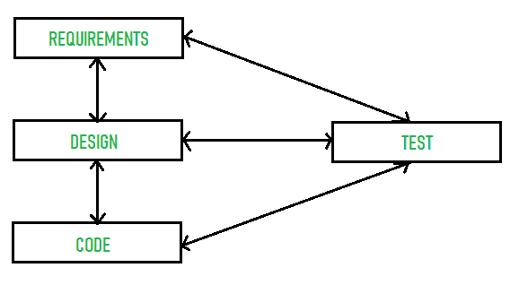

# 溯源性及其类型

> 原文:[https://www.geeksforgeeks.org/traceability-and-its-types/](https://www.geeksforgeeks.org/traceability-and-its-types/)

**追溯**由两个词组成，即痕迹和能力。追踪是指找到某人或某物，能力是指做某事的技能、能力或天赋。因此，可追溯性简单地说就是通过文件化的识别手段，跟踪需求、提供更好的质量、发现任何风险、保持和验证一个项目或产品的历史和生产记录的能力。因此，供应商很容易降低任何风险或发现任何问题，并提高项目或产品的质量。所以，有可追溯性而不是没有可追溯性很重要。使用可追溯性、发现需求和任何风险来提高产品质量变得非常容易。

下面给出了各种类型的可追溯性:

1.  **来源追溯–**
    这些基本上是从需求到提出这些需求的利益相关者的链接。
2.  **需求可追溯性–**
    这些是依赖需求之间的联系。
3.  **设计追溯–**
    这些是从需求到设计的环节。

溯源矩阵一般用于表示溯源信息。为了提及小型系统的可追溯性，通常会维护可追溯性矩阵。如果一个需求依赖于另一个需求，则在行-列单元中提到“D”，如果需求之间的关系较弱，则相应的条目可以用“R”表示。例如:

| 需求标识 | A | B | C | D | E | F |
| A |  | D |  |  | 稀有 |  |
| B |  |  | D |  |  |  |
| C |  |  |  | 稀有 |  |  |
| D |  |  | D |  |  | 稀有 |
| E |  |  |  |  |  |  |
| F | 稀有 |  |  | D |  |  |

简单的可追溯性矩阵结构如下所示:

