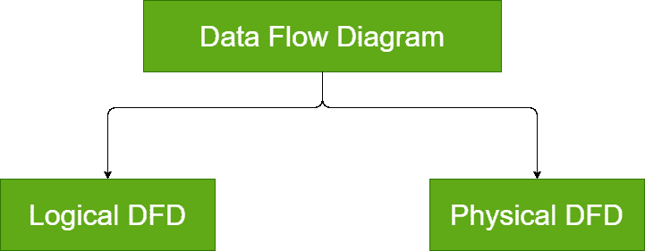
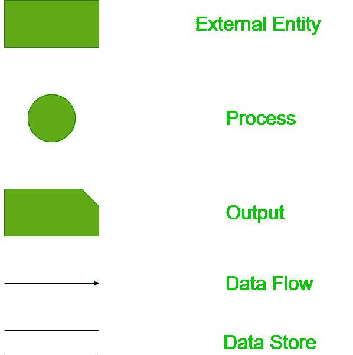

# 数据流图的类型和组成(DFD)

> 原文:[https://www . geesforgeks . org/数据流类型和组件图-dfd/](https://www.geeksforgeeks.org/types-and-components-of-data-flow-diagram-dfd/)

**数据流图(DFD)** 是任何系统中数据流的图形表示。它能够说明输入数据流、输出数据流和存储数据。数据流图描述了数据如何在系统中流动。

有时人们会混淆数据流图和流程图。数据流图和流程图有很大的区别。流程图示出了程序模块中的控制流程。数据流图说明了系统中不同级别的数据流。数据流图没有任何控制或分支元素。

**DFD 的类型:**
DFD 有两种类型:

1.  **逻辑 DFD:**
    逻辑数据流图主要关注系统流程。它说明了数据如何在系统中流动。逻辑 DFD 在各种组织中用于系统的平稳运行。与银行软件系统一样，它用于描述数据如何从一个实体移动到另一个实体。
2.  **物理 DFD:**
    物理数据流图展示了数据流是如何在系统中实际实现的。物理 DFD 更具体，更接近实现。

**数据流图的组成部分:**
以下是数据流图的组成部分，用于表示数据的来源、目的地、存储和流动。

*   **实体:**
    实体包括数据的来源和目的地。实体用矩形表示，并有相应的名称。
*   **流程:**
    对数据执行的任务称为流程。流程用圆圈表示。在某些地方，圆边矩形也被用来表示过程。
*   **数据存储:**
    数据存储包括系统的数据库。它由两个较小的边都缺失的矩形表示，或者换句话说，在两条平行线内。
*   **数据流:**
    数据在系统中的移动称为数据流。它是借助箭头来表示的。箭头的尾部是来源，箭头的头部是目的地。

**数据流图的重要性:**
数据流图是表示系统中数据流的简单形式主义。它允许一组简单直观的概念和规则。这是一种优雅的技术，既可用于表示软件问题的结构化分析结果，也可用于表示组织中的文档流。