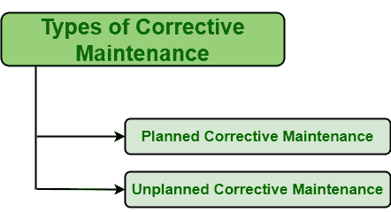

# 纠正性维护类型

> 原文:[https://www . geesforgeks . org/类型-纠正-维护/](https://www.geeksforgeeks.org/types-of-corrective-maintenance/)

**纠正性维护(CM)** 是一种维护策略，通常是在任何资产发生故障或崩溃后恢复该资产所必需的。修复可以通过修理、更换、重新调整等方式完成。CM 的目标有很多，但其主要目标是将损坏或故障的资产纠正并恢复到正常工作状态。CM 主要适用于对运行功能和操作不重要的资产。

**纠正性维护的类型:**
CM 通常分为两个不同的类别，如下所示:

1.  **计划的纠正性维护:**
    计划的 CM，顾名思义，就是计划好的，以后可以执行的一种 CM。因此，计划管理也被称为计划管理或延期管理。这是 CM 的一种类型，是必不可少的，需要执行，但不能在资产失败后立即执行。以后可以执行。计划的 CM 通常针对不重要或不太重要的资产执行，即在整个系统发生故障后对其影响很小。这种类型的资产故障是可以容忍的，并且易于恢复、修复或更换，也具有成本效益。

计划管理进一步分为两个不同的类别，在此基础上，管理被认为是计划的:

*   **[【运行至故障(RTF)维护】](https://www.geeksforgeeks.org/run-to-failure-rtf-maintenance/)–**
    对于此类 CM，一般采用 RTF 维护策略，即允许资产运行至故障，然后进行维修或更换，使其恢复正常工作状态。
*   **预防性维护(PM)–**
    预防性维护策略可以作为 CM 的一部分，在 CM 中通常已经识别出导致资产故障的问题或事项。在这种情况下，问题会在导致设备故障之前确定，如果发现任何问题，则可以计划和安排纠正性维护。

还有其他原因也导致认为计划或推迟了纠正性维护:

*   执行 CM 所需的替换零件或资源不可用。
*   目前没有执行 CM 所需的专家。
*   更严重的病例需要技术人员。

*   **Unplanned Corrective Maintenance :**
    Unplanned CM, as name suggests, is a type of CM that is unplanned and needed to perform immediately after asset failure. Therefore, Unplanned CM is also known as Unscheduled CM or Immediate CM. It is a type of CM is that essential and needed to be performed but not too later after asset failure. It is needed to perform immediately just after asset failure. CM is usually performed for assets that are very critical i.e. have greater impact on overall system after its failure. Such type of assets failure is tolerable and are easy to be restored, repaired, or replaced as well as are cost-effective also.

    计划外 CM 进一步分为两种不同的情况，据此 CM 被认为是计划外的:

    *   有几种情况，其中预防性维护被应用，但是在计划的维护行动之间也以某种方式发生故障。因此，这种情况下所需的 CM 被认为是计划外的，因为资产故障需要立即修复或更换，因为它可能是关键的，并且会以更高的成本影响生产和整个系统。在这种情况下，成本管理也很高，并且根据资源、工具、零件等的可用性来执行。需要修复或替换故障资产。
    *   在其他情况下，资产可能会意外失败，而没有任何潜在失败的迹象或失败发生的机会。在这种情况下，应用的 CM 也被认为是无计划的，因为没有计划的维护策略来解决故障资产。