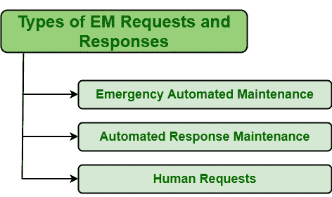

# 电磁请求和响应的类型

> 原文:[https://www . geesforgeks . org/type-of-em-requests-and-response/](https://www.geeksforgeeks.org/types-of-em-requests-and-responses/)

**紧急维护(EM)** 是一种维护类型，它不仅会增加管理操作的成本，还会最大限度地缩短设备的寿命或寿命，增加人工成本，并增加安全和环境风险。电磁本质上是反应性的，是专门为处理意外故障而设计的，但被认为是效率最低的维护形式。但是电磁非常重要，因为一些故障会影响并威胁到生命、生产和环境等。

**类型:**
EM 请求基本上有三种类型，如下所示:

1.  **紧急自动维护:**
    紧急自动维护顾名思义，是一种通常由自动设备或系统操作的紧急维护。这种维护过程被称为全自动维护过程，通常用于防止系统损坏。这一过程减少了对人的需求，即无需任何员工的输入即可自动运行。这只是提高了工人的安全性，增加了生产产量，降低了运营成本，提高了资源和工具的使用效率，提高了产品质量等。每当发生任何意外故障或资产崩溃时，通常需要紧急自动维护。

*   **自动响应维护:**
    自动响应通常是预定义的响应，即每当发生紧急情况时发送的预定义维护请求。这些维护请求由工作单管理软件或系统自动生成，无需任何人工干预。*   **Human Requests :**
    Emergency maintenance requests can also be generated manually i.e. by employees, technicians, team members. Emergency Maintenance requests simply means that immediate action is required to be taken to repair failed asset. In these, maintenance requests are usually sent by employees or team members that were present at site at time of failure occurrence.

    在所有类型的维护中，人们永远不会希望需要执行 EM。EM 是一种维护类型，每个人都希望永远不要执行它。因此，应该避免这种紧急维护情况。电磁成本是实施预防性维护的两倍，耗时，存在安全风险，缩短了资产寿命，增加了资源利用率等。为了避免电磁干扰，应该实施预防性维护。