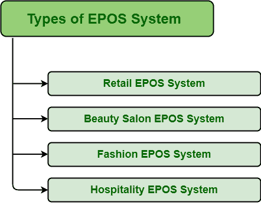

# EPOS 系统的类型

> 原文:[https://www.geeksforgeeks.org/types-of-epos-system/](https://www.geeksforgeeks.org/types-of-epos-system/)

**EPOS(电子销售点):**
顾名思义，是由计算机硬件、软件、外设组成的系统。硬件有助于计算机系统的运行和存储数据，软件有助于更有效地记录销售和经营业务，外围设备用于将信息输入计算机以存储和处理数据。该计算机系统负责执行各种任务，如销售、结账、库存监控、付款等。它是最好的系统之一，旨在帮助企业处理更多的销售和客户。它保持数据的准确性和快速处理。它只是记录准确的数据，即准确记录哪些项目被出售，反过来帮助人们保持在库存水平的顶部。

**EPOS 系统的类型:**
如今，EPOS 系统对于保持准确的数据、提高销量、s 和性能非常重要。每个零售商都必须使用 EPOS 系统，这通常被认为是零售管理成功的关键。现在，有几种类型的 EPOS 系统可用，如下所示。

1.  **零售 EPOS 系统–**
    零售 EPOS 系统，顾名思义，是一种主要用于零售运营的 EPOS 系统，有助于从世界任何地方管理库存、员工、数据和支付。它之所以被广泛使用，是因为它可以根据不同的任务进行定制，并且可以轻松地实现或集成到业务软件的堆栈中。现在最好的零售 EPOS 系统之一是 Eurostop。它只是提高了跟踪销售、采购和订单的效率和准确性，并减少了维护手动解决方案所需的时间。它还包括客户关系管理系统，因此不需要增加额外的客户关系管理系统，从而节省时间和成本。
2.  **美容院 EPOS 系统–**
    美容院 EPOS 系统，顾名思义，是一种主要应用于美容院、健身房、按摩院、温泉等场所的 EPOS 系统。这些主要用于提供各种功能，如跟踪员工佣金、库存控制、预约等。它提高了顾客的满意度，简化了预订，反过来又让顾客继续购物。它也有助于人们通过忠诚度计划、促销优惠等以简单的方式管理客户。记录客户的姓名、地址、电子邮件地址等。
3.  **时尚 EPOS 系统–**
    时尚 EPOS 系统，顾名思义，是一种 EPOS 系统，主要用于服装鞋店、西装店、纱丽店等时尚店铺，以及任何隶属于时尚店铺的店铺。它是时装业的最佳解决方案，并提供对服装库存的更好控制。简单来说，它有助于一个人以智能和现代的方式零售时尚产品。这也有助于确定哪些卖家值得出售，哪些卖家有利于增加销售额，以及简化流程和提高生产率。
4.  **酒店 EPOS 系统–**
    酒店 EPOS 系统，顾名思义，是一种 EPOS 系统，主要用于保持准确性、灵活性，帮助人们无故障地处理和维护每一笔复杂的交易。这些系统旨在降低成本并实现利润最大化。这些大多用于大中型咖啡馆、餐馆、酒吧、酒吧等。它以小企业和大企业都能承受的价格提供同样的利润。这类系统的类型可以是平板收银机系统、厨房视频管理系统、餐厅 EPOS 系统等。