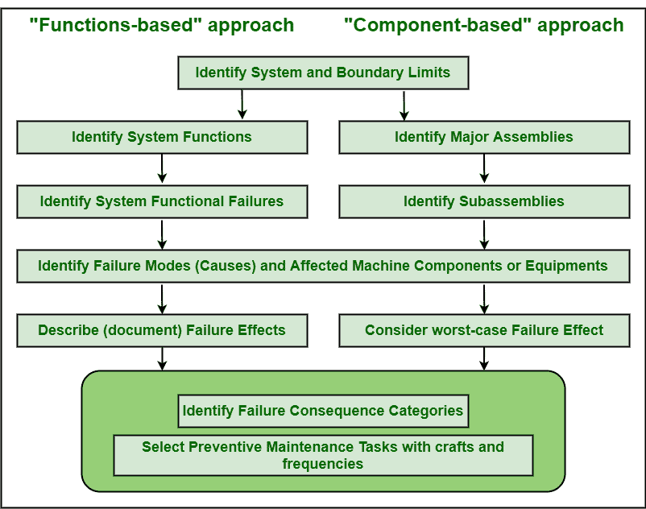

# RCM 方法的类型

> 原文:[https://www.geeksforgeeks.org/types-of-rcm-approaches/](https://www.geeksforgeeks.org/types-of-rcm-approaches/)

[以可靠性为中心的维护(RCM)](https://www.geeksforgeeks.org/different-rcm-maintenance-strategies/) 是一个过程，用于确定系统中的整体维护，使其能够在成本、功能、生产可用性等方面有效运行。没有任何故障中断。它只是帮助一个人实施成本和设备都有效的维护策略。RCM 只需将最佳维护策略分配给单个资产，这样就可以减少效率低下的情况。RCM 通常关注如果系统中存在故障的根本原因会发生什么。这只是让人们更容易根据每个资产的[优先级和故障严重程度](https://www.geeksforgeeks.org/difference-between-severity-and-priority-in-testing/)为其分配适当的策略。

**RCM 的类型:**
目前可用的 RCM 技术基本上有两种。RCM 技术的选择通常基于以下几个因素:

*   失败后果。
*   失败的概率。
*   风险承受能力。
*   资源的可用性。
*   历史数据的可用性。

两种类型的 RCM 技术如下:

1.  **经典 RCM :**
    经典 RCM 又称严谨 RCM。在这种 RCM 技术中，RCM 根据对所有功能的严格评估，考虑所有可能的功能故障，创建所有可能故障模式的列表。然后评估与每个功能故障相关的每个故障模式。RCM 然后进一步集中分析每个资产上所有可能的故障模式，即被分析系统中的设备。严格的 RCM 是一个缓慢的过程，因为它会分别分析所有可能的故障模式。这些技术要求严格记录功能、功能故障、故障模式、故障影响。这种方法既费时又费力。这是基于功能的方法。
2.  **缩写 RCM :**
    缩写 RCM 也称为直观 RCM，Streamlined RCM。我们知道经典的 RCM 是非常耗时的过程和劳动密集型的活动。有各种缩短版本的 RCM 正在开发，以加快 RCM 分析或最大化分析所需时间的整体价值。因此，这种简化的过程被称为简化的 RCM 技术。这是一种基于组件和条件的方法，不需要严格的文档。它简单地考虑了设备系统的层次结构，节省了总分析和实施时间的四分之一。这种 RCM 方法要求至少有一个人对不同的状态监测技术有充分的了解和理解。