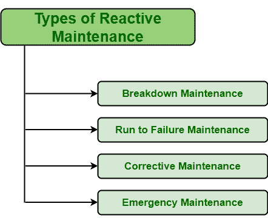

# 无功维护类型

> 原文:[https://www . geesforgeks . org/无功维护类型/](https://www.geeksforgeeks.org/types-of-reactive-maintenance/)

[反应性维修](https://www.geeksforgeeks.org/reactive-maintenance-in-software-engineering/)是简单维修资产即设备、部件等的方法。故障或损坏后恢复到正常工作状态。这种维护策略也被称为故障维护。此类维护策略仅适用于需要低成本更换或维修的设备，以及对功能或操作不太重要的设备。这是因为反应式维护不涉及任何计划进度。但是等待设备故障所需的资金和时间比定期维护设备以防止故障所需的资金和时间要少。

**反应性维护类型:**
如果现在有反应性维护策略，基本上有四种不同的类型，如下所示:

1.  **故障维修–**
    故障维修，顾名思义，就是设备完全故障时，为了将其修复到正常工作状态而需要进行的一种维修。这种类型的维护仅适用于特定设备不运行、故障或发生故障时。故障维护通常是计划外事件，但也可以是计划内事件。人们必须等待执行维护任务，直到特定设备由于故障或故障而停止运行。当设备不工作时，通常需要进行故障维护，并且可以修复到正常工作状态。它应该是计划内事件，而不是计划外事件，因为计划外事件可能导致健康和安全风险、代价高昂的停机时间、停产等。
2.  **运行至故障维护–**
    运行至故障维护，顾名思义，是一种应用到设备出现故障为止的维护。在这种类型的维护中，设备被允许运行直到其故障。这是一种计划维护，适用于设备在意外时间发生故障的情况。它仅仅意味着不对资产进行预防性维护或零预防性维护，并让资产运行直到其崩溃或故障。它总是包括一个深思熟虑的决定，即在不影响生产和质量的情况下，关于设备维修的有计划的仔细决定。
3.  **纠正性维护–**
    纠正性维护，顾名思义，是一种用于识别和纠正设备故障的维护策略，以便特定的故障设备能够修复到其正常工作状态。在资产或设备发生故障后，它要么更换，要么修理。纠正性维护的主要优点之一是，可以在缺陷导致任何类型的问题并导致设备故障之前识别缺陷。在各种维护程序中，故障零件会在任何中断发生之前被发现和识别。
4.  **紧急维护–**
    紧急维护顾名思义，是一种在资产或设备发生故障或出现故障并导致更大的健康和安全风险时立即应用的维护类型。这种维护类型只是为了防止组织的财产、盈利、生产。它适用于需要解决的紧急安全要求。