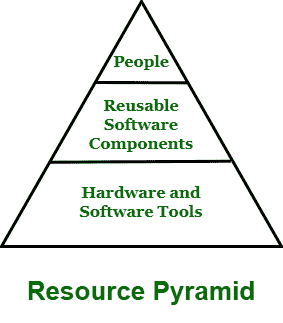

# 项目开发中使用的资源类型

> 原文:[https://www . geesforgeks . org/项目开发中使用的资源类型/](https://www.geeksforgeeks.org/types-of-resources-used-in-project-development/)

**项目资源**简单来说就是指成功开发和完成项目所需的资源。这些资源可以是有助于执行项目中某些任务的资金、人员、材料、工具或供应品。没有这些资源，就不可能完成项目。在项目规划阶段，确定完成项目所需的资源以及如何分配这些资源是关键要素，也是非常重要的任务。在项目管理中，一些所需的资源被分配给项目的每个任务来完成工作。

考虑了三种类型的资源，它们对于项目的执行和按时按预算完成项目非常重要。这些资源可以用金字塔来表示，也称为资源金字塔。在金字塔的底部，即最后一层，存在硬件和软件工具，然后在中间层，存在可重用组件，在金字塔的顶部，即顶层，存在人力资源。如下图所示:

当软件规划者想要指定资源时，他们使用四个特征来指定它:

*   资源描述
*   资源可用性
*   资源可用的时间
*   资源可用性持续时间

**资源类型:**

1.  **Human Resource –**
    Human plays an important role in software development process. No matter what size is and how much complexity is there in project, if you want to perform project task in an effective manner, then human resources are very essential. In software industry, people are assigned some organizational positions such as manager, software developer, software testing, engineer, and so on. These positions are according to their skills and specialty.

    仅对于小型项目，单个个人可以执行所有这些角色。但是对于大型项目来说，团队的人在工作。项目所需的总人数是通过计算开发工作量(人工月)来估算的。

2.  **可重用组件–**
    为了简化软件开发过程或加速软件开发过程，工业界更喜欢使用一些现成的软件组件。组件可以被定义为在软件开发过程中可以被创建和重用的软件构件。一般来说，无论项目的类型、规模或复杂性如何，所有项目都需要资金。管理项目预算是所有项目经理必须做的最重要的任务之一。可重用资源也称为成本资源，因为它们有助于降低开发的总体成本。组件的使用强调可重用性。这也被称为基于组件的软件工程。
3.  **Hardware and Software tools –**
    These are actually material resources that are part of project. This type of resource should be planned before starting development of project otherwise it way causes problems for the project.

    例如，如果您在执行任务时需要某些软件元素，但不知何故您无法按时获得它们，甚至它们可能需要几周时间才能从制造商处发货，这将导致您的项目延迟。