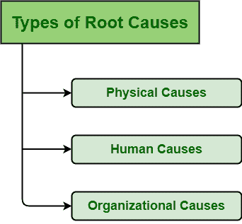
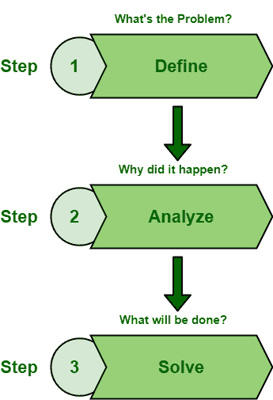

# RCA 的根本原因和益处的类型

> 原文:[https://www . geesforgeks . org/RCA 的根本原因和益处类型/](https://www.geeksforgeeks.org/types-of-root-causes-and-benefits-of-rca/)

缺陷被认为是开发和改进软件的一部分。[根本原因分析](https://www.geeksforgeeks.org/basic-principle-of-root-cause-analysis/)是一种防止将来再次出现相同问题或缺陷的技术。RCA 被认为是解决问题过程的一部分。RCA 被认为是组织持续改进的最佳工具和核心构件之一。

RCA 应该被考虑并包含在解决问题的努力和技术中，因为 RCA 是通向质量改进的最佳途径。RCA 不仅仅分析或确定一种类型的根本原因，事实上，它分析和确定了多种类型的根本原因。

**根本原因的类型:**
人们需要跟踪缺陷或问题的根本原因是什么。在 RCA 期间，有几种类型的根本原因会导致系统中的缺陷。这些根本原因如下–

 

1.  **Physical Causes :**
    Physical cause, as name suggests, is a cause that arises by problems with any physical component of system. Physical causes are not human-made mistakes. This causes can be occurred due to following reasons –
    *   硬件故障是最常见的故障之一，发生率为 42%。
    *   一些工具由于任何原因停止工作，那么它可能会导致问题。
    *   服务器未启动，即未启动或系统未按预期运行。
    *   有形的，或物质的物品由于某种原因失效。
2.  **Human Causes :**
    Human cause, as the name suggests, is a cause that arises by human-made mistakes and it leads to physical causes. Human beings tend to make mistakes. Human-made mistakes lead to a total of 30% defect or problem in the system. Human cause or error is the key to understand and prevent software defects or problems. Most defects are caused by human errors. If a person did something wrong or did not do things that were required, then it leads to human errors or causes. This causes can be occurred due to the following reasons –
    *   一个人不具备完成任何任务所需的技能。
    *   人对工具和技术没有足够的知识和理解。
    *   人们不知道需要遵循哪些步骤和指示。
    *   人员执行了工具不需要的任务。
    *   人为造成的编程错误。
3.  **组织原因:**
    组织原因，顾名思义，就是组织产生的原因。有时，组织也要对系统中的问题负责。组织所做的所有决定不一定都是正确的。一个决定可能是错误的，也可能是不恰当的。这可能是由于以下原因造成的–
    *   团队领导给执行任务的团队成员错误的指示。
    *   关于选择人员执行任务的错误决定。
    *   所需工具不可用。
    *   没有正确维护和处理员工。
    *   不鼓励和支持团队成员。

**RCA 的目标和收益:**
借助原因映射法，根本原因分析由三个步骤组成，是 RCA 的主要目标。这些在下面给出–

 

1.  **定义:**
    RCA 的第一个目标就是简单地确定或识别问题或缺陷。人们需要确定到底发生了什么。是的，找出问题或缺陷并不容易，但也不是不可能。人们可以通过简单地关注缺陷或问题对系统或组织目标的影响来确定和定义缺陷或问题。
2.  **分析:**
    RCA 的第二个目标简单来说就是分析和识别实际触发缺陷的原因以及它是如何触发缺陷或问题的。人们需要确定它是如何以及为什么会发生的。如果我们不分析问题或缺陷的根本原因，那么我们将来会一次又一次地看到同样的问题。也就是说，最好是消除引发缺陷的根本原因，这样就可以防止和减少缺陷的发生。
3.  **解决:**
    RCA 的第三个目标简单来说就是确定解决问题所需的工具和措施。人们需要找到最好的解决方案和工具，以非常有效的方式解决或消除缺陷。所需的措施和行动应该是正确的和更有效的，因为有效的解决方案也会影响人们执行或执行工作流程的方式。有效的解决方案会带来更好的结果。因此，找出简单地减少和防止将来可能再次发生的缺陷所需的解决方案是非常重要的。