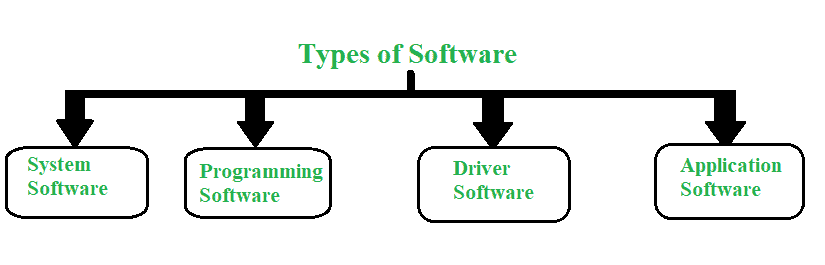
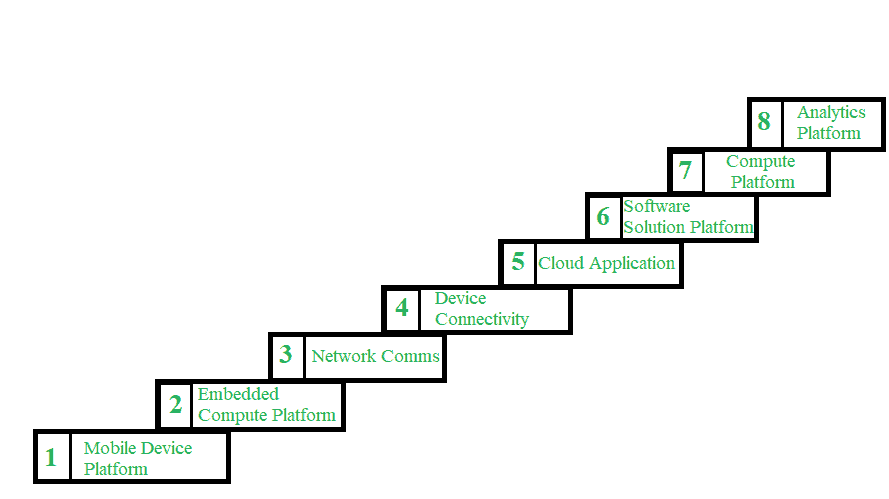

# 软件平台类型

> 原文:[https://www.geeksforgeeks.org/types-of-software-platforms/](https://www.geeksforgeeks.org/types-of-software-platforms/)

**平台**是[硬件和软件](https://www.geeksforgeeks.org/difference-between-hardware-and-software/)架构，作为开发其他应用程序、流程或技术的基础或基础。在计算中，平台指的是基础硬件，即计算机系统和软件，即[操作系统](https://www.geeksforgeeks.org/operating-systems/)，软件应用程序通常运行在该操作系统上。如果一个应用程序是其他程序的基础，它也可以作为平台。例如，我们日常生活中使用的网络浏览器很少接受第三方插件，因此浏览器应用程序成为接口平台。

软件类型

近年来，几乎每个软件企业都建立了一些相当“平台”。然而，所有创建的平台都不一样。脸书、[亚马逊网络服务](https://www.geeksforgeeks.org/introduction-to-amazon-web-services/)、亚马逊市场、谷歌搜索、[安卓](https://www.geeksforgeeks.org/introduction-to-android-development/)、优步都是平台，但与此同时，这些平台在如何创造网络效果、允许的互动种类、遵循的方法、策略和其他方法上都有很大不同。

现在让我们讨论各种类型的平台。它们是:

1.  **实用平台:**
    谷歌搜索、Bing、Kayak、Skyscanner 都是一些实用平台的例子。公用事业平台通过提供有用且通常免费的服务来吸引用户。一旦有一定数量的用户使用这项服务，平台就会向第二类参与者开放，比如谷歌搜索的广告商，Kayak 或 Skyscanner 的航空公司。有用的服务本身没有网络效应。用户吸引商家，但平台上的商家不一定吸引用户。我们参加谷歌搜索是为了寻找信息，而不是看广告。

*   **内容分发平台:**
    谷歌 AdSense、PropellerAds、千禧传媒都是内容分发平台的样本。这种平台将所有者与希望向用户传递内容(或广告)的内容联系起来。平台上的内容越多，平台就变得越有吸引力。用户范围和内容匹配的准确性是这个平台最重要的两个方面。*   **数据采集平台:**
    谷歌地图、Waze、Salesforce、OpenSignal 和 InsideSales 都是数据采集平台的一些例子。这些平台为用户提供有用的服务，并通过使用平台服务生成数据。从平台所有用户收集的数据反馈给服务，从而使其对用户更有用。这些平台上的网络效应隐含在数据上，而不是用户上。平台服务的使用产生数据，反过来又使平台对用户更有价值，从而吸引更多的用户，用户的使用产生更多的数据，等等。*   **互动网络:**
    脸书、微信、Telegram、Ello、比特币都是互动网络的一些例子。这些类型的平台促进了特定参与者(人和/或企业)之间的互动。数字交互可以是消息、语音呼叫、图像或汇款的形式。互动网络的基本特征是同一性。平台上的所有交互都基于特定的客户。用户加入平台是为了与其他用户互动，因此第一个网络效应是在平台用户之间。用户吸引用户，用户吸引更多的用户。因此，平台可以是连接同类参与者的单侧平台。*   **技术平台:**
    亚马逊网络服务和微软 Azure 就是一些技术平台的例子。技术平台提供构建模块或服务，这些模块或服务在大量产品中被重用。技术平台不是双边市场。技术平台通过向开发人员销售其服务来创收，并且通常对顶级用户(最终用户)不可见。例如，虽然像网飞和亚马逊 Prime 这样的奥特在亚马逊网络服务平台(AWS)上运行其视频流服务，但顶级用户只与网飞和亚马逊 Prime 互动。在这种类型的平台中，没有隐性的网络效应。这些平台的成长受到开发者的好评，不依赖于需求端和供给端的互动。因此，技术平台比多边或对等平台更容易推出。*   **市场:**
    亚马逊、易贝、Flipkart、Kickstarter 或 UpWork 都是市场的一些例子。这些是连接供给和需求的双边平台。市场使得需求方参与者(即买方)和供应方参与者(即卖方)之间能够进行交易。在这些平台中，产品和提供的服务的价格由卖家决定。市场中的网络效应介于需求方和供给方之间。卖家以令人兴奋的报价吸引买家，而买家又吸引更多的卖家，等等。身份在这个平台中起次要作用。买家搜索选定的产品或服务，但不搜索选定的卖家。产品或服务由多个在价格、声誉等方面竞争的卖家提供。*   **点播服务平台:**
    优步、DoorDash、Go-Mart、Doz 都是点播服务平台的样本。这些类型的平台提供端到端服务，由一组独立的服务提供商或承包商来完成。按需服务平台将搜索、订购、支付、履行和确认服务的流程整合在一个屋檐下。价格、质量标准和履行流程由平台设定和管理。用户或买方通常在选择如何提供服务以及由谁提供服务方面自由度较小。*   **计算平台:**
    苹果 iOS、谷歌安卓都是一些计算平台的例子。计算平台呈现平台用户和第三方开发者之间的交互。在计算平台中，用户和开发者之间的联系是通过应用商店/市场建立的。一旦平台达到一定的用户量，这些平台往往会发展出强大的双向网络效应。用户吸引开发者，开发者制作应用，应用吸引用户，用户吸引开发者，等等。*   **Content Crowdsourcing Platforms :**
    YouTube, Crackle, Twitch, and Yelp are some examples of Content Crowdsourcing Platforms. These types of platforms collect content from users in form of videos, blog posts, reviews, etc, and share this content with wide range of users. In Content Crowdsourcing Platforms users interact with platform and interaction is ground to content. Network effect is observed between content contributors i.e., creators, and content consumers i.e., viewers of platform. If more content is available on platforms, more content consumers will join platform making it more valuable for content contributors, who in turn generate more content.

    除上述平台外，还有八种类型的软件平台:

    

    其他类型的软件平台