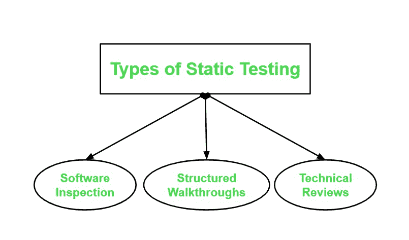
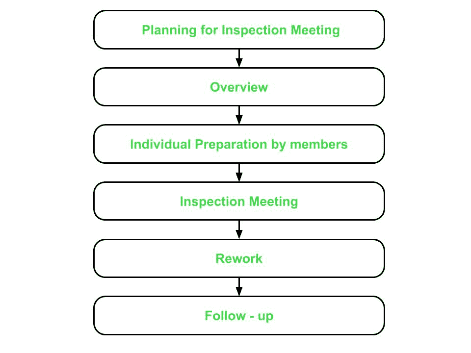
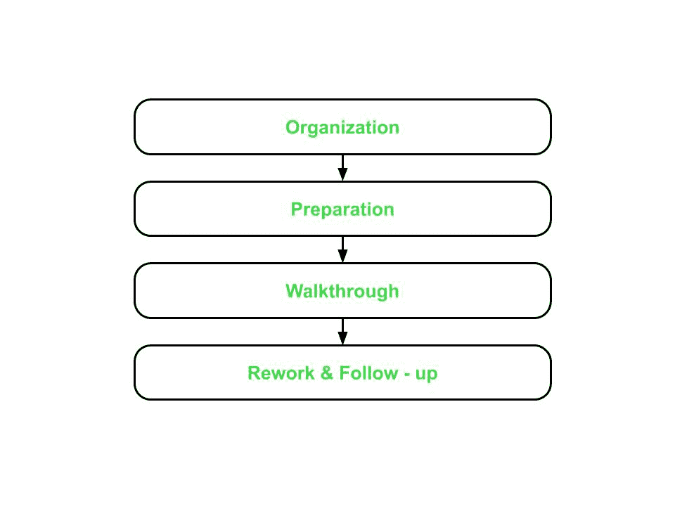

# 静态测试类型

> 原文:[https://www.geeksforgeeks.org/types-of-static-testing/](https://www.geeksforgeeks.org/types-of-static-testing/)

测试过程分为两种类型:[静态测试](https://www.geeksforgeeks.org/software-testing-static-testing/)和[动态测试](https://www.geeksforgeeks.org/software-testing-dynamic-testing/)。静态测试不同于动态测试，因为静态测试不涉及程序或软件的执行。然而，通过执行软件产品的代码来执行动态测试。

根据定义，**静态测试**是一种不涉及执行或运行程序或软件产品的人工测试技术。相反，它包括在[软件开发生命周期(SDLC)](https://www.geeksforgeeks.org/software-development-life-cycle-sdlc/) 的每个阶段，按照软件产品的[软件需求规范(SRS)](https://www.geeksforgeeks.org/software-requirement-specification-srs-format/) 中提到的要求或标准检查或监控软件。

**为什么需要静态测试？**

*   **早期阶段的 bug/缺陷检测–**
    制作软件时，不能只依赖动态测试，因为它会在后期阶段发现软件产品的 bug 或缺陷，这可能会花费开发人员大量的时间和精力进行调试。
*   **软件规模增加–**
    随着软件产品规模的增加，随着代码覆盖效率的降低，处理变得困难。这就是为什么需要静态测试，因为它有助于在软件早期消除错误或 bug。
*   **动态测试很耗时–**
    虽然动态测试揭示了 bug 并提供了一些关于 bug 的细节，但是修复 bug 仍然很费时费力，因为它包括从测试用例到根本原因的故障检测，这使得整个过程非常困难。
*   **动态测试是昂贵的–**
    如前所述，动态测试需要测试用例，这样做本身就是昂贵的，因为测试用例应该首先被创建，然后被执行和验证，并且还必须被维护，导致测试人员的大量工作。

**静态测试的好处:**

*   **降低了 SDLC 成本–**
    由于缺陷是在 SDLC 的早期阶段发现的，因此修改产品和解决问题所需的努力和时间更少，从而降低了 SDLC 的整体成本。
*   **提高产品质量–**
    当在软件中检测到缺陷时，它们会被修复，从而提高产品质量。
*   **追踪 bug 的确切位置–**
    在静态测试中，可以追踪 bug 的确切位置，而在动态测试中，这是不容易做到的。
*   **即时评估&反馈–**
    产品评估经常发生，使产品质量更好，因为在开发产品的每个阶段都会收到即时反馈。
*   **提高动态测试的有效性–**
    随着代码在静态测试后变得更干净、更好，创建和维护高质量的测试用例需要更少的努力和时间，从而使动态测试更加有效。

**静态测试类型:**

**1。软件检查:**

检验过程在 SLDC 的早期阶段执行，并应用于产品的特定部分，如安全气囊系统、代码、产品设计。等等。它包括在早期阶段手动检查产品的各种组件。软件检查过程包括以下六个阶段:

*   **检查会议策划–**
    *   这一阶段的重点是确定要检验的产品和检验的目的。
    *   在此阶段，会指派一名主持人来管理整个检查过程。
    *   指定的主持人检查产品是否准备好接受检查。主持人还选择检查组，并为他们分配角色。
    *   主持人还安排检查会议，并向检查小组分发所需材料。
*   **概述–**
    *   在这一阶段，视察队将获得视察会议的所有背景资料。
    *   作者——负责开发产品的编码者或设计者——展示了他对产品的逻辑和推理，包括产品的功能、预期目的以及开发时使用的方法或概念。
    *   确保检查小组的每个成员都理解并熟悉将要召开的检查会议的目标和目的。
*   **成员个人准备–**
    *   在这一阶段，检查组成员通过研究前几个阶段提供的材料，单独为检查会议做准备。
    *   团队成员识别产品中潜在的错误或缺陷，并将它们记录在日志中。日志最终提交给版主。然后，主持人汇编从成员那里收到的所有日志，并向作者发送一份副本。
    *   检查员——负责检查和识别文件或程序中的错误和不一致，审查产品并记录发现的任何问题(包括一般问题和特定领域的问题)。检查员将问题和准备时间记录在日志上。
    *   主持人查看日志，检查团队是否为检查会议做好了准备。
    *   最后，版主将所有编辑好的日志提交给作者。
*   **检查会议–**
    *   这个阶段涉及作者对团队成员在编译日志中提出的问题的讨论。
    *   成员们就提出的问题是否是一个错误作出决定。
    *   主持人结束会议，并提供会议摘要-这是在产品中发现的错误列表，将由作者解决。
*   **返工–**
    *   返工由作者根据前一阶段主持人提出的总结清单进行。
    *   作者修复了所有的错误，并向版主报告
*   **跟进–**
    *   主持人检查是否所有错误都已解决。主持人然后准备一份报告。如果所有错误都已修复并解决，主持人将发布文档。
    *   否则，未解决的问题会添加到报告中，并安排另一次检查会议。

**2。结构化演练:**
这种类型的静态测试不太正式，本质上也不那么严格。与检查过程相比，它具有更简单的过程。它包括以下四个步骤:

*   **组织–**
    这一步包括为结构演练选择的团队分配角色和职责。该团队可由以下成员组成:
    *   协调员-组织并协调所有成员的演练相关活动。
    *   演示者–介绍要检查的项目。
    *   记录–记下成员提出的所有问题和建议。
    *   测试人员-发现待检查项目中的缺陷或缺陷。
    *   维护甲骨文–专注于产品的未来维护。
    *   标准持有者——评估是否符合标准和指南。
    *   用户代表–代表用户的需求和关注点。
*   **准备–**
    *   在这一步中，重点在于为结构演练做准备，这可能包括思考测试产品所需的基本测试用例。
*   **穿越–**
    *   演练由一个带着一小组测试用例来参加会议的测试人员来执行。
    *   测试用例由测试人员在心理上执行，结果记录在纸上或演示媒体上。
*   **返工和跟进–**
    *   这个步骤类似于检查过程的最后两个阶段。
    *   如果没有检测到错误，则产品被批准发布。否则，错误被解决，并且再次进行结构化漫游。

**3。技术评论:**

与检查或漫游技术相比，这是一种更高级别的技术，因为它还涉及管理。该技术用于通过检查产品是否符合开发标准、指南和规范来评估和评价产品。
它没有定义的流程，大部分工作由主持人执行，如下所述:

*   主持人收集材料和文档并分发给所有团队成员。
*   主持人还准备了一套指标来评估产品的规格和已经建立的标准和准则:
    *   一致性
    *   证明文件
    *   遵守标准
    *   完全
    *   问题定义和要求
*   结果记录在一份文件中，其中包括缺陷和建议。
*   最后，解决缺陷并考虑改进产品的建议。