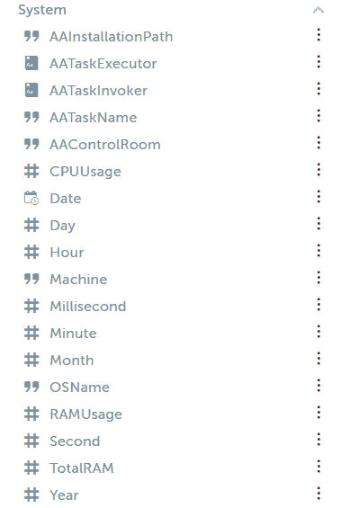

# 自动化任意位置(RPA)中的变量类型

> 原文:[https://www . geesforgeks . org/automation-anywhere-RPA 中的变量类型/](https://www.geeksforgeeks.org/types-of-variables-in-automation-anywhere-rpa/)

在本文中，我们将讨论 [Automation Anywhere (RPA)](https://www.geeksforgeeks.org/hello-world-bot-using-automation-anywhere/) 中变量类型的概述，并将详细讨论变量类型。我们一个一个来讨论。

**概述:**
本主题描述了自动化任务时可以定义和使用的变量类型。Automation Anywhere 中有三种类型的变量:用户(本地)变量、系统变量和凭据变量。

**Automation Anywhere 中变量的类型**[**(RPA)**](https://www.geeksforgeeks.org/robotics-process-automation-an-introduction/)**:**
在这里，我们将讨论变量的类型如下。

1.  用户(本地)变量
2.  系统变量
3.  凭据变量

我们一个一个来讨论。

**类型-1 :**
**用户(本地)变量:**
用户变量由自动化用户定义，用于特定任务或任务集。一个用户变量可以包含一个值或多个值。提示分配(类型:字符串)是一个预定义的变量，用于新的自动化任务。创建用户(本地)变量后，可以再次初始化它，或者在任务运行时分配它。

**类型-2 :**
**系统变量:**
在系统变量中，有由 Automation Anywhere 提供的预定义变量。系统变量可用于所有自动化任务。系统变量类型包括以下组件。

*   **日期和时间系统变量–**
    与系统相关的日期和时间变量。
*   **系统变量–**
    循环:与循环命令结合使用。
*   **Excel 系统变量–**
    对 Excel 自动化有用。
*   **电子邮件系统变量–**
    对电子邮件自动化有用。
*   **触发器变量–**
    与触发器一起使用。
*   **PDF 系统变量–**
    可用于 PDF 命令。
*   **系统变量–**
    特定于系统设置/参数特定于特定客户端机器的变量。

特定于客户端机器的系统变量

**Type-3 :**
**凭据变量:**
仅在 10.2.1 版的企业版中可用凭据变量存储运行自动化任务时使用的敏感信息。凭据变量只能由机器人创建者使用，并且只能在需要凭据输入的命令字段中使用。这些凭据由企业控制室的管理员以凭据密钥的形式定义，凭据密钥由一组属性值组成，并安全地存储在一个集中的位置—凭据库中。与用户和系统变量不同，您不能在变量管理器中查看凭据变量。当您使用支持凭据变量的命令创建任务时，它们在“插入变量”窗口中可见。

**参考资料:**
您可以从 automation anywhere 官方文档([系统变量类型](https://docs.automationanywhere.com/bundle/enterprise-v11.3/page/enterprise/topics/aae-client/bot-creator/using-variables/system-variables.html)中了解更多关于系统变量的详细信息。