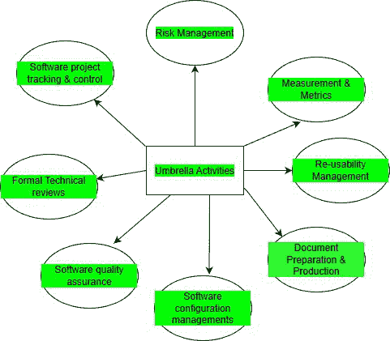

# 软件工程中的保护伞活动

> 原文:[https://www . geesforgeks . org/保护伞-软件工程中的活动/](https://www.geeksforgeeks.org/umbrella-activities-in-software-engineering/)

软件工程是相互关联的阶段的集合。这些步骤在不同的软件过程模型中以不同的方式表达或可用。伞式活动是软件开发团队遵循的一系列步骤或过程，以保持完整开发任务的进度、质量、变更和风险。伞式活动的这些步骤将在软件开发的通用视图的各个阶段中发展。

软件开发过程中的活动由许多一般活动来补充。一般来说，常见的活动适用于整个软件项目，并帮助软件开发团队管理和跟踪进度、质量、变更和风险。

**伞式活动由不同的任务组成:**

*   软件项目跟踪和控制
*   正式技术审查
*   软件质量保证
*   配置管理或软件配置管理
*   文件准备和制作
*   重用性管理
*   测量和度量
*   风险管理

*   **软件项目跟踪与控制:**该活动允许软件团队检查软件开发的进度。在实际开发开始之前，制定一个软件开发计划，并在此基础上进行开发，但一定时间后，需要对开发进度进行分析，找出需要采取的措施。它必须在开发、测试等完成后的适当时间被接受。测试结果可能需要重新安排开发时间。
*   **风险管理:**风险管理是帮助软件开发团队理解和管理不确定性的一系列步骤。识别它，评估它发生的可能性，评估它的影响，并制定一个“如果问题确实发生”的应急计划是一个非常好的主意。
*   **软件质量保证**:顾名思义，它定义并执行确保软件质量所需的活动。软件的质量，如用户体验、性能、工作负载灵活性等。，必须在达到指定的里程碑后进行测试和验证，这减少了开发过程结束时的任务，这些任务必须由专门的团队执行，以便开发可以继续。
*   **技术评审:**它评估软件工程工作产品，以便在错误传播到下一个活动之前发现并消除错误。软件工程是在集群或模块中完成的，在完成每个模块后，最好检查已完成的模块，找出并删除错误，以防止它们传播到下一个模块。
*   **度量:**这包括软件项目所有方面的所有度量。定义和编译过程、项目和产品度量，以帮助团队交付满足涉众需求的软件；它可以与所有其他框架和一般操作结合使用。
*   **软件配置管理**:管理整个软件开发过程中变更的影响。软件配置管理(SCM)是一组活动，旨在通过识别可更改的工作产品、建立它们之间的关系以及定义管理它们的不同版本的机制来管理更改。工作产品。
*   **复用性管理:**定义工作产品(包括软件组件)复用的标准，开发实现复用组件的机制。这包括批准备份软件项目的任何部分或为将来的更新或更新提供的任何类型的支持。根据用户/当前时间要求更新软件。
*   **工作产品准备和生产:**它包括创建工作产品所需的活动，如模型、文档、日志、表格和列表。