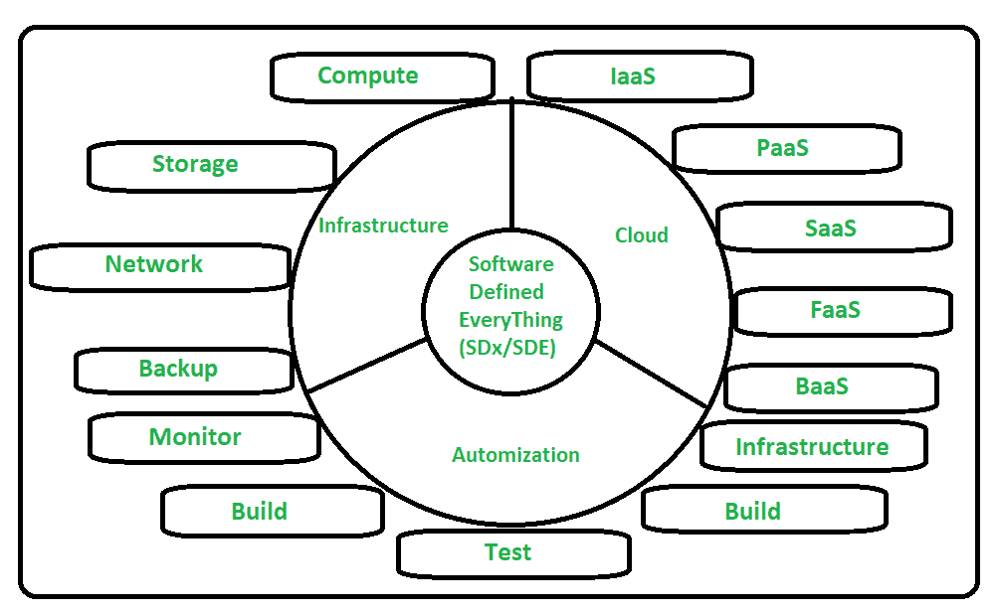

# 软件定义一切(SDx/SDE)的保护伞

> 原文:[https://www . geesforgeks . org/软件定义的万物伞-sdx-sde/](https://www.geeksforgeeks.org/umbrella-of-software-defined-everything-sdx-sde/)

**软件定义的一切(SDx/SDE)** 是一个宽泛的术语。软件定义的一切是当前信息技术更广泛的趋势之一。它将各种软件定义的计算技术组合在一起。SDE/SDx 是一项技术进步，允许虚拟化整个技术堆栈计算、网络、存储和安全层。软件定义的一切旨在使信息技术基础设施更加灵活和敏捷。

软件定义的一切(SDE)是一个容器术语，其中 SDE/Sdx 的保护伞包括[软件定义的网络(SDN)](https://www.geeksforgeeks.org/software-defined-networking/) 、软件定义的存储(SDS)和软件定义的数据中心(SDDC)。

将信息技术视为软件定义的降低了成本，减少了错误，通过在技术世界中打开新的机会，使一切变得更快、更灵活。在软件定义的一切(SDE/SDx)环境中，网络、存储和数据中心基础架构等的管理和控制是通过智能软件而不是基础架构的硬件组件实现自动化的。

**软件定义一切的保护伞:**
下图说明了软件定义一切的保护伞–

如果我们看到上图，就可以清楚地看到软件定义一切(SDE)对云、基础设施和自动化的影响更大。

**1。基础设施:**
现在，在标准硬件的支持下，一天的信息技术基础设施可以作为软件实施，其中计算基础设施被虚拟化并作为服务交付。

*   **软件定义计算–**
    服务器的虚拟化有助于节省硬件和软件成本，并提高处理计算资源的灵活性。
*   **软件定义存储–**
    在软件定义存储(SDS)中，物理存储硬件被解耦，并在服务器硬件中使用存储介质，如 NVMe、固态硬盘或硬盘来提供虚拟存储。
*   **软件定义的网络–**在软件定义的网络(SDN)中，网络架构被抽象，以使网络设备可编程。

**2。** [**云**](https://www.geeksforgeeks.org/cloud-based-services/) **:**
各种各样的按需信息技术服务/计算机系统资源根据组织或客户的需求通过互联网交付给他们。

*   **基础设施即服务(IaaS)–**
    通过互联网虚拟化计算资源。它提供即时计算基础设施，由供应商/服务提供商通过互联网提供和管理。
*   **平台即服务(PaaS)–**
    平台提供给客户在云中开发和部署应用。PaaS 环境负责应用程序的负载平衡和扩展。
*   **软件即服务(SaaS)–**
    允许用户通过互联网连接和使用应用程序。在这种情况下，服务提供商为客户托管应用程序，并通过互联网向这些客户提供这些应用程序。
*   **功能即服务(FaaS)–**
    在功能即服务(FaaS)中，边缘的模块化代码片段被执行。它提供了一个平台，允许客户开发、运行和管理应用程序功能，而不用担心构建和维护的复杂性。
*   **备份即服务(BaaS)–**
    在备份即服务(BaaS)中，数据通过在线数据备份提供商的云备份和恢复服务进行备份/存储。它是指传统数据备份方法的现代替代方法。

**3。自动化:**
自动化指的是一种代码方法，这意味着一切都需要被编程来自动工作。它使信息技术保持更加灵活、快速、安全和稳定。

*   **基础设施–**
    自动化基础设施方法允许使用可配置的软件来定义和管理您的 IT 基础设施。
*   **构建和测试–**
    自动化方法中的构建和测试构建和测试过程自动化。在这种情况下，结果仍可追溯。
*   **安装–**
    自动化安装方法允许操作系统的配置和应用程序的安装实现自动化。
*   **监控–**
    自动化方法中的监控允许自动监控(提供识别和纠正错误等技术援助)和数据收集过程。