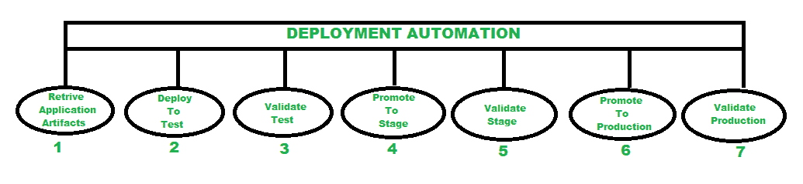

# 了解部署自动化

> 原文:[https://www . geesforgeks . org/understanding-deployment-automation/](https://www.geeksforgeeks.org/understanding-deployment-automation/)

在本文中，我们将讨论部署自动化、自动化部署中的类别、如何在部署中实现自动化、自动化如何帮助开发运维以及部署自动化的优缺点。所以，让我们开始详细探讨这个话题。

**部署自动化** :
部署自动化是指一套自动化流程，用于使用自动化工具和技术将软件应用程序/产品移动到测试和生产环境的几个阶段，从而在软件交付周期中实现可重复和可靠的部署。它还让我们更频繁地发布新的应用程序和功能，而无需任何人工干预。意味着它完全致力于在测试和生产阶段实现自动化。

**自动化部署中的类别:**
自动化部署可以根据跨环境的自动化覆盖级别分为不同的类别

1.  **持续部署–**
    是部署管道全流程自动化的方法。源代码中出现的每个过程都会自动部署到生产中。
2.  **持续集成–**
    在应用中定期集成代码变更的方法是自动进行 bug 测试的。部署的一切都是集成的，然后进行验证和测试，以检测可能的错误。
3.  **持续交付–**
    保持代码随时准备部署的做法。它是持续集成的延伸，可确保产品随时可用。

**实现自动化部署:**
部署管道主要遵循三个步骤:构建、测试、部署，其中管道确保它有助于自动化部署过程。

1.  **构建–**
    首先获取一个服务器，即 Jenkins 或 GoCD，然后将其链接到源代码和一个命令来构建应用程序。
2.  **测试–**
    每个套装的独立构建被创建，并与多米诺骨牌链接，这样每个套装之前都有一个触发。这样，如果出现问题，就可以初步解决。一旦构建完成，就可以发布了。
3.  **部署–**
    在这一阶段，应用程序被部署到测试环境中，确保它已经通过了所有测试。

下图代表典型的发布流程

**部署自动化的优势:**

1.  **可以由任何人实现–**
    团队中的任何成员都可以手动或部分执行自动化部署，因为理解它不是一门火箭科学。
2.  **快速有效–**
    自动化软件部署可以提高工作效率，因为它们只需几秒钟即可完成，我们不需要检查验证。
3.  **高频发布–**
    部署自动化可以非常频繁地在单个软件上执行。当团队频繁生产时，它会促进敏捷软件开发。
4.  **即时反馈–**
    由于部署自动化包含的错误较少且发布频繁，因此我们可以更快地获得反馈。公司可以收集这些反馈，可以提高他们的绩效和生产力。
5.  **最少错误–**
    手动部署可能包含多个错误，例如

*   释放时可能会错过关键步骤
*   发布时可能会出现问题
*   软件的不正确版本可能会上线

同时，与手动部署相比，自动化部署包含的错误更少。

**协助 DevOps 实现自动化:**

*   持续的集成和开发得到了开发和运营团队的支持，他们以敏捷的方式与 DevOps 一起运行，这导致了更快的发布周期、更少的停机时间和纠正错误的机会。
*   当部署团队和运营部门在两个不同方向部署应用程序或配置环境时，部署自动化无法执行，这将导致错误和不一致。
*   要自动化的环境必须是一致的，即每个环境都应该包含相同的部署过程。
*   这就是为什么部署和运营团队与 DevOps 合作非常重要。部署自动化的过程必须由 DevOps 团队创建，以使过程一致且可重复。

**自动化部署中的陷阱:**

*   **对自动化部署的更高依赖–**
    每当自动化开发失败或中断时，总是建议使用替代策略来继续工作。
*   **耗时–**
    自动化部署有时会很耗时，需要确保的是，实现它的时间不会比实际开发产品的时间多。
*   **快速管道设计–**
    这阻止了团队改进自己的流程。管道应该是灵活的，能够应对突然的变化。

最后**、**如果我们的业务需要软件部署系统，部署自动化可以为其带来很多好处。对于那些致力于从 DevOps 中获得效率收益的组织来说，这是关键的一步。产品交付频率的提高改善了环境类型。频繁部署应用程序可能会在关键时刻满足业务需求。