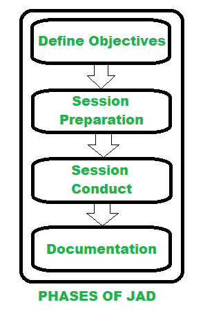

# 了解联合应用开发

> 原文:[https://www . geesforgeks . org/understance-joint-application-development/](https://www.geeksforgeeks.org/understanding-joint-application-development/)

**联合应用开发简而言之，JAD** 是用于设计和开发基于计算机的系统/解决方案的过程。它根据业务需求并排收集需求，同时为公司开发新的信息系统，这意味着 JAD 让客户或最终用户参与设计和开发过程。它还包括通过一系列称为 JAD 会议的协作研讨会来提高规范质量和用户参与度的方法。由于客户参与了整个开发过程，它导致更快的开发时间和更大的客户满意度。

**联合应用开发历史:**

联合应用程序开发是由克里斯·莫里斯和托尼·克劳福德在 20 世纪 70 年代末开发的，旨在提高客户满意度。在 20 世纪 80 年代，他们举办了各种研讨会来证明这个项目，从那以后，它被应用于许多工业部门，产生了优秀的产品。

**JAD 的参与者:**

有许多关键的利益相关者参与了 JAD 过程。这些是:

1.  **执行流程:**
    该流程来自客户方，包括项目经理、首席信息官、首席执行官或 CISO，他们有权就项目做出决策。
2.  **主持人:**
    此人负责创建、管理和执行 JAD 活动，最大限度地减少分歧，鼓励最终用户参与，保持专注和公正的方法。
3.  **IT 代表:**
    这个人提供技术建议，帮助团队开发技术模型，并构建最终结果的原型。他们必须接近并支持客户根据需求将他们的可视化转化为模型，发展对最终用户业务目标的理解，在信息技术功能中表现出来，提供本质上负担得起的最终解决方案等。
4.  **最终用户:**
    这个关注的人通常是 JAD 的主要关注点。它们提供适当的业务知识和策略，说明受开发影响的所有关键用户组，并代表组织内的多个级别。
5.  **Scribe :**
    此人负责准确有效地记录 JAD 流程和 JAD 会话。他们通常在每次 JAD 会议中充当合作伙伴和促进者，并为评审提供参考。
6.  **观察者:**
    观察者将观察每个 JAD 会话，并将为最终用户需求和 JAD 会话决策收集知识，仅与 JAD 会话之外的 JAD 参与者进行交互。

下图说明了 JAD 的不同阶段

**JAD 会议:**

*   JAD 会议必须有明确的目标和议程项目。要确保技术和商业界以及做笔记的人都有关键人物在场。
*   为了推动会议，问题和项目是讨论的本质，除了快速回答，我们不应该去哪里。此外，我们应该提出问题，记录重要项目，并分配行动项目。
*   JAD 会议的目的是激发创造性思维，从而引发联合讨论，这需要各部门的专业知识。
*   团队应该互相帮助做决定。如果团队不能做出决定，那么我们需要运行安排好的 JAD 会议，称为 JAD 研讨会。
*   我们知道大多数的 JAD 会议都安排在开发阶段，它可能发生在项目需求期间。

**联合应用开发优势:**

以下是 JAD 的一些主要优势:

1.  从客户的角度设计产品。
2.  公司和客户之间的团队合作有助于消除所有风险。
3.  由于相互作用密切，进展更快。
4.  JAD 有助于加速设计，也有助于提高质量。
5.  JAD 鼓励团队互相推动，这使他们更快地工作，并按时交付。

**联合应用开发面临的挑战:**

1.  有时团队成员之间的意见可能会有所不同，这使得协调目标和保持专注变得困难。
2.  根据项目的规模，在 JAD 中，人们可能要花费大量的时间。

联合应用程序开发(JAD)可能不是组织所需要的答案，但它提供了一个比其他同类产品更具包容性和流动性的环境。JAD 被用作项目系统开发早期阶段的一种技术，用于开发业务系统需求。JAD 的目的之一是将管理信息系统和最终用户聚集在一个结构化的研讨会中，这是由经验丰富的 JAD 主持人和定制的日程安排来完成的，以帮助参与者完成高质量的需求。还可以看到，JAD 过程最大限度地减少了开发时间、成本和错误。