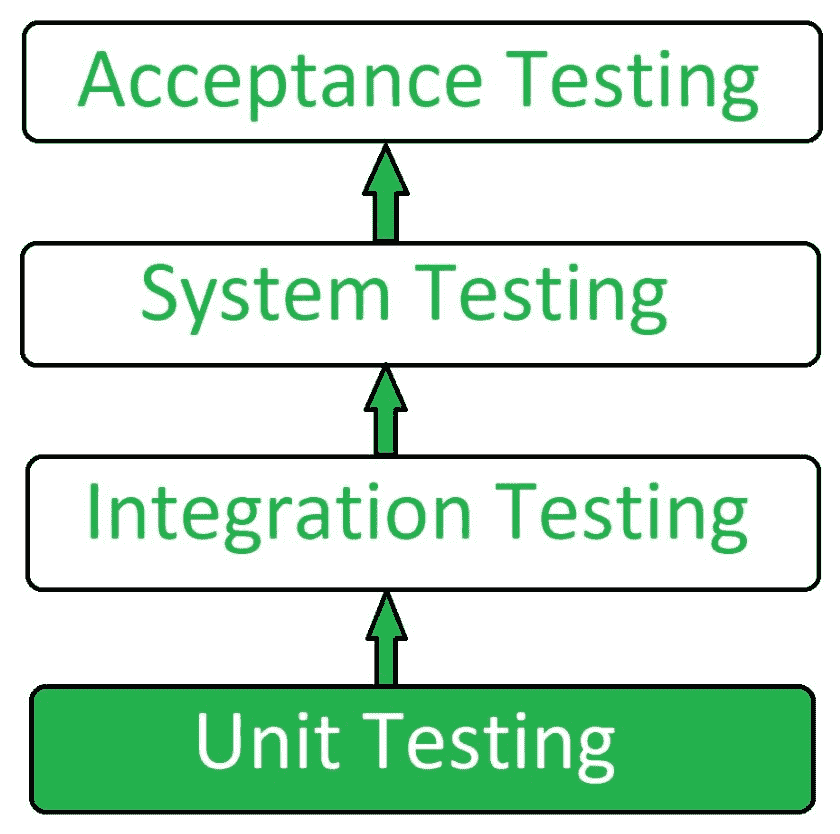
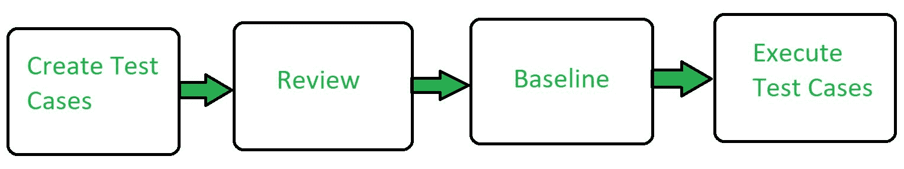

# 单元测试|软件测试

> 原文:[https://www . geesforgeks . org/unit-testing-software-testing/](https://www.geeksforgeeks.org/unit-testing-software-testing/)

先决条件–[软件测试的类型](https://www.geeksforgeeks.org/types-software-testing/)
**单元测试**是一种软件测试技术，通过这种技术来测试软件的各个单元，即一组计算机程序模块、使用程序和操作程序，以确定它们是否适合使用。这是一种测试方法，使用它来测试每个独立的模块，以确定开发人员自己是否有任何问题。它与独立模块的功能正确性相关。

单元测试被定义为一种软件测试类型，其中软件的各个组件都被测试。
软件产品的单元测试是在应用程序开发过程中进行的。单个组件可以是单个函数或过程。单元测试通常由开发人员执行。

在 SDLC 或 V 模型中，单元测试是集成测试之前完成的第一级测试。单元测试是一种通常由开发人员执行的测试技术。虽然由于开发人员不愿意测试，质量保证工程师也做单元测试。

**单元测试的目标:**
单元测试的目标是:

1.  隔离一段代码。
2.  验证代码的正确性。
3.  测试每个功能和程序。
4.  在开发周期的早期修复 bug 并节省成本。
5.  帮助开发人员理解代码库，并使他们能够快速进行更改。
6.  帮助代码重用。

**单元测试类型:**
单元测试有 2 种类型:**手动**、**自动**。

**单元测试工作流程:**

**单元测试工具:**
下面是一些常用的单元测试工具:
1。
2。Junit
3。NUnit
4。EMMA
5。PHPUnit

**单元测试的优势:**

*   单元测试允许开发人员了解单元提供了什么功能，以及如何使用它来获得对单元应用编程接口的基本理解。
*   单元测试允许程序员细化代码并确保模块正常工作。
*   单元测试可以测试项目的一部分，而无需等待其他部分完成。