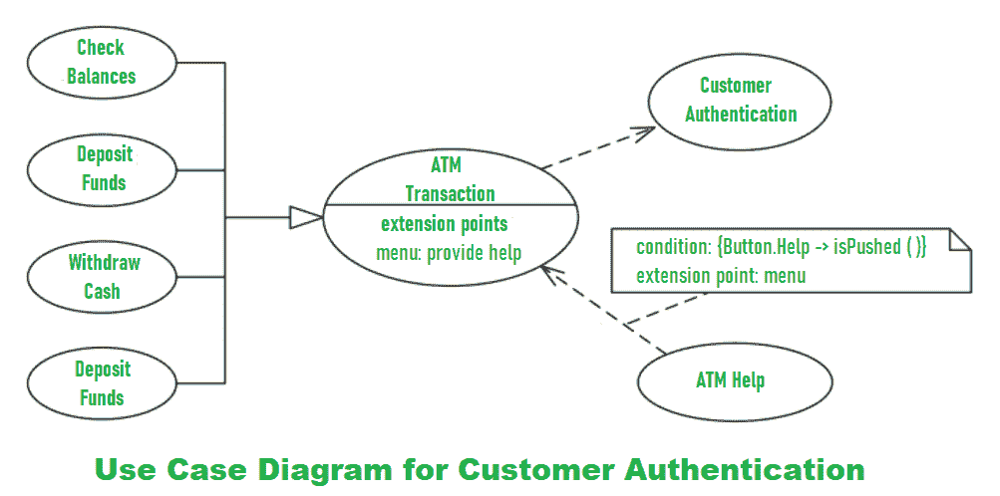
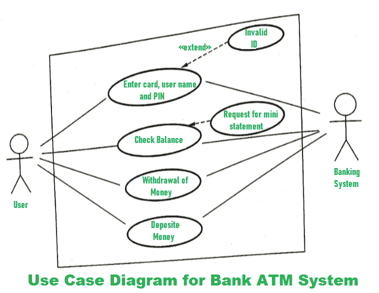
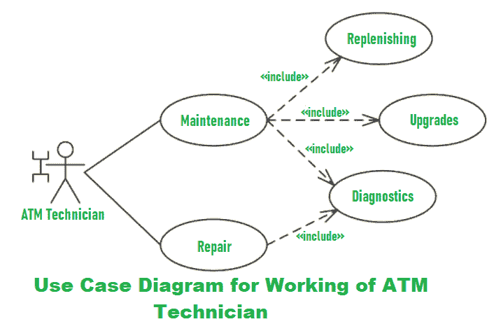

# 银行 ATM 系统用例图

> 原文:[https://www . geesforgeks . org/银行 atm 系统用例图/](https://www.geeksforgeeks.org/use-case-diagram-for-bank-atm-system/)

**自动柜员机(ATM)** 又称 ABM(自动银行机)是一种银行系统。该银行系统允许客户或用户进行金融交易。这些交易可以在公共场所进行，不需要店员、出纳员或银行出纳员。借助**用例图**，可以解释自动柜员机的工作和描述。

我们将了解自动柜员机系统用例图的设计。系统的一些场景如下。

*   **Step-1:**
    The user is authenticated when enters the plastic ATM card in a Bank ATM. Then enters the user name and PIN (Personal Identification Number). For every ATM transaction, a Customer Authentication use case is required and essential. So, it is shown as include relationship.
    Example of use case diagram for Customer Authentication is shown below:

    

*   **Step-2:**
    User checks the bank balance as well as also demands the mini statement about the bank balance if they want. Then the user withdraws the money as per their need. If they want to deposit some money, they can do it. After complete action, the user closes the session.
    Example of the use case diagram for Bank ATM system is shown below:

    

*   **Step-3:**
    If there is any error or repair needed in Bank ATM, it is done by an ATM technician. ATM technician is responsible for the maintenance of the Bank ATM, upgrades for hardware, firmware or software, and on-site diagnosis.
    Example of use case diagram for working of ATM technician is shown below:

    