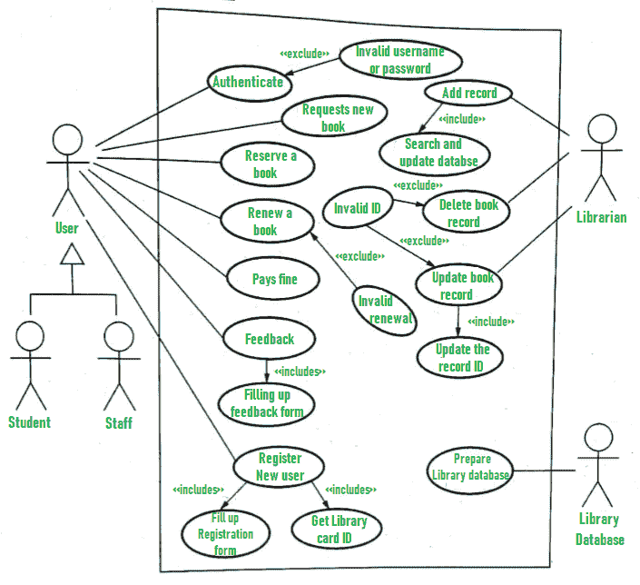

# 图书馆管理系统用例图

> 原文:[https://www . geesforgeks . org/库管理系统用例图/](https://www.geeksforgeeks.org/use-case-diagram-for-library-management-system/)

**用例图**称为行为模型或图。它只是描述和显示用户或客户与应用服务或系统的提供者之间的关系或交互。它描述了一个系统与系统的一个或多个用户协作完成的不同动作。用例图现在被大量用于管理系统。

在这里，我们将了解库管理系统的设计用例图。系统的一些场景如下:

1.  最初将自己注册为新用户的用户被视为图书馆系统的工作人员或学生。
    *   为了让用户注册为新用户，用户需要填写注册表单。
    *   注册后，图书管理员会向用户发放图书证。在借书证上，身份证被分配给持卡人或用户。
2.  拿到借书证后，用户按要求索取一本新书。
3.  在请求之后，用户预订了期望的书或请求的书，这意味着没有其他用户可以请求该书。
4.  现在，用户可以续借一本书，这意味着如果用户已经续借了，用户可以获得想要的书的新到期日。
5.  如果用户不知何故忘记在到期日之前还书，那么用户就要支付罚款。或者如果用户忘记续借书到到期日，那么书就会过期，用户就要支付罚款。
6.  如果用户愿意，可以填写反馈表。
7.  图书管理员在这个系统中起着关键作用。图书管理员会在图书馆数据库中添加每一个学生或用户的记录，无论是每次出书、还书还是支付罚款。
8.  图书管理员还会删除某个学生的记录，如果这个学生离开了学校或者从学校昏倒了。如果该书不再存在于图书馆中，那么该特定书的记录也将被删除。
9.  更新数据库是图书馆员的重要角色。