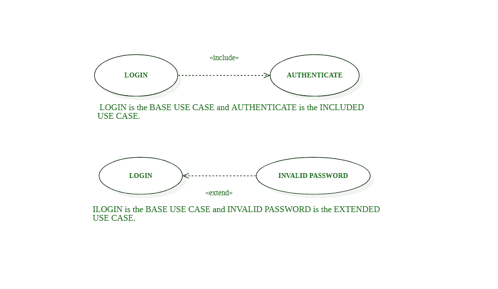
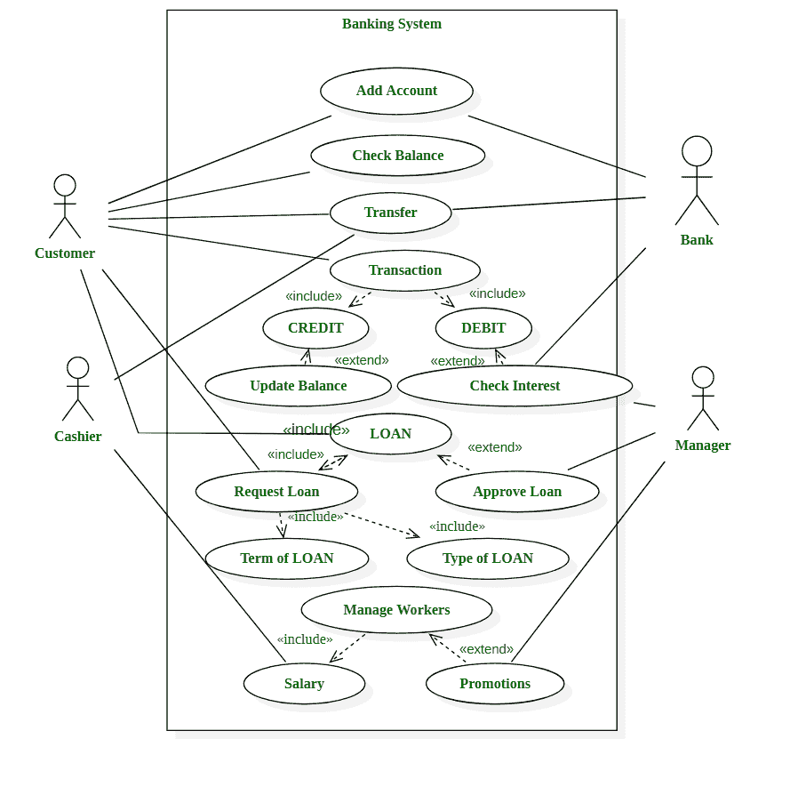

# 网银系统用例图

> 原文:[https://www . geesforgeks . org/网上银行系统用例图/](https://www.geeksforgeeks.org/use-case-diagram-for-online-banking-system/)

用例图是一个**的 UML 图，其中每个用例从最终用户和关系的角度规定了软件的预期行为，并提供了关于用例、参与者和系统之间交互的不同组件的简要概述。用例图用于准备、呈现和理解系统的功能需求。用例图指定了正在开发的软件的确切上下文。它没有指定必须执行操作的顺序。每个用例代表系统的功能，它可以是过程自动化的，也可以是手动的。**

**<u>区别</u> **<u>< <包括> ></u>** <u>和</u> **<u>< <延伸> ></u>** <u>中</u> **<u>使用案例图:</u>****

*   *****< <包含> >*** 扩展了**基本用例**，并规定**包含用例**必须成功运行才能完成基本用例。如果没有包含的用例，基本用例是不完整的。包含的用例可以是基本用例本身，也可以由许多不同的基本用例共享。** 
*   *****< <扩展> >*** 另一端，用于添加**扩展用例**，扩展**基础用例。**基本用例甚至可以在不调用/调用被称为可选用例的扩展用例的情况下成功运行。基本用例本身是完整的，但是在某些条件下，它需要引用扩展条件。**

**<<include>>和<<extend>>的表示如下:-</extend></include>**

****

**用户必须提供适当的详细信息才能安全登录。每次尝试登录时，软件都必须检查和验证详细信息。这里登录是基本用例，认证是**包含用例**。**

**如果用户输入适当的详细信息，则允许用户登录。但是，如果用户输入的详细信息不正确，软件必须能够捕捉并向用户显示问题，并允许用户重新输入详细信息。因此，登录是一个完整的用例。但是，在某些情况下，它可能会使用对应于无效密码的操作。这里登录是基本用例，无效密码是**扩展用例**。**

****网银系统用例图如下:****

****

****在这里，我们将尝试理解网银系统用例图的设计。系统的一些可能场景解释如下:****

1.  **客户需要创建一个账户来使用银行提供的服务。银行核实细节并为每个新客户创建新账户。每个客户都是用例图的参与者，网上银行系统提供的添加账户功能就是用例。**
2.  **每个客户都可以检查银行账户中的余额，并发起跨银行不同分支机构转账的请求。收银员是银行的一名员工，负责为顾客提供服务。**
3.  **客户可以执行现金交易，其中客户必须向银行账户增加现金价值或从账户提取现金。可以执行两个或两个中的任一个，即贷方和借方现金，以成功执行一个或多个交易。**
4.  **每次交易成功后，客户可能希望或可能不希望获得行动细节。经理可以检查交易对应的每个账户的利息值，以确保和验证详细信息。**
5.  **客户也可以向银行申请贷款，客户必须在贷款申请中添加适当的详细信息。**
6.  **客户必须根据贷款目的或需求以及偿还贷款的期限或期限提供贷款类型。**
7.  **银行每个分行的经理可以选择接受或批准贷款，以进一步启动流程，或者根据条款和条件拒绝贷款请求。**
8.  **银行每个员工的记录由银行维护，银行管理银行每个分支机构的所有员工。每个分公司的经理都可以选择给员工发奖金。请注意，每个员工的工资是作为员工管理的一部分支付的，但晋升或奖金可能会也可能不会提供给每个员工。**

**这是网上银行系统用例的完整设计和描述，规定了某些特定用例的<<include>>和<<extend>的使用。</extend></include>**