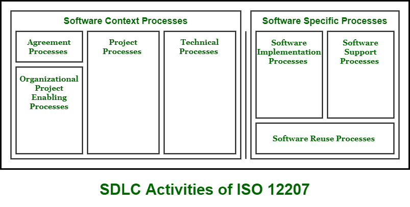

# SDLC 的各种活动

> 原文:[https://www . geesforgeks . org/各种-活动-of-SDLC-软件-开发-生命周期/](https://www.geeksforgeeks.org/various-activities-of-sdlc-software-development-life-cycle/)

[软件开发生命周期(SDLC)](https://www.geeksforgeeks.org/software-development-life-cycle-sdlc/) 顾名思义，是软件行业用来设计、开发和测试高质量软件的整个项目的蓝图或过程。这个蓝图或过程包括一些常见的阶段，如需求收集和分析、软件设计、编码和实现、测试、开发和维护。SDLC 的主要目标是实现和生产高质量的软件，满足客户的要求和期望，在给定的时间和成本估计内完成。

国际标准组织是生命周期过程的国际标准。它旨在定义定义开发和维护软件系统所需的所有过程的主要标准。

ISO 12207 社会发展中心的活动如下:

1.  **协议流程–**
    协议流程一般是为了简单地在两个组织之间建立协议而进行的。在这组过程中，执行了许多重要的任务，如需求分析、定义系统范围、找出系统开发的限制。
2.  **组织项目启动流程–**
    组织项目启动流程是一组定义和维护生命周期模型和程序的流程，供组织在国际标准范围内使用。
3.  **项目流程–**
    在此阶段，项目描述涉及规划、评估和控制。有两类过程——项目管理过程和项目支持过程。这是决策管理过程、风险管理过程、配置管理过程工作的阶段。
4.  **技术流程–**
    这是一个阶段，在这个阶段，一组流程工作来定义系统的需求，分析需求，并将需求转化为有效的设计。
5.  **软件实现过程–**
    在这个阶段，一组过程用于产生在软件中实现的特定系统元素。因此，软件产品或服务就是在这个阶段开发的。
6.  **软件支持流程–**
    该阶段包含一套流程，包括文档管理流程、质量保证流程、软件验证流程等。这些过程作为开发的软件系统的支持过程。
7.  **软件复用过程–**
    存在某些过程，例如领域工程过程、复用程序管理过程，它们充当软件复用过程。