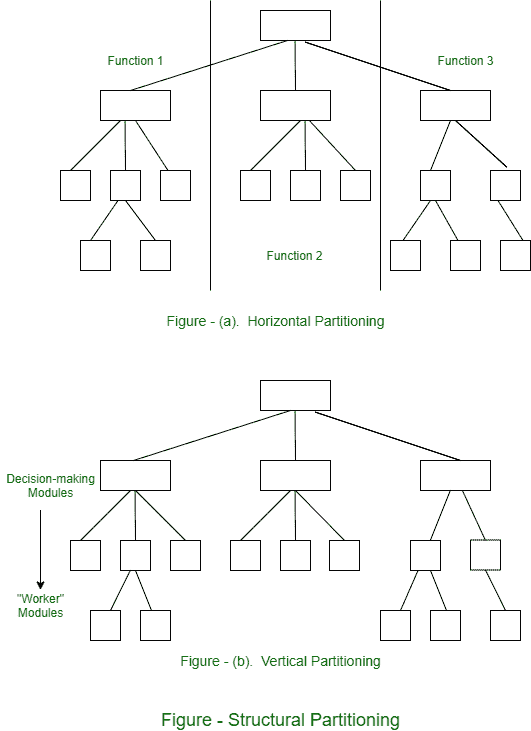

# 各种划分方法

> 原文:[https://www . geeksforgeeks . org/各种分区方法/](https://www.geeksforgeeks.org/various-approaches-of-partitioning/)

如果系统具有层次结构，程序结构可以很容易地在水平和垂直方向上划分**和**，图(a)代表了这个视图。

在给定的图(a)中，水平划分为每个主要程序功能定义了模块化层次结构的各个分支。控制模块(由矩形显示)用于协调任务之间的通信。这三个分区在简单的水平分区中完成，即输入、数据转换(处理)和输出。

**水平分区**提供了以下好处–

1.  易于测试的软件。
2.  易于维护的软件。
3.  副作用更少的传播。
4.  软件，可以轻松扩展。

另一方面，**垂直分段**，也称为“因子分解”，表示控制和功能必须分布在程序结构中，从上到下。顶层模块必须执行控制功能，并且在结构中执行较少的模块是费力的，执行所有的输入、处理和输出任务。

图(b)表示垂直分区。由于程序结构变化的性质，需要垂直分段。观察图(b)，可以说控制模块的改变会使其下属更容易引起副作用的扩散。一般来说，变化是-对输入、计算或转换以及输出的变化。

程序的基本行为不太可能改变。这就是为什么，垂直分区的结构不太容易受到变化带来的副作用的影响，因此更容易维护，这是它的关键质量因素。