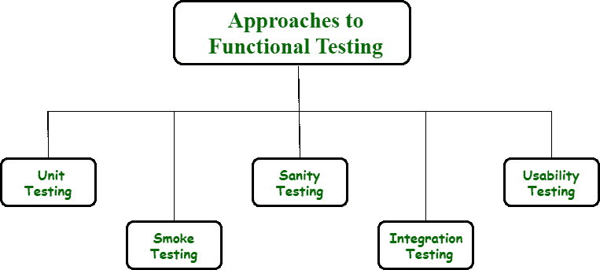

# 功能测试的各种方法

> 原文:[https://www . geesforgeks . org/各种功能测试方法/](https://www.geeksforgeeks.org/various-approaches-to-functional-testing/)

[功能测试](https://www.geeksforgeeks.org/software-testing-functional-testing/)是对产品进行质量保证的过程，在这个过程中，质量得到检查和保持。该测试通常用于检查和验证软件应用程序的正常运行，即检查软件应用程序是否按照设计规范以正确的方式正常运行。

在测试过程中，我们只需检查核心应用程序功能、文本输入、菜单功能等。在这些类型的测试中，主要目的是集中精力满足客户要求。通过提供正确的输入、验证或检查输出以及将获得的结果与预期结果进行比较来测试软件系统的每个功能。

**功能测试方法:**

1.  **[【单元测试】](https://www.geeksforgeeks.org/unit-testing-software-testing/)–**
    单元测试顾名思义就是单独测试一个软件单元的功能。单元可以是模块、类、组件、元素、单个函数、方法或过程。这种类型的测试在软件开发生命周期开始时检测错误或 bug 或缺陷非常有用。单元测试降低或减少了软件开发的总成本和开发时间。可以进行两种类型的单元测试，即手动和自动。
2.  **[冒烟测试](https://www.geeksforgeeks.org/smoke-testing-software-testing/)–**
    该测试的主要目的包括检查软件系统的大多数关键、重要和重要功能是否正常工作。这个测试的结果决定了程序的演示或预发布版本(也称为“构建”)对于进一步的测试过程是否稳定。它只是检查系统的稳定性，由开发人员和测试人员共同执行。这就是为什么冒烟测试也被称为构建验证测试。
3.  **[【健全性测试】](https://www.geeksforgeeks.org/sanity-testing-software-testing/)–**
    该测试的主要目的包括仅关注应用程序的新功能领域，无论它们是否正常工作以及错误是否得到修复。这种测试是在从 smoke 测试接收到软件构建后进行的，代码或功能上的微小变化会检查 bug 或错误是否被修复，以及是否有任何其他由于变化而产生的问题。这种类型的测试只由测试人员完成。
4.  **[集成测试](https://www.geeksforgeeks.org/software-engineering-integration-testing/)或[回归测试](https://www.geeksforgeeks.org/software-engineering-regression-testing/)–**
    该测试的主要目的包括检查和检测两个软件单元或模块或应用的集成单元之间的交互是否存在任何错误或缺陷。它将应用程序作为一个整体或一组进行测试。它揭示了集成单元之间交互的故障或缺陷。
5.  **[可用性测试](https://www.geeksforgeeks.org/usability-testing/)–**
    本次测试的主要目的包括确保用户对应用的满意度以及用户使用系统应用的难易程度。它识别在使用软件应用程序时是否有任何问题。