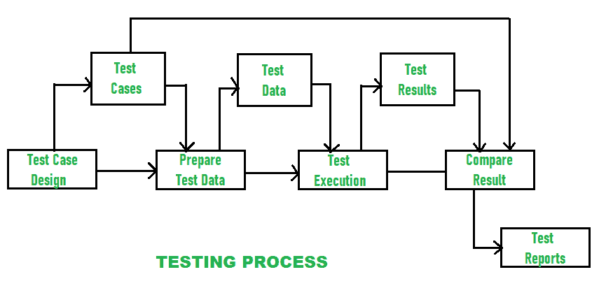

# 软件测试的各个方面

> 原文:[https://www . geesforgeks . org/各方面软件测试/](https://www.geeksforgeeks.org/various-aspects-of-software-testing/)

[软件测试](https://www.geeksforgeeks.org/software-testing-basics/)是[软件开发](https://www.geeksforgeeks.org/software-development-life-cycle-sdlc/)非常重要的一部分。

软件测试通常包括测试软件功能，以确定开发的软件是否满足用户和开发人员的要求，并确定是否存在任何缺陷或风险。通过软件测试，缺陷可以被移除，然后软件将是无缺陷的，并且可以生产或开发高质量的产品。

软件测试标准基于两个基本属性–

1.  **可靠性:**
    如果所有的测试用例都检测到同一套错误，那么只有一个测试标准是可靠的。软件是否无故障和可靠是通过可靠性测试来保证的。
2.  **有效性:**
    有效性测试确保产品或软件是否真正满足客户或用户的需求。如果程序中有任何错误，那么只有一个测试标准是有效的。

对于测试标准，有一个重要的定理——“如果满足测试标准的需求成功，则测试标准有效可靠，则程序不包含错误。”

各种测试活动如下所示:

1.  **测试计划–**
    准备好测试计划或测试脚本。为了分析文档(对于黑盒)和程序代码(对于白盒)的需求，生成测试计划。
2.  **测试用例设计–**
    创建一套在测试软件时有效的测试是测试用例设计的最终目标。
3.  **测试执行–**
    为了得到测试结果，通过各种测试用例来推导测试数据。
4.  **数据收集和比较–**
    测试结果的收集和验证是否完整和正确。
5.  **有效评估和报告生成–**
    上述所有测试活动都在软件模型上执行，并确定了最大错误数。测试报告的生成有助于我们处理错误，并找到减少错误的有效方法，以获得高质量的产品。