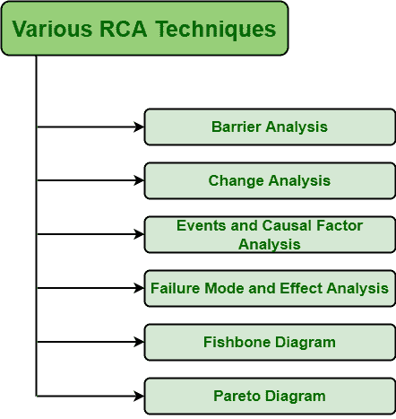

# 各种 RCA 技术

> 原文:[https://www.geeksforgeeks.org/various-rca-techniques/](https://www.geeksforgeeks.org/various-rca-techniques/)

[根本原因分析(RCA)](https://www.geeksforgeeks.org/basic-principle-of-root-cause-analysis/) 是一种反应式方法，用于检测问题，然后解决问题。人们需要明白，解决问题的最好方法是解决或消除问题的根源，而不是解决问题或缺陷的症状。消除根本原因只会导致特定问题的最小化。现在有各种各样的 RCA 技术，对各种组织都有好处。下面给出了一些技巧–

*   **[屏障分析:](https://www.geeksforgeeks.org/basic-elements-of-barrier-analysis/)**
    屏障分析，顾名思义，是一种用于调查对目标产品有负面影响的途径的技术。它只是分析了为什么以及如何壁垒没有阻止能源流动造成负面影响。它只是一个模型或技术，被几个组织用来了解为什么会出现缺陷，以及如何防止再次发生。它适用于基于安全性的 RCA，但也可用于其他不同的问题。它特别用于加工工业。
*   **变更分析:**
    变更分析，顾名思义，是一种用于将发生的变更与不存在或发生变更的情况进行比较的分析类型。在这里，变化被认为是一个问题或缺陷。变化仅仅是由于问题或缺陷引起的。因此，变更分析只是确定问题的内容、位置、方式和程度，然后将其与不存在特定缺陷的条件或情况进行比较。
*   **事件和因果因素分析:**
    事件和因果因素分析，顾名思义，是一种常用于事故和其他重大事件的技术。简而言之，这种分析技术只是分析导致事件的事件，并确定每个事件可能的因果和促成因素。

*   **故障模式及影响分析(FMEA) :**
    FMEA 基本上是一个分析系统过程或产品中故障的系统工程过程。这样做只是为了识别系统或产品设计过程中可能存在的故障。在这种情况下，缺陷或问题会根据其严重性进行优先排序。*   **鱼骨图:**
    鱼骨图又称**石川图**，是头脑风暴时基本使用的手法。与其他高度复杂和困难的方法相比，这种方法简单且不太复杂，是最好的方法之一。在该技术中，分析了问题或缺陷的可能影响或原因。*   **[帕累托图:](https://www.geeksforgeeks.org/when-to-use-a-defect-pareto-chart/)**
    帕累托图是一种仅用于分析有限数量的缺陷或问题及其原因的技术。它只是说 80%的问题或缺陷仅仅是由于 20 %的问题造成的。因此，它只关注需要解决或消除的主要原因，只是为了解决更多的缺陷或问题。