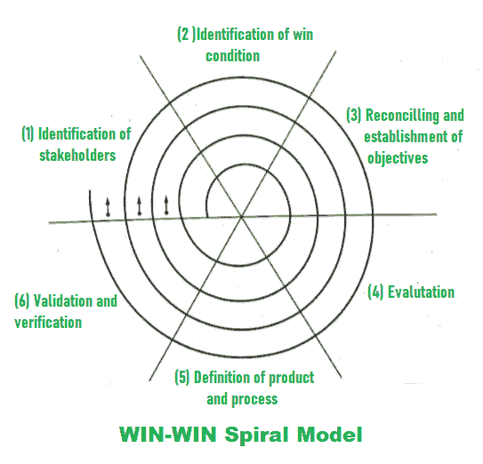

# WIN-WIN 螺旋模型的各个阶段

> 原文:[https://www . geesforgeks . org/各阶段双赢螺旋模式/](https://www.geeksforgeeks.org/various-stages-of-win-win-spiral-model/)

[螺旋模型](https://www.geeksforgeeks.org/software-engineering-spiral-model/)通常显示原型模型的重复性质，并控制线性顺序模型的适当明确的方法。螺旋模型也被称为元模型，因为所有其他过程模型都包含在螺旋模型中。

[瀑布模型](https://www.geeksforgeeks.org/software-engineering-classical-waterfall-model/)也是用螺旋模型的单回路来表示的。为了在实际产品建立之前开发原型，螺旋模型使用原型方法。[进化模型](https://www.geeksforgeeks.org/software-engineering-evolutionary-model/)也受到螺旋模型的支持，因为沿着螺旋的迭代代表进化水平，使用它可以构建一个完整的系统。可以使用原型方法在螺旋模型中降低风险。从瀑布模型来看，采用了系统化的适当开发方法。

为了获得项目需求，客户沟通在螺旋模型中非常重要和必要，WIN-WIN 模型也建议和支持与客户进行良好和适当的沟通。在实际操作中，客户和开发者必须面对简单地意味着妥协的协商过程。当双方都同意时，谈判才会成功。这就是所谓的 WIN-WIN 局面。

*   **Customer’s win means –** 
    Obtaining the system that fulfill most of the requirements of customers. 
*   **Developer’s win means –** 
    Getting the work done by fulfilling the realistic requirements of customers in a given deadline and achievable budgets. 

在螺旋的每个通道的开始，谈判活动以 WIN-WIN 螺旋模式进行。

下图显示了可以在 WIN-WIN 螺旋模型中执行的各种活动–

1.  “利益相关者”的识别。

2.  利益相关者决心尽最大努力实现或获得双赢。

3.  为赢得条件而奋力拼搏的利益相关者的谈判。软件项目团队为双赢的结果而努力。然后确定下一级目标、约束和替代方案。

4.  对过程和产品进行评估，然后分析、解决或降低风险，使之变得容易。

5.  为正常工作定义下一级产品和流程。

6.  必须验证过程和产品定义。

7.  审查产品并给出必要的重要评论。

有三个锚点可以在 WIN-WIN 螺旋模型中定义，如下所示–

1.  **生命周期目标(LCO)–**
    LCO 定义了软件工程活动所必需的目标。

2.  **生命周期架构(LCA)–**
    LCA 定义了可以按照设定的所有目标生产的软件架构。

3.  **初始运行能力(IOC)–**
    IOC 代表具有所有初始所需运行能力的软件。