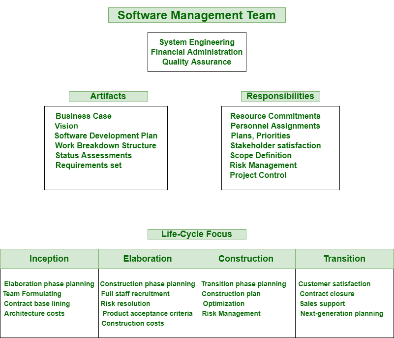
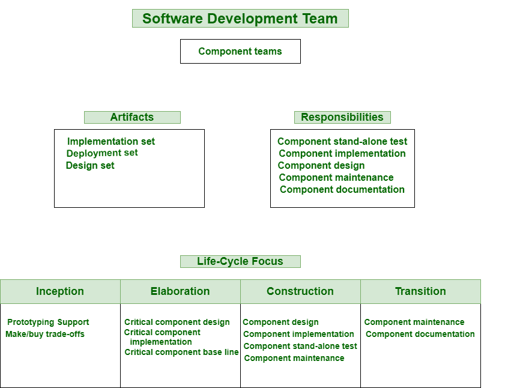
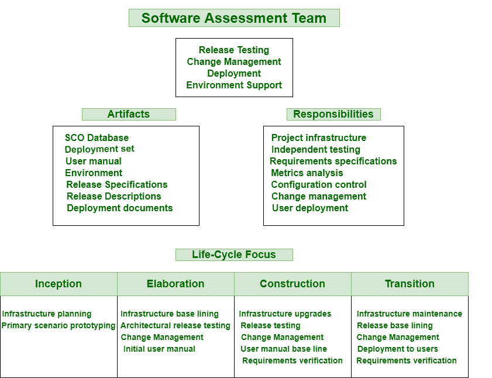

# 项目组织中的各个团队

> 原文:[https://www . geeksforgeeks . org/各种项目团队组织/](https://www.geeksforgeeks.org/various-teams-in-project-organization/)

**项目组织**是由专家单独创建，不同部门工作的项目结构。所有这些人员通常在项目经理的领导下工作。它简单地映射了所有项目级角色和[职责](https://www.geeksforgeeks.org/project-organizations-and-their-responsibilities/)。项目结构可以根据特定项目组织的规模和条件进行修改。

该组织的重要特点如下:

1.  **Software Management Team :**
    The software management team is generally active participant that helps in better collaboration, better production, and better management of software project. They are responsible for resources and processes essential to deliver new software or upgrade existing products.

    

    他们维护功能、质量，改进处理，在不同目标的利益相关者或供应商之间协商合同。这个团队只需掌控质量的所有方面。

2.  **Software Architecture Team :**

    软件架构团队有许多技能，如经验(在软件开发中产生过程视图、组件视图、部署视图，在应用领域中产生设计视图和用例视图)、更好的沟通技能(以便他们能够说服、理解、挖掘真实的问题和难题、说服持怀疑态度的人并销售架构)、目标导向、领导力(必须有一些领导技能，如技术领导力)等。

    

    架构团队共享一个共同的目标或一小组目标，这些目标必须对架构团队和他们的环境明确定义。这通常是架构的责任。

3.  **Software Development Team :**
    Software development team generally apply their knowledge of engineering and of various [programming languages](https://www.geeksforgeeks.org/introduction-to-programming-languages/) in software development. This team consists of designers, software developers, project managers, and tester of greater caliber.

    

    该团队通常包括几个子团队，专门负责需要通用技能集的各种组件组。开发团队只是负责维护单个组件的质量，甚至包括开发、测试和维护的所有组件。

4.  **Software Assessment Team :**
    Software Assessment Team generally examines whether software processes that are used by an organization are effective and efficient in achieving goals or not, simply based on process model.

    

    这个团队确定需要改进的地方，甚至提出改进的计划。确保独立的质量观点和开发活动的并发性是使用独立团队进行软件评估的两个主要原因。现代开发过程应该采用面向用例的测试或者基于能力的测试。