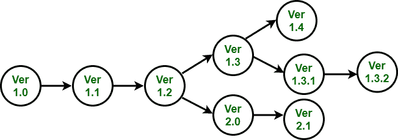

# 软件工程中的版本和发布管理

> 原文:[https://www . geesforgeks . org/version-and-release-management-in-software-engineering/](https://www.geeksforgeeks.org/version-and-release-management-in-software-engineering/)

版本和发布管理中涉及的过程与识别和跟踪系统的版本有关。版本管理器设计程序来确保系统的版本可以在需要时被检索到，并且不会被开发团队意外更改。对于产品，版本经理与营销人员一起工作，对于客户的定制系统，计划何时应该创建系统的新版本，而不是为了部署而分发。

系统实例是系统的一个实例，它可以在某些方面不同于其他实例。系统的不同版本有可能具有不同的功能、增强的性能或修复的软件故障。某些版本在功能上可能是等效的，但设计用于不同的硬件或软件配置。只有微小差异的版本有时被称为**变体。**

系统版本可能是分发给客户的版本。每个系统版本都应该包含新的功能，或者应该面向特定的硬件平台。一个系统的版本通常比发行版多得多。版本是由内部开发或测试组织创建的，并不打算发布给客户。

**版本标识:**
要创建系统的特定版本，您必须指定应该包含在其中的系统组件的版本。在一个大型软件系统中，有数百个软件组件，每个组件可能存在于几个不同的版本中。

因此，必须有一种明确的方法来识别每个组件版本，以确保正确的组件包含在系统中。组件版本识别使用三种基本技术:

*   **版本编号:**
    在版本编号方案中，版本号被添加到组件或系统名称中。如果第一个版本叫 1.0，后续版本就是 1.1、1.2 等等。在某个阶段，会创建一个新版本(版本 2.0)，过程会在版本 2.1 重新开始。该方案是线性的，基于系统版本是按顺序创建的假设。大多数版本管理工具，如 RCS 和 CVS，都支持这种版本识别方法。

*   **基于属性的识别:**
    如果每个版本都由一组唯一的属性来识别，那么很容易添加新版本，这些版本是从任何现有版本派生而来的。这些是使用唯一的属性值集来识别的。它们与它们的父版本共享大部分这些值，因此版本之间的关系得以维护。您可以通过指定所需的属性值来检索特定版本。属性函数支持“上次创建的版本”或“给定日期之间创建的版本”等查询。基于属性的标识可以由版本管理系统直接实现，组件属性保存在系统数据库中。或者，属性识别系统可以构建为隐藏版本编号方案之上的层。
*   **面向变更的标识:**
    每个组件在基于属性的标识中被称为 as，但是还与一个或多个变更请求相关。也就是说，假设组件的每个版本都是响应一个或多个变更请求而创建的。组件版本由应用于组件的一组更改请求来标识。