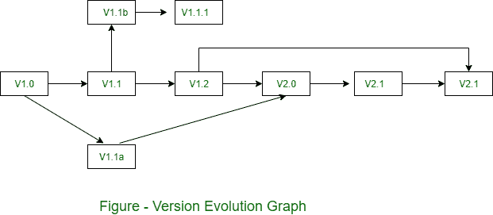

# 项目中的版本控制

> 原文:[https://www.geeksforgeeks.org/version-control-in-project/](https://www.geeksforgeeks.org/version-control-in-project/)

版本控制将过程和工具结合起来，以管理在软件工程过程中创建的不同版本的配置项。

软件版本是软件配置项(源代码、文档、数据)的集合。每个版本可能由不同的变体组成。版本控制活动分为四个子活动-

1.  **Identifying New Versions :**
    A software configuration item (SCI) will receive a new version number when its baseline has changed. Each previous version will be stored in a compatible directory like version 0, version 1, version 2 etc.

2.  **Numbering Scheme :**
    The numbering scheme will have the following format-

    ```
    version X.Y.Z .... 
    ```

    第一个字母(X)表示整个 SCI。因此，对整个配置项所做的更改，或者大到足以保证该项目的全新发布的更改，将导致第一个数字增加。

    第二个字母(Y)表示 SCI 的一个组成部分。如果对一个组件进行了更改或对多个组件进行了小的更改，该数字将依次增加。

    第三个字母(Z)表示 SCI 组件的一部分。只有将的组件分成单独的部分时，此编号才可见。在这种详细程度下所做的更改将需要第三位数字的连续更改。

3.  **Visibility :**
    The version number can be viewed in a frame, or below the title. The decision for this depends on the decision of the group to code all documents for a frame enabled browser or allow for a non-frame enabled browser.
    In either case, the number will always be made available.
4.  **Tracking :**
    The best way to keep track of the different versions list is with the version development graph shown in figure.

    

    例如，如果我们需要跟踪每个更新的项目进度，那么我们可以在每次变更时分配一个版本号。