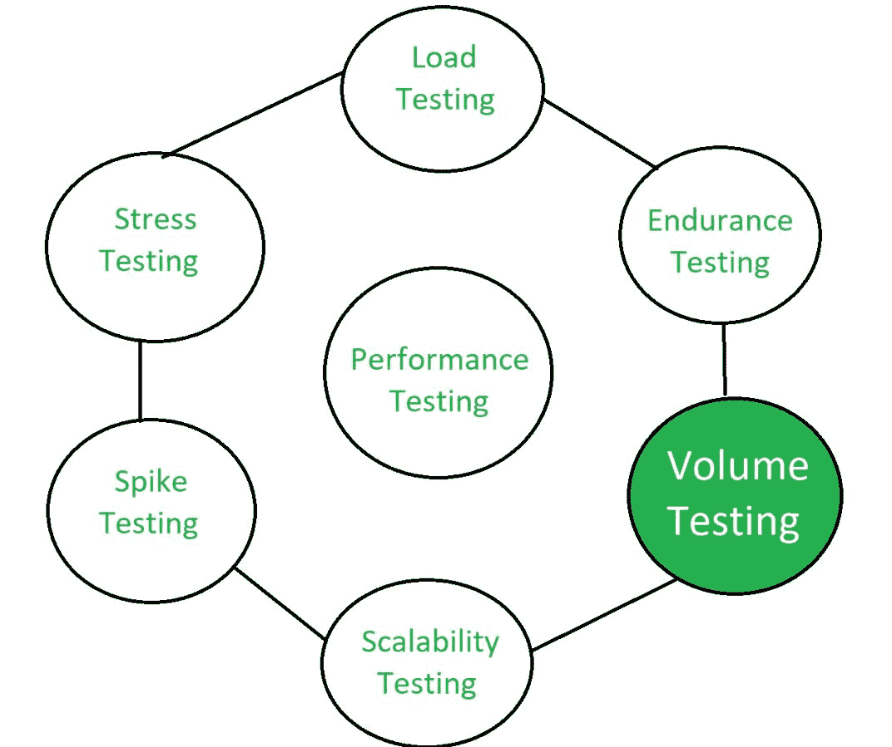

# 容积测试

> 原文:[https://www.geeksforgeeks.org/volume-testing/](https://www.geeksforgeeks.org/volume-testing/)

**批量测试**是一种软件测试，是为了测试一个有一定数据量的软件应用程序而进行的。卷测试中使用的数量可以是数据库大小，也可以是作为卷测试主题的接口文件的大小。

当使用特定的数据库大小测试应用程序时，数据库会扩展到该大小，然后测试应用程序的性能。当应用程序需要与接口文件交互时，这可能是读取或写入文件，也可能是从文件中读取或写入。创建所需大小的示例文件，然后使用该文件测试应用程序的功能，以测试性能。

在批量测试中，大量数据作用于软件。基本上是通过增加数据库中的数据量来分析系统的性能。执行容量测试是为了研究当数据库中的数据量增加时对响应时间和系统行为的影响。

**容积测试**又称**洪水测试**。

**容积测试的特点:**
容积测试的特点如下:

*   随着时间的推移，随着大量数据的超时，软件的性能下降。
*   基本上测试数据是由测试数据生成器创建的。
*   在开发阶段只测试少量数据。
*   测试数据需要逻辑正确。
*   测试数据用于评估系统的性能。

**容量测试的目标:**
容量测试的目标是:

*   认识到大量数据可能带来的问题。
*   通过增加数据库中的数据量来检查系统的性能。
*   找到系统稳定性降低的点。
*   确定系统或应用程序的容量。

**体积测试属性:**
以下是体积测试过程中检查的重要属性:

*   **系统响应时间:**
    在批量测试时，测试系统或应用的响应时间。还测试了系统在有限时间内是否有响应。如果响应时间很长，则重新设计系统。
*   **数据丢失:**
    在卷测试时，也测试了没有数据丢失。如果数据丢失，一些关键信息可能会丢失。
*   **数据存储:**
    在体积测试时，也测试数据是否存储正确。如果数据存储不正确，则在适当的位置进行相应的恢复。
*   **数据覆盖:**
    在批量测试中，测试数据是否被覆盖，而不需要事先给开发者信息。如果是这样，那么开发人员会得到通知。

体积测试是[性能测试](https://www.geeksforgeeks.org/performance-testing-software-testing/)的一种。

**容积测试的优势:**

*   批量测试有助于节省应用程序维护的维护成本。
*   批量测试也有助于快速启动可扩展性计划。
*   批量测试还有助于早期识别瓶颈。
*   批量测试确保系统能够在现实世界中使用。