# VS 代码|用 C++构建、运行和调试

> 原文:[https://www . geesforgeks . org/vs-code-build-run-debug-in-c/](https://www.geeksforgeeks.org/vs-code-build-run-and-debug-in-c/)

在本文中，我们将讨论断点调试所需的 [VS 代码设置](https://www.geeksforgeeks.org/how-to-setup-competitive-programming-in-visual-studio-code-for-c/)。首先创建一个配置 VS 代码的文件 **launch.json** ，在[调试过程](https://www.geeksforgeeks.org/software-engineering-debugging/)开始时启动 [GDB 调试器](https://www.geeksforgeeks.org/gdb-step-by-step-introduction/)。然后创建一个文件 **tasks.json** ，告诉 VS Code [如何构建(编译)程序](https://www.geeksforgeeks.org/compile-32-bit-program-64-bit-gcc-c-c/)。最后，对控制台设置进行一些更改，并实现构建和调试。

**<u>程序</u> :**
下面是演示目的的代码:

## C++

```
// C++ program to find the value of
// the pow(a, b) iteratively
#include <bits/stdc++.h>
using namespace std;

// Driver Code
int main()
{
    int a, b, pow = 1;

    // Input two numbers
    cin >> a >> b;

    // Iterate till b from 1
    for (int i = 1; i <= b; i++) {
        pow = pow * a;
    }

    // Print the value
    cout << pow;
}
```

### <u>Launch.json</u>

该文件与调试器的名称、调试器的路径、当前 CPP 文件的目录以及关于数据的控制台等信息相关。以下是文件**中的代码:**

```
{
    // Use IntelliSense to learn 
    // about possible attributes.
    // Hover to view descriptions 
    // of existing attributes.
    // For more information, visit: 
    // https://go.microsoft.com/fwlink/?linkid=830387
    "version": "0.2.0",
    "configurations": [
        {
            "name": "g++.exe - Build and debug active file",
            "type": "cppdbg",
            "request": "launch",
            "program": "${fileDirname} 
              \\${fileBasenameNoExtension}.exe",
            "args": [],
            "stopAtEntry": false,
            "cwd": "${workspaceFolder}",
            "environment": [],
            "externalConsole": true,
            "MIMode": "gdb",
            "miDebuggerPath": "C:\\MinGW\\bin\\gdb.exe",
            "setupCommands": [
                {
                    "description": "Enable pretty-printing for gdb",
                    "text": "-enable-pretty-printing",
                    "ignoreFailures": true
                }
            ],
            "preLaunchTask": "C/C++: g++.exe build active file"
        }
    ]
}
```

**<u>launch . JSON</u>中的重要术语:**您可以完全使用上面给出的代码，也可以自动使用机器中生成的代码。在这两种情况下，你都必须采取一些预防措施。首先，确保属性**“外部变量”**被标记为真(我们将在本主题后面理解其意义)。然后检查属性**“midebugagepath”**是否正确指向 **gdb 调试器**。让我们详细讨论这些属性:

1.  **名称**和**类型:**这些都是相当不言而喻的，这些都是指发射. json 的名称和类型。
2.  **请求:**说明 **JSON 文件**的类型。
3.  **程序:**存储 **launch.json** 文件所针对的程序的详细地址。
4.  **cwd:** 表示当前工作目录。请注意， **launch.json** 文件中的所有地址都是通用格式，它们并不特定于任何文件。
5.  **外部控制台:**由于无法在 VS Code 的集成终端中处理输入/输出，因此使用外部控制台。所以设置为**真**。
6.  **midebugagepath:**指向调试器的位置，这个会因用户而异。
7.  **预启动任务:**这包含 **tasks.json** 文件的名称。

步骤:

*   转到屏幕左侧的运行选项卡，然后单击运行和调试。

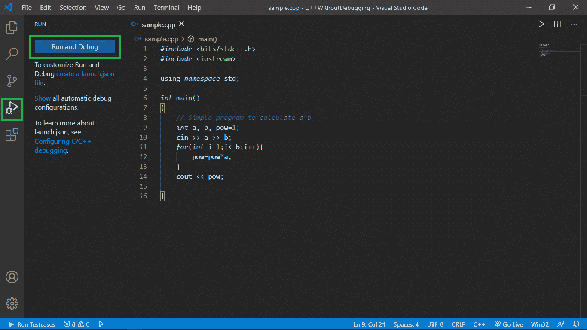

*   您将被要求选择调试器，选择 C++(GDB/LLDB)。*注意只有在您的电脑中安装并配置了 MinGW 时，此选项才会出现。(参考* [*本*](https://www.geeksforgeeks.org/how-to-setup-competitive-programming-in-visual-studio-code-for-c/) *篇安装配置 MinGW)。*

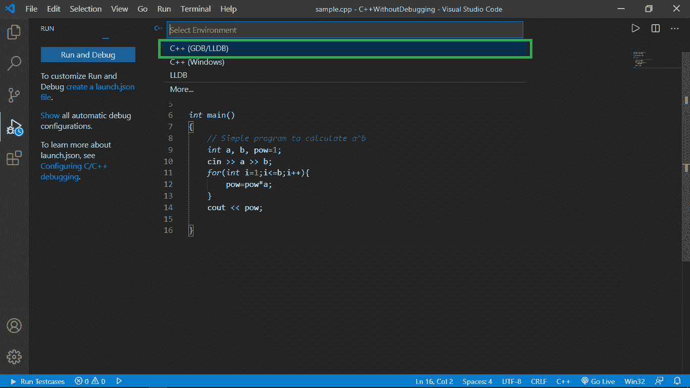

*   然后选择“g++”。exe–构建和调试活动文件”。*指 g++ GNU C++编译器。*

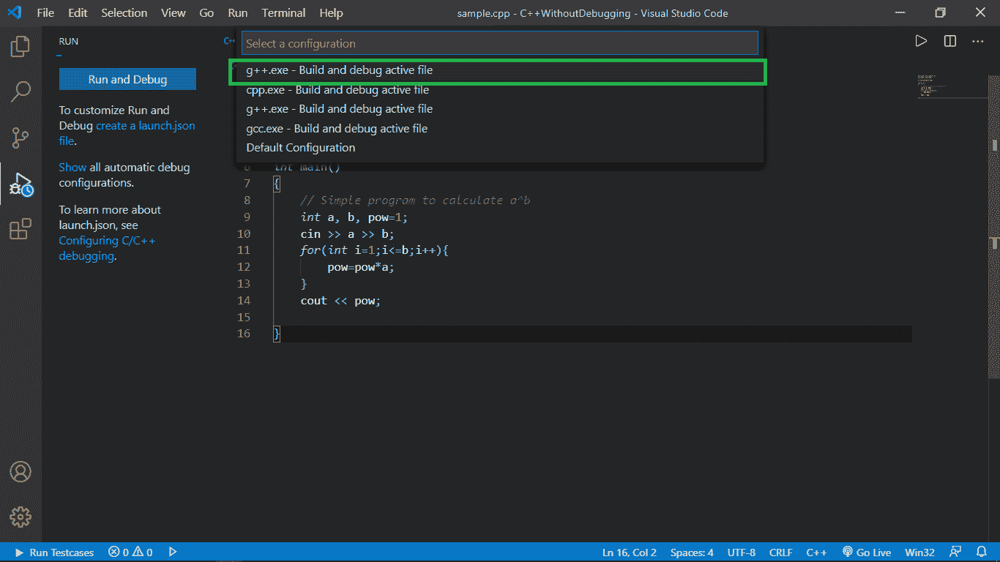

*   之后会出现一个 Launch.json 文件，您可以使用它，也可以使用我上面提供的文件。再次确保 externalConsole 标记为 true，并且 miDebuggerPath 设置正确。

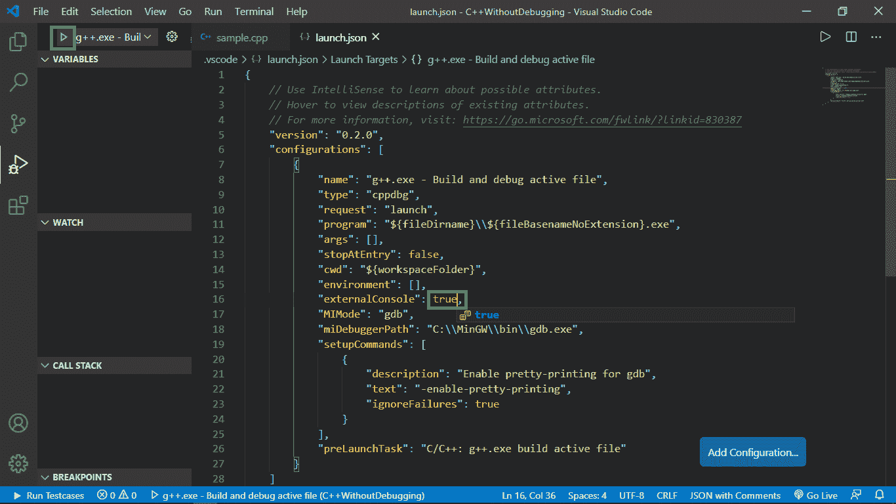

*   之后，点击屏幕左上角的播放按钮，进入 **tasks.json** 文件。

### <u>Tasks.json</u> :

这个文件包含一些信息，比如用于编译的命令、编译器的地址、与 **launch.json** 中相同的标签以及其他一些信息。以下是文件**中的代码:**

```
{
    "version": "2.0.0",
    "tasks": [
        {
            "type": "shell",
            "label": "C/C++: g++.exe build active file",
            "command": "C:\\MinGW\\bin\\g++.exe",
            "args": [
                "-std=c++11",
                "-O2",
                "-Wall",
                "-g",
                "${file}",
                "-o",
                "${fileDirname}
                 \\ ${fileBasenameNoExtension}.exe"
            ],
            "options": {
                "cwd": "${workspaceFolder}"
            },
            "problemMatcher": [
                "$gcc"
            ],
            "group": {
                "isDefault": true,
                "kind": "build"
            }
        }
    ]
}

```

**<u>tasks . JSON</u>中的重要术语:**上面提到的 **tasks.json** 文件完全可以不用谨慎使用。但是，唯一需要注意的是，tasks.json 的*****标签*** **应该与 Launch.json 的*****preLaunchTask*****匹配，下面我们来详细讨论一些术语:****

*   ****标签:**这是 tasks.json 文件特有的，被 launch.json 用来在执行之前调用 tasks.json。**
*   ****命令**:这指向 g++编译器应用程序，因为它将用于编译**
*   ****参数:**这些参数和命令在连接时看起来就像是我们用于编译 CPP 文件和创建可执行文件的命令，如下所示:**

> **g++ STD = c++ 11-O2-wall $ { file }-o $ { filedirname } \ $ { filebasebasebasenameextension }。exe 文件**

****步骤:****

*   **从**启动. json** 的最后一步开始，我们已经点击了左上角的播放按钮，现在出现了一个对话框，显示当前目录中没有 tasks.json 文件。所以我们需要创建一个，所以**点击**配置任务**上的**。**

**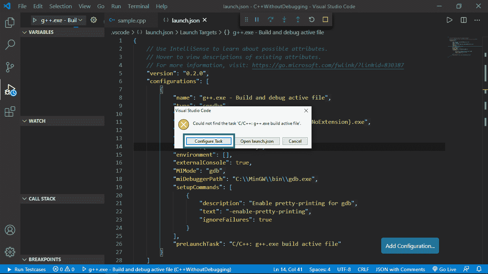**

*   **然后**点击从**模板**创建任务文件。****

**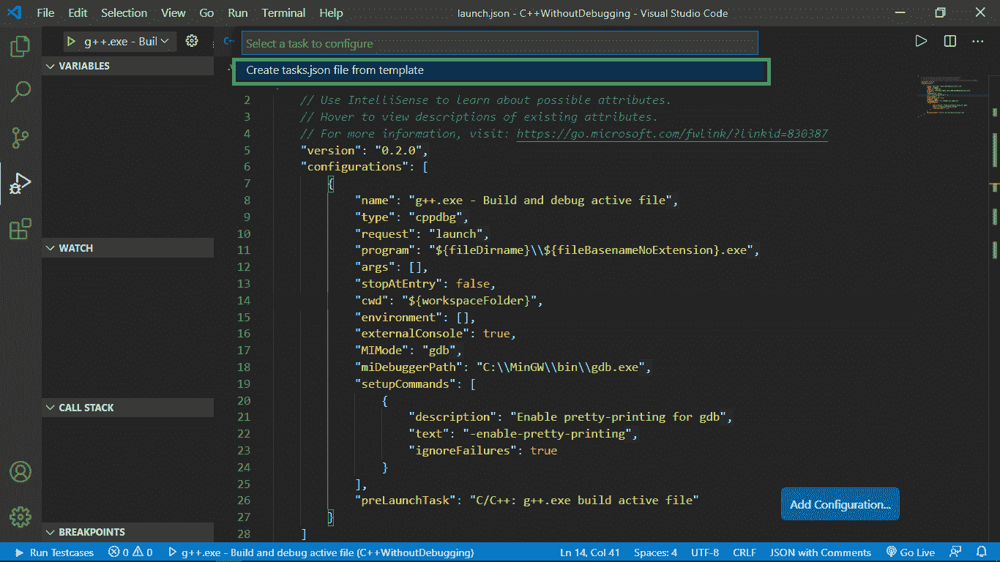**

*   **然后**点击**其他**上的**。**

**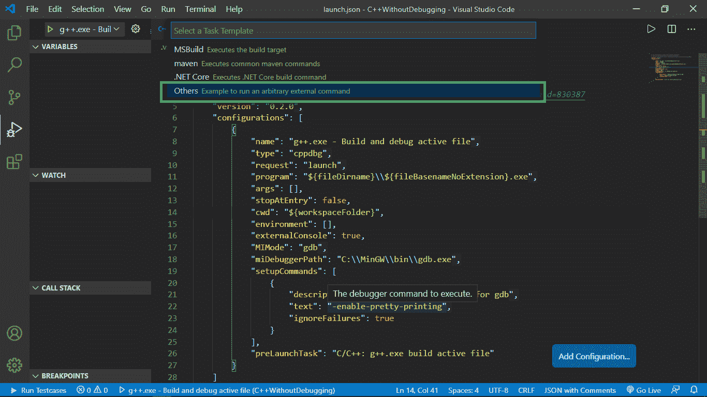**

*   **将上面提供的代码粘贴到新创建的 tasks.json 文件中。在这样做之前，请确保删除现有代码。**

**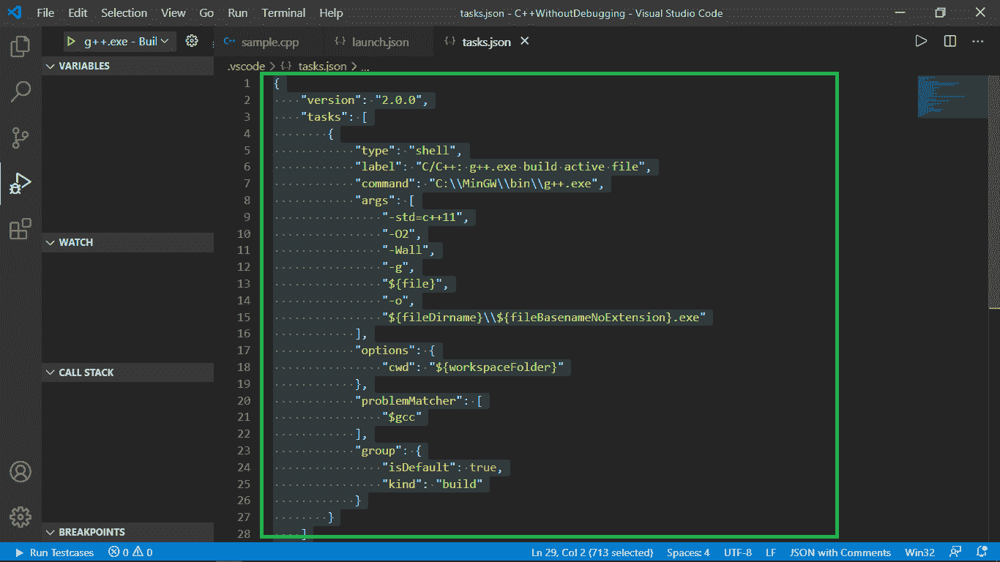**

### ****<u>控制台调整</u>****

****步骤:****

*   **已经提到的一点是**发射中的**外部控制台**必须是**真实的**。****
*   **现在，在我们的程序中包含 **conio.h** 头文件，并在我们的 [main()函数](https://www.geeksforgeeks.org/executing-main-in-c-behind-the-scene/)的最后调用 get-character 方法。这将阻止命令提示符在执行完成后立即消失，以便我们有时间检查输出，直到我们按下任何字符。现在代码变成了:**

## **C++**

```
// C++ program to find the value of
// the pow(a, b) iteratively
#include <bits/stdc++.h>
#include <conio.h>
using namespace std;

// Driver Code
int main()
{
    int a, b, pow = 1;

    // Input two numbers
    cin >> a >> b;

    // Iterate till b from 1
    for (int i = 1; i <= b; i++) {
        pow = pow * a;
    }

    // Print the value
    cout << pow;

    _getch();
}
```

*   **在我们想要检查/调试的某行代码处放置一个红色的**断点**。**
*   **然后我们点击屏幕左上角的播放按钮开始构建。**

**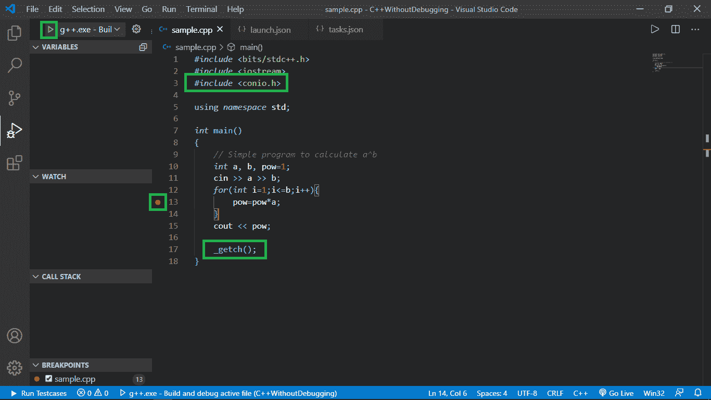**

### ****<u>断点调试</u> :****

****<u>步骤:</u>****

*   **在出现的命令提示符下，我们**输入所需的输入，然后按回车键**。**

****

*   **我们注意到**执行从**开始，它**在提到的**断点**处暂停**。**

**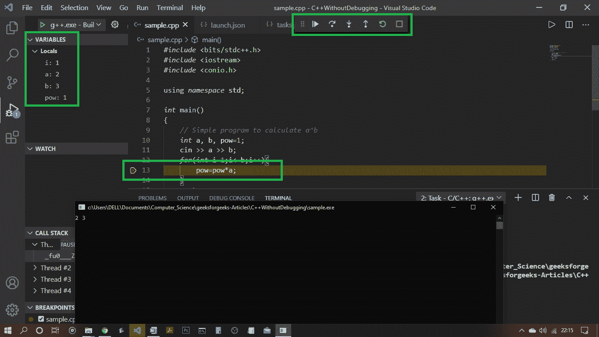**

*   **现在有了一些选择，我们可以继续，跨过，踏入，走出，或者重新开始执行。你可以做任何你想做的事情来调试你的代码。**
*   **另外，请注意屏幕左侧**上执行**时间**时所有变量**的**值。****

**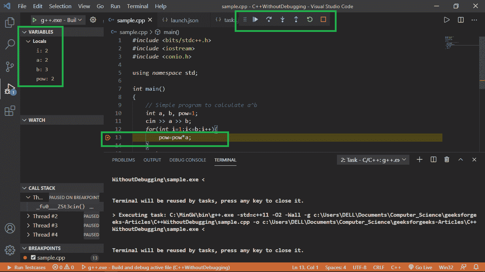**

*   **想调试多少就调试多少，然后**整个执行完毕**后，转到 [**命令提示符**](https://www.geeksforgeeks.org/command-line-arguments-in-c-cpp/) **注意那里的输出**。**

**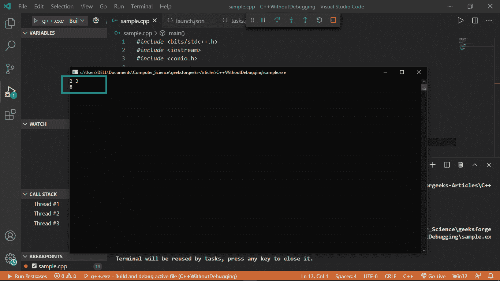**

*   **检查完输出后，按任意键关闭命令提示符。**