# VS 代码| c++编译运行

> 原文:[https://www.geeksforgeeks.org/vs-code-compile-and-run-in-c/](https://www.geeksforgeeks.org/vs-code-compile-and-run-in-c/)

在这篇文章中，我们将学习如何在 **VS 代码**中编译和运行 [C++](https://www.geeksforgeeks.org/c-plus-plus/) 程序。有两种方法，你可以根据自己的方便使用其中任何一种。需要注意的是，大多数有竞争力的程序员使用 C++，因此程序的编译和执行需要快速完成。本文讨论的一些方法几乎使[编译](https://www.geeksforgeeks.org/compiling-a-c-program-behind-the-scenes/)和执行的过程自动化。

**<u>程序</u> :**
下面让代码演示编译和执行:

## C++

```
// C++ program to take the input of
// two numbers and prints its sum
#include <bits/stdc++.h>
using namespace std;

// Driver Code
int main()
{
    int a, b;

    // Input two numbers
    cin >> a >> b;

    // Find the sum
    int sum = a + b;

    // Print the sum
    cout << sum;

    return 0;
}
```

### **<u>使用集成命令行</u> :**

要编译和创建可执行文件，请运行以下命令:

> g++ -std = c++11 -O2 -Wall programName.cpp -o programName.exe

**<u>理解上述命令中的不同术语</u> :**

*   **g++:** 告诉计算机给定的命令是给 g++编译器的。
*   **-std = c++11:** 编译器遵循 c++11 标准，你可以根据你想要使用的设置为-std = c++14 或者-std=c++17。
*   **-O2:** 优化代码
*   **-墙:**显示关于可能错误的警告
*   **programName.cpp:** 是指要编译的 c++文件
*   **-o programName.exe:** 创建一个建议名称的可执行文件(此处为 programName.exe)。

**注意:**CPP 文件和可执行文件的名称不必相同。

**<u>步骤</u> :**

*   将鼠标悬停在**终端选项卡**上，选择**新终端**。

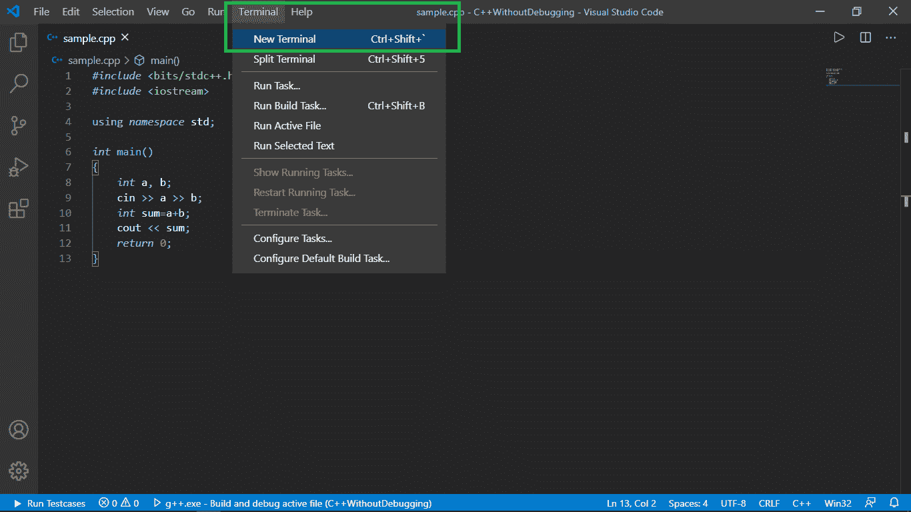

*   命令提示符将以当前目录打开。

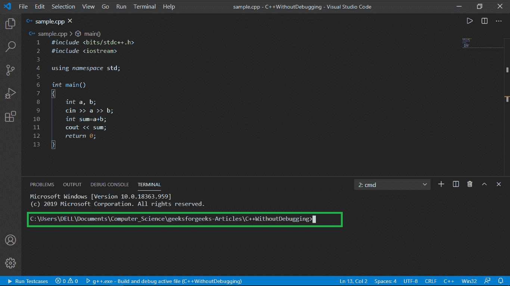

*   用适当的程序名和可执行文件名键入上面给出的语法。

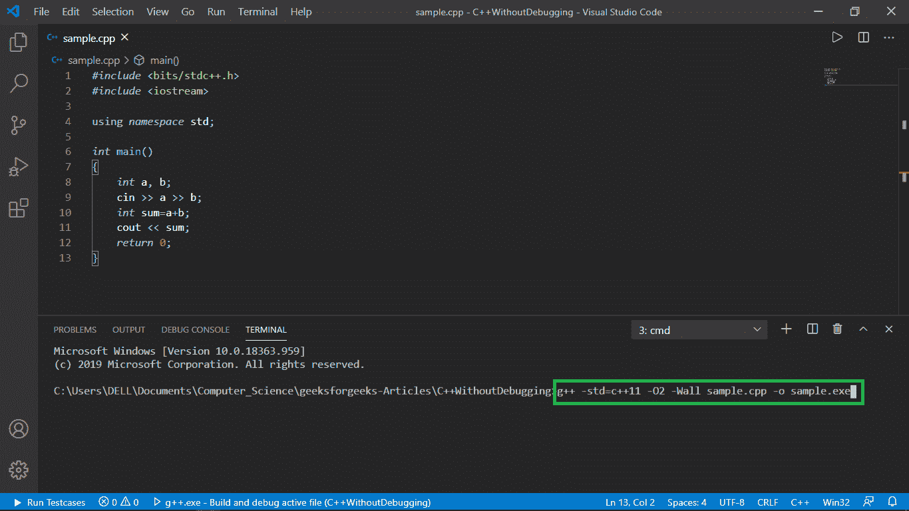

*   按回车键并

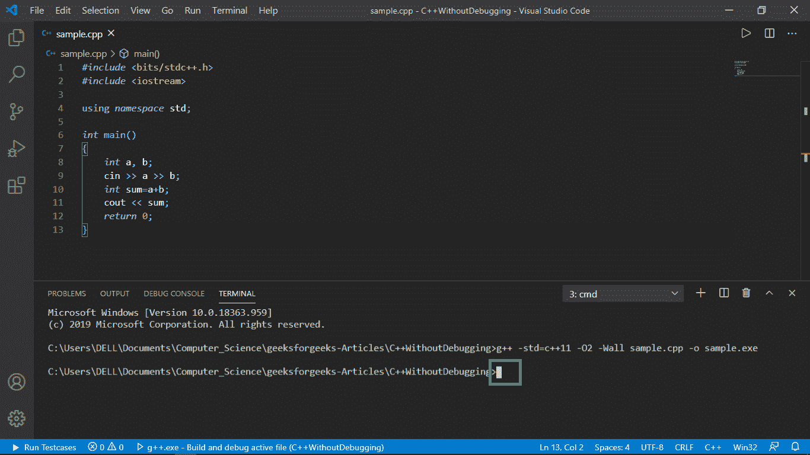

### **<u>方法 1–调用可执行文件并管理输入/输出</u>**

**<u>命令行本身的输入/输出:</u>**

*   传递要运行的可执行文件，然后按回车键。

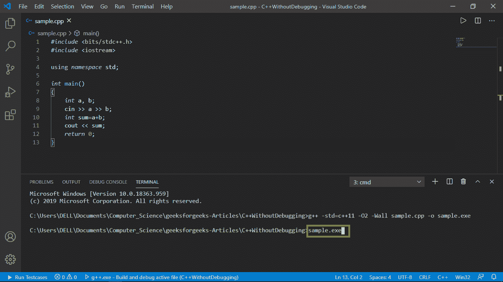

*   键入所需的输入，每个输入用空格分隔，然后按回车键。

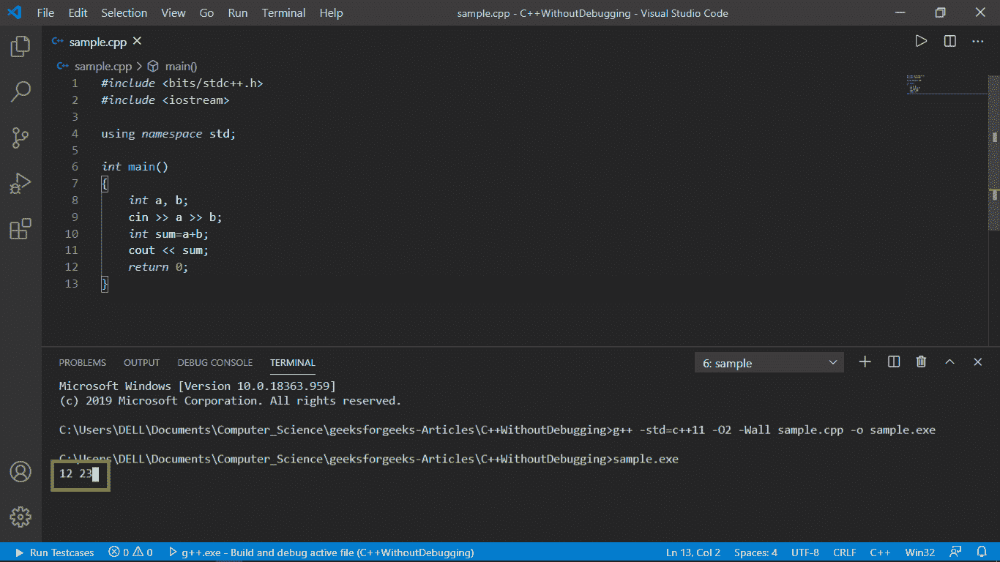

*   所需的输出应显示在命令行的新行中，如下所示。

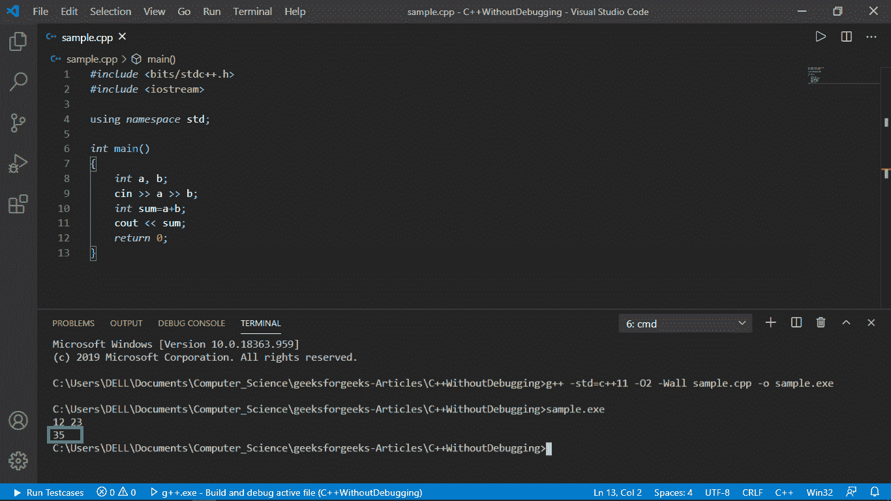

**<u>通过文本文件输入/输出</u> :**

*   创建两个文本文件 **input.txt** 和 **output.txt** 。确保 **input.txt** 包含需要输入的内容。

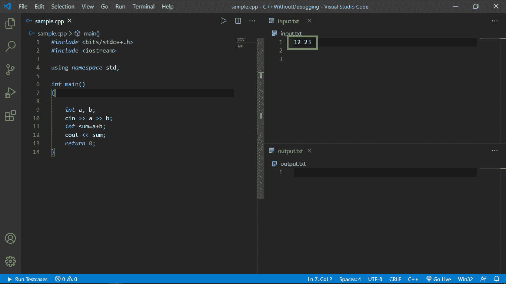

*   将以下代码粘贴到您的[主()函数](https://www.geeksforgeeks.org/executing-main-in-c-behind-the-scene/)中。

## C++

```
#ifndef ONLINE_JUDGE
freopen("input.txt", "r", stdin);
freopen("output.txt", "w", stdout);
#endif
```

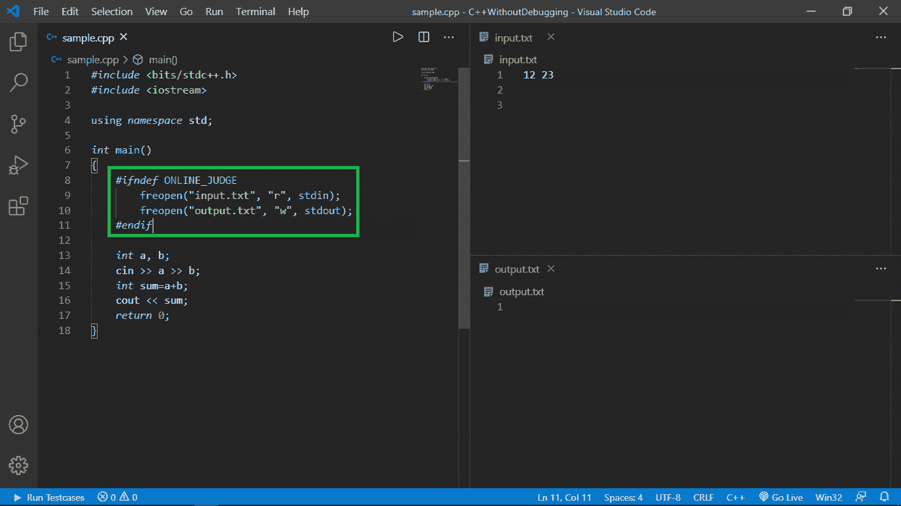

*   再次编译新代码，最好与可执行文件同名。


*   传递要在命令行中运行的可执行文件，然后按 enter 键

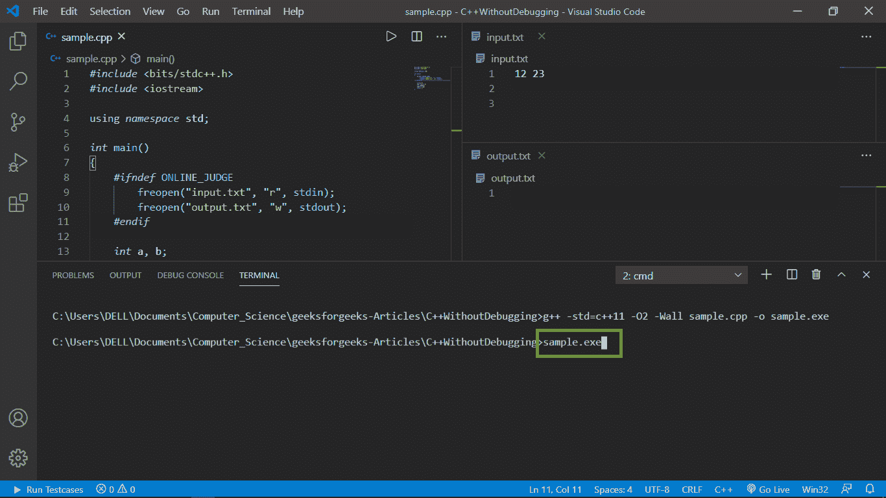

*   您会注意到 **output.txt** 文件中的输出。

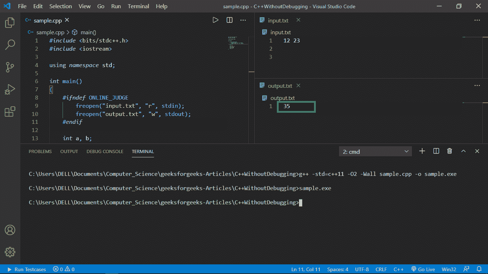

### **<u>方法 2–使用代码运行器扩展</u> :**

使用到目前为止创建的[模板](https://www.geeksforgeeks.org/templates-cpp/)，我们可以轻松升级到代码运行器。以下是步骤:

*   如下所示安装代码运行器扩展:

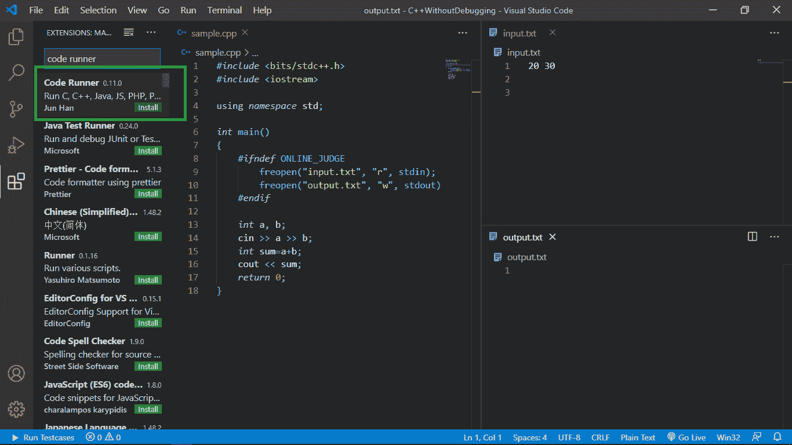

*   点击窗口右上角的播放按钮，如下所示:

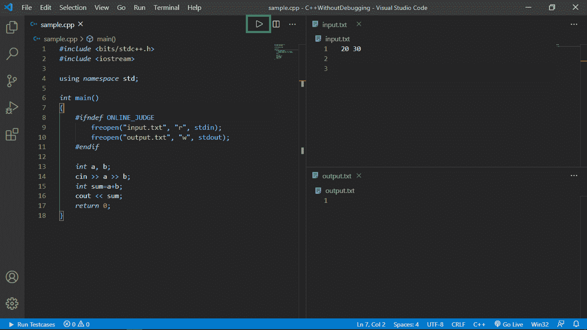

*   程序的输出自动显示在 **output.txt** 文件中。

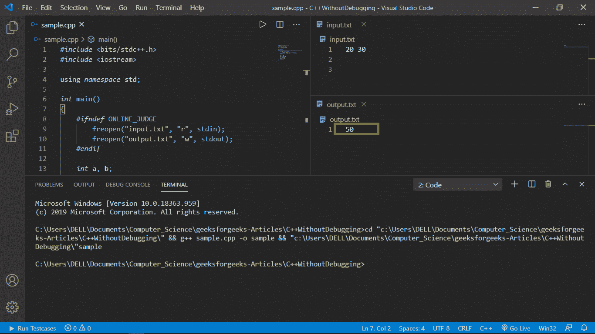

### 使用竞争性编程助手(cph)扩展的输入/输出:

*   首先通过**迪维言舒阿格拉瓦尔**搜索并安装 **cph**

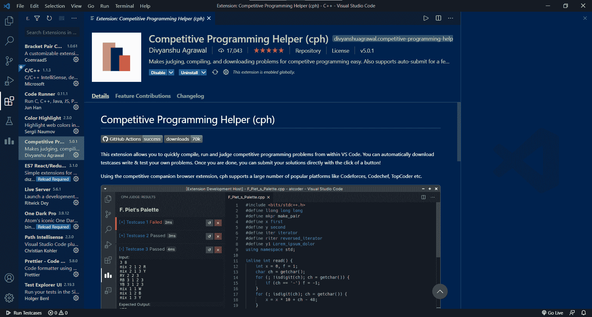

*   现在，我们将运行一个简单的程序，并尝试演示如何使用这个 ext。

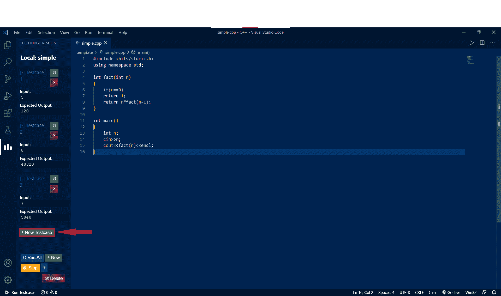

*   使用+ **新的测试用例，**我们分别得到不同的测试用例及其预期输出。

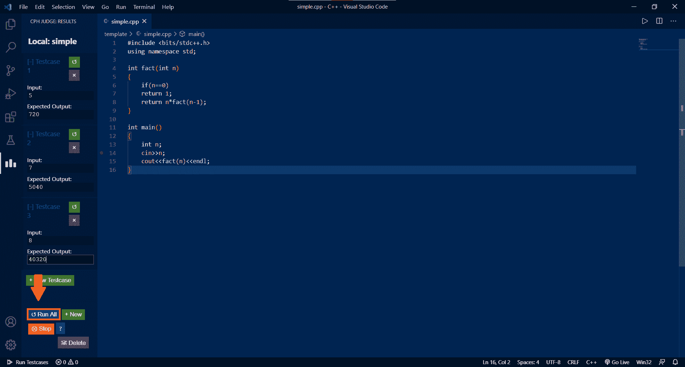

*   使用**全部运行，**我们运行所有的测试用例

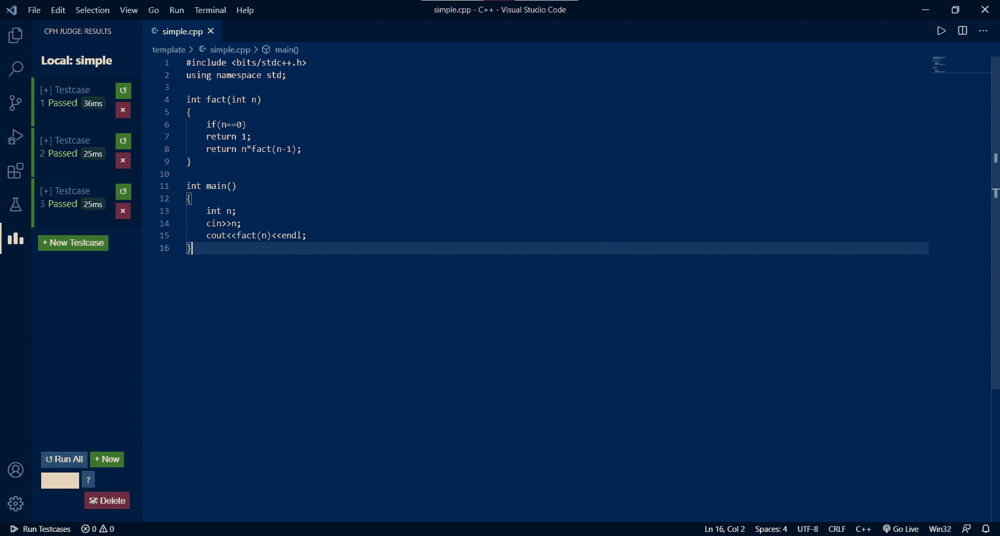