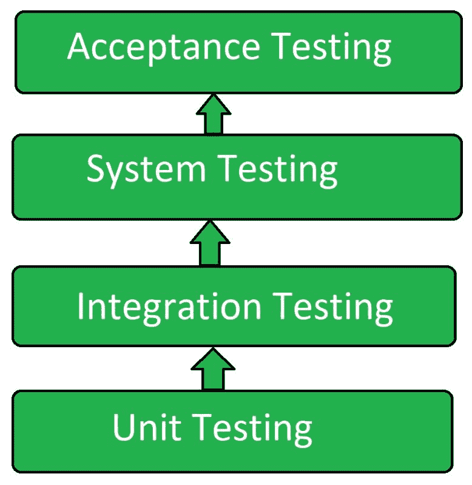

# 瀑布软件测试

> 原文:[https://www.geeksforgeeks.org/waterfall-software-testing/](https://www.geeksforgeeks.org/waterfall-software-testing/)

**瀑布软件测试**是一种软件测试类型，其中不同的测试级别相继执行。它涉及测试团队成员，与敏捷测试不同，开发团队不参与测试阶段。一旦软件或产品的全面开发完成，测试团队就基本上执行测试操作。只有在开发生命周期完成之后，测试生命周期才开始。一旦软件开发完成，就只进行测试操作。

**瀑布测试的目的:**
瀑布测试的目的是:

*   检测软件产品或应用程序中的缺陷。
*   开发完成后测试系统或应用程序。
*   同时发现所有的缺陷。
*   按顺序执行测试过程。

**瀑布测试的特点:**

*   测试被认为是一个独立的阶段。
*   测试仅在开发阶段完成后进行。
*   开发团队不参与测试工作。
*   测试以水平方式进行。
*   另一个测试只在前一个测试完成后进行。

**瀑布测试表示:**

**瀑布测试的优势:**
瀑布测试的优势有:

1.  由于没有开发团队的参与，所以减少了开发人员的工作量。
2.  五月思想的介入导致了一个更糟糕的结论，并在决策中产生了问题，因此在瀑布测试中不存在这样的问题，因为开发和测试团队不能一起工作。
3.  耗时更少，因为测试不是在每次迭代中执行的。
4.  同时检测所有缺陷。
5.  开发工作和测试工作是分开的，这样可以提高软件质量。
6.  开发阶段没有障碍。

**瀑布测试的缺点:**
瀑布测试的缺点是:

1.  如果一个测试失败，就会停止，并且无法进行进一步的测试。
2.  有时可能会更耗时，因为几个缺陷同时出现。
3.  增加了测试团队的工作量。
4.  测试团队以水平方式执行测试，这可能会导致时间消耗。
5.  与敏捷测试相比，软件质量可能较低。