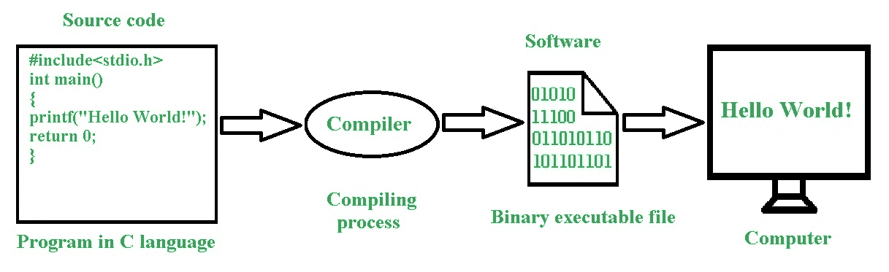

# 什么是计算机软件？

> 原文:[https://www.geeksforgeeks.org/what-is-a-computer-software/](https://www.geeksforgeeks.org/what-is-a-computer-software/)

**计算机软件**或者仅仅是软件，只不过是对计算机的一组指令，以获得一些工作作为输出。

而另一方面谈论硬件，它在物理意义上充当计算机的构建模块。计算机软件是由什么构成的？计算机软件是计算机程序、图书馆和其他数据的结合，特别是在线文档或数字媒体。硬件和软件的工作方式截然不同，不能想象它们能独立工作。

**Figure –** Steps to develop a software

大多数软件是用高级编程语言或更接近人类语言的语言编写的；高级语言通过编译器或解释器转换成机器可理解的语言。

计算机软件也可以用低级语言编写，使用[汇编程序](https://www.geeksforgeeks.org/introduction-of-assembler/)。计算机软件的蓝图和实现因软件的卷积及其用途和目的而异。

[数据结构](https://www.geeksforgeeks.org/data-structures/)像数组、二叉树、哈希表、快速排序等算法被证明对创建软件非常有效。世界上很大一部分盈利行业是由软件行业组成的。根据使用领域，软件可以分为应用软件和恶意软件或恶意软件。