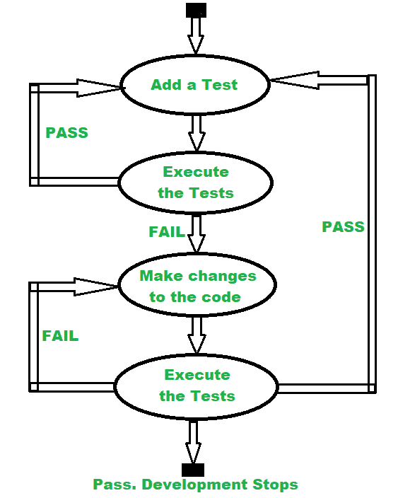

# 什么是软件测试中的代码驱动测试？

> 原文:[https://www . geesforgeks . org/什么是代码驱动的软件测试测试/](https://www.geeksforgeeks.org/what-is-code-driven-testing-in-software-testing/)

**先决条件–**[测试驱动测试(TDD)](https://www.geeksforgeeks.org/test-driven-development-tdd/)

代码驱动测试是一种软件开发方法，在这种方法中，它使用测试框架，允许执行单元测试来确定代码的各个部分是否在各种条件下按预期相应地运行。也就是说，在代码驱动测试中，开发测试用例来指定和验证代码功能。它避免了代码的重复，这种代码驱动的测试由开发团队执行。

CDD(代码驱动测试)是软件开发中日益增长的趋势，它使用像 JUnit 和 NUnit 这样的框架来允许执行单元测试，以确定在各种情况下代码各部分的行为。

代码驱动测试自动化是敏捷软件开发的一个重要特征，它主要作为 [TDD(测试驱动开发)](https://www.geeksforgeeks.org/test-driven-development-tdd/)方法在敏捷软件开发中推广。在 TDD 中，[单元测试](https://www.geeksforgeeks.org/unit-testing-software-testing/)是在代码编写过程之前开发的。一旦测试通过，那么代码就被认为是完整的或好的。由于良好的代码覆盖率，它更可靠，因为它在开发过程中不断运行，而不是在[瀑布开发周期](https://www.geeksforgeeks.org/software-engineering-classical-waterfall-model/)结束时运行一次。

下图很容易理解这个代码驱动的测试工作流:

**第一步:**添加测试，这足以失败，任何代码。

**步骤 2:** 执行完整的测试套件，确认新测试失败。

**第 3 步:**代码被更新以产生它来通过套装的新测试。

**步骤 4:** 再次执行测试用例。如果失败，更新代码，如果这些将通过。然后对另一个开发元素再次重复同样的方法。

**代码驱动测试的优势:**

*   测试软件的公共接口是一种很好的工作方法。
*   它提供了高代码覆盖率，使产品更加可靠。
*   它允许执行单元测试来确定不同环境下不同部分的行为。
*   这是在软件组件/模块的早期发现 bug 的最佳方法。