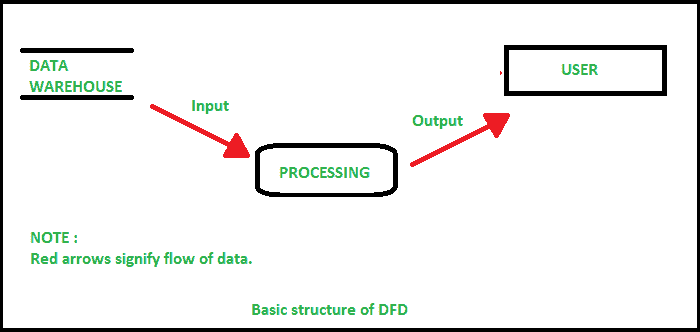

# 什么是 DFD(数据流图)？

> 原文:[https://www.geeksforgeeks.org/what-is-dfddata-flow-diagram/](https://www.geeksforgeeks.org/what-is-dfddata-flow-diagram/)

**DFD** 是**数据流图**的缩写。系统或过程的数据流由 DFD 表示。它还能洞察每个实体的输入和输出以及流程本身。DFD 没有控制流，也不存在循环或决策规则。取决于数据类型的具体操作可以用流程图来解释。数据流图可以用几种方式表示。DFD 属于结构化分析建模工具。数据流图非常受欢迎，因为它们帮助我们可视化软件系统过程中涉及的主要步骤和数据。

#### DFD 的组成部分

数据流图有 4 个组成部分:

*   **流程**
    系统中的输入到输出的转换是因为流程功能而发生的。一个过程的符号是带有圆角的矩形、椭圆形、矩形或圆形。这个过程被命名为一个短句，用一个词或一个短语来表达它的本质
*   **数据流**
    数据流描述了系统不同部分之间的信息传递。箭头符号是数据流的符号。应该给流取一个相关的名称，以确定要移动的信息。数据流还代表材料以及正在移动的信息。物料转移是在不仅仅是信息系统中建模的。给定的流应该只传输单一类型的信息。流向由箭头表示，箭头也可以是双向的。
*   **仓库**
    数据存储在仓库中以备后用。两条水平线代表商店的标志。仓库不仅仅是一个数据文件，它可以是任何东西，比如一个文件夹，一张光盘，一个文件柜。数据仓库可以独立于其实现进行查看。当数据从仓库流出时，它被认为是数据读取，当数据流向仓库时，它被称为数据输入或数据更新。
*   **终结者**
    终结者是站在系统外与系统通信的外部实体。它可以是，例如，像银行这样的组织，像客户这样的人群，或者同一组织的不同部门，它不是模型系统的一部分，而是一个外部实体。模型化的系统也与终端通信。

#### 创建 DFD 的规则

*   实体的名称应该简单易懂，无需任何额外的帮助(如注释)。
*   流程应编号或放入有序列表中，以便参考。
*   DFD 应该在所有 DFD 层面保持一致性。
*   一个 DFD 最多可以有 9 个进程，最少可以有 3 个进程。

#### DFD 的等级

DFD 用等级制度来保持透明度，这样就可以创造多层次的 DFD。DFD 的等级如下:

*   0 级 DFD
*   一级 DFD:
*   二级 DFD:

#### DFD 的优势

*   它帮助我们理解系统的功能和极限。
*   这是一种图形表示，非常容易理解，因为它有助于可视化内容。
*   数据流图代表系统组件的详细和解释良好的图。
*   它被用作系统文档文件的一部分。
*   技术或非技术人员都可以理解数据流图，因为它们非常容易理解。

#### DFD 的缺点

*   有时，DFD 会在系统方面迷惑程序员。
*   数据流图需要很长时间才能生成，并且由于这个原因，很多时候分析师被拒绝在上面工作。