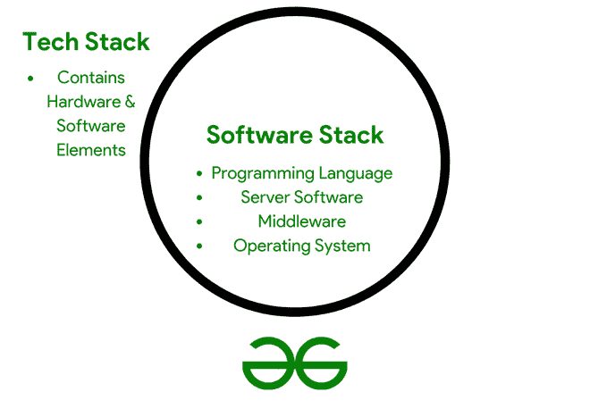

# 什么是软件栈

> 原文:[https://www.geeksforgeeks.org/what-is-software-stack/](https://www.geeksforgeeks.org/what-is-software-stack/)

**什么是软件栈:**
软件栈是独立组件的集合，这些组件协作以使应用程序实现更容易。操作系统、架构层、协议、运行时环境、数据库或调用功能都包含在层次结构中。层次结构中的较低层经常与硬件接口，而层次结构中的较高层执行特定的用户活动和服务。组件通过遍历堆栈的一系列复杂指令直接与应用程序交互。

一个应用程序是由一组功能组成的，这些功能在一个定义的体系结构中一起工作，为用户提供某些服务。最基本的应用程序架构由三层组成:

1.  **表示层** r 是客户通过网站或基于网络的应用门户访问程序时看到的内容。
2.  **逻辑层**包括应用程序逻辑和业务规则，有助于实现应用程序请求。该层计算并判断如何处理请求，同时管理数据层和显示层之间的数据传输。
3.  数据层是一个服务器端系统，当需要计算时，或者如果必须将其移动到用户可见的表示层时，它会传递逻辑层信息。

软件栈提供了几个优点，包括能够为问题提供预先确定的答案，这有时是最好的解决方案。

*   他们给出了获得期望结果所需的最少的软件。
*   软件堆栈可以安装在系统中，也可以自动安装在计算机模板中。
*   对于可定制的系统，软件栈的安装和操作是相同的。因此，提供的答案也是一致的。
*   大多数软件栈都支持完整的包。有些还有社区论坛。
*   映像或软件规范可用于安装软件堆栈。

启用 Java 等程序所需的操作系统和运行条件是客户端机器堆栈[的一部分(参见 Java 虚拟机](https://www.geeksforgeeks.org/jvm-works-jvm-architecture/))。应用程序可能包含在堆栈中，尽管这通常被称为应用程序堆栈。

每个组件都为其他组件增加了一层兼容性，将它们捆绑在一起可以轻松地一次性下载和部署。堆栈的组件可以从一般的

图 1。理解软件堆栈。

**示例–**
Mac OS X 操作系统走向极度专业化(例如，特定的 PHP 框架)。
选择一个堆栈而不是另一个堆栈有几个原因——根据项目的不同，更新的不一定更好。也许您预见到了站点未来对垂直可伸缩性的需求，或者您的开发团队特别擅长编程语言——这两者都可能影响您对堆栈的选择。
有几个老派的，主要是过时的栈，比如 [LAMP](https://www.geeksforgeeks.org/installing-php-and-configuring-it-on-ubuntu-14-04-trusty/) ，代表利用 Linux 托管 [Apache HTTPS](https://www.geeksforgeeks.org/introduction-apache-maven-build-automation-tool-java-projects/) ，MySQL，PHP 来运行一个网站。Linux 仍然是推荐的，而其他人不再被建议用于新网站。

**知名软件栈示例:**
**1。首先想到的是平均值堆栈。**
MEAN 栈(MongoDB、Express.js、AngularJS 和 Node.js)是基于 JavaScript 的栈，使用 MongoDB 数据库程序进行后端开发，在 Node.js 之上构建 Express.js 框架进行前端开发，使用 AngularJS 框架进行前端开发。MEAN 栈的软件都是免费的和开源的，使得理解和开始变得简单。此外，由于它是一个从前到后的 Javascript 堆栈，开发人员可以在前端和后端组件之间交换和优化代码。

**2。MEVN 堆栈是第二位的。**
MEAN 栈的另一个流行变体是 MEVN 栈(MongoDB、Express.js、Vue.js 和 Node.js)，它用 Vue.js 代替 Angular，vue . js 是一个轻量级的 Javascript 框架，功能最少。Vue 和 React 一样，依靠庞大的开发人员社区来生产第三方插件和工具，这些插件和工具可以添加功能并增强核心框架的功能。

在寻找工程合作伙伴时，了解他们使用什么工具来完成您正在寻找的工作至关重要。说到平台，并不是所有的软件企业都提供新的解决方案。你需要一个前瞻性的团队，不仅能创造你的杰作，还能确保它不会在短时间内过时。
预编译运算符实现是华为工程师使用针对达芬奇架构高度优化的特定编程语言构建的内核函数，由 Ascend AI 软件堆栈提供。目前，开发人员无法访问这种级别的编程。

为了实现通用性，这些操作被预编译并实现为通用内核。Ascend AI 软件堆栈的灵感来自于 TVM 设计思想，以提高推理性能。当离线模型生成器转换模型时，为某些输入数据形状和参数组合提供定制的内核，以提高推理性能。

**结论:**
这就是你需要知道的关于软件栈到底是什么的一切。希望这篇文章能让你了解软件栈的基础甚至高级方面！