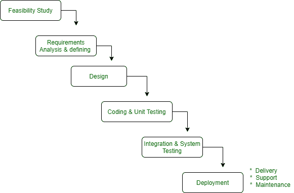

# 什么时候应该用瀑布模型

> 原文:[https://www . geesforgeks . org/何时应该使用瀑布模型/](https://www.geeksforgeeks.org/when-should-you-use-waterfall-model/)

**瀑布模型**是用于软件开发的最早的 SDLC 方法。这个模型是序列模型的一个例子。因此，它也被称为线性顺序生命周期模型。

瀑布模型很容易理解和使用。在瀑布模型中，每个阶段必须在下一阶段开始之前完成。又称[经典生命周期模型](https://www.geeksforgeeks.org/software-engineering-classical-waterfall-model/)。

**什么时候该用？**

1.  要求明确且固定，可能不会改变。
2.  没有模棱两可的要求(没有混淆)。
3.  当技术被很好地理解时，使用这个模型是很好的。
4.  这个项目很短，成本也很低。
5.  风险为零或最小。

**优势:**
这些都是瀑布模型的一些优势。

1.  它简单易懂，易于使用。
2.  很容易管理。
3.  它适用于那些对需求非常了解的小型和低预算项目。
4.  明确定义的阶段和很好的理解。
5.  安排任务很容易。
6.  过程和结果都有很好的记录。

**缺点:**
这些是瀑布模型的一些缺点。

1.  很难分阶段衡量进展。
2.  长期和正在进行的项目模型不佳。
3.  直到生命周期的后期才产生工作软件。
4.  高风险和不确定性。
5.  对于长时间和面向对象的项目来说，这不是一个好的模型。
6.  无法适应不断变化的需求。