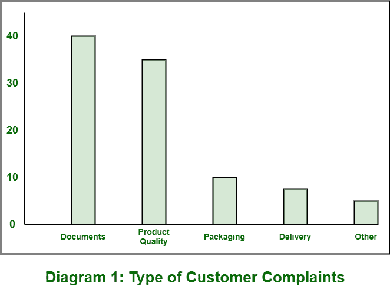
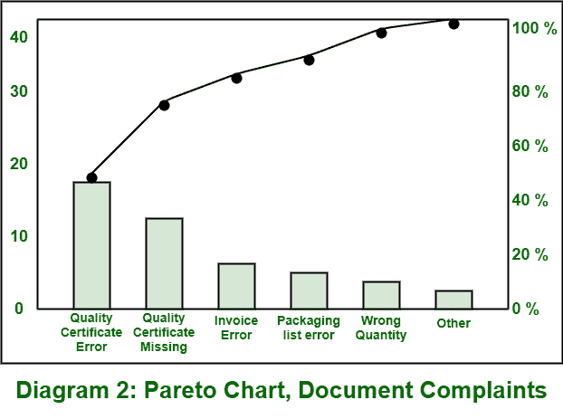

# 何时使用缺陷帕累托图？

> 原文:[https://www . geesforgeks . org/何时使用缺陷排列图/](https://www.geeksforgeeks.org/when-to-use-a-defect-pareto-chart/)

**缺陷一般都有记录和记录。在此之后，下一步是借助不同的根本原因分析技术来审查和分析缺陷。但在进行根本原因分析之前，通常会准备一张帕累托图，该图通常显示缺陷发生频率最高的缺陷类型，即目标。**

****帕累托图**基本上是用来判断现有问题中哪一个出现的频率更高。为此，帕累托图基本上代表了不同类别的缺陷或遇到的问题的出现频率。有各种各样的任务需要帕累托图来描述它们的过程。**

****何时使用帕累托图:**** 

*   **Pareto chart is basically required for analyzing data. This is simply done to determine frequency of problems or main causes in process. **
*   **If there are so many problems that are different from each other or if there are different causes, then Pareto chart is required if one wants to focuses on only particular problem or causes that are more significant. **
*   **By simply focusing on particular components, if one wants to identify major causes, then Pareto chart is required. **
*   **If managers want to identify main problem in workflow process, then Pareto diagram are very useful. Pareto diagrams are commonly known as 80/20 Pareto rule. **
*   **When we want to communicate about our data with others, tell and explain to them about our data, then we can use Pareto chart. **
*   **如果一个人想确定主要问题或关于业务的问题，那么帕累托图是必需的。** 

**在使用帕累托图之前，需要确定过程数据是否满足以下几点:** 

*   **Data are compulsorily needed to arranged and sorted into different categories like defects, cost, or count. **
*   **类别的排序是必不可少的，因此应该很重要，因为它对数据的频率非常重要。如果它不被认为是重要的，那么数据频率将不相关。在这种情况下，更改这些类别非常重要。** 

****例:**
我们举一个客户投诉的例子，如下图:**

****图表–1:**显示了收到的五个不同类别的客户投诉数量。**

****

****图表–2:**显示最高投诉，即分为六个不同类别的文件。这些类别与对文件的投诉有关。它还在右侧显示累积值。**

****