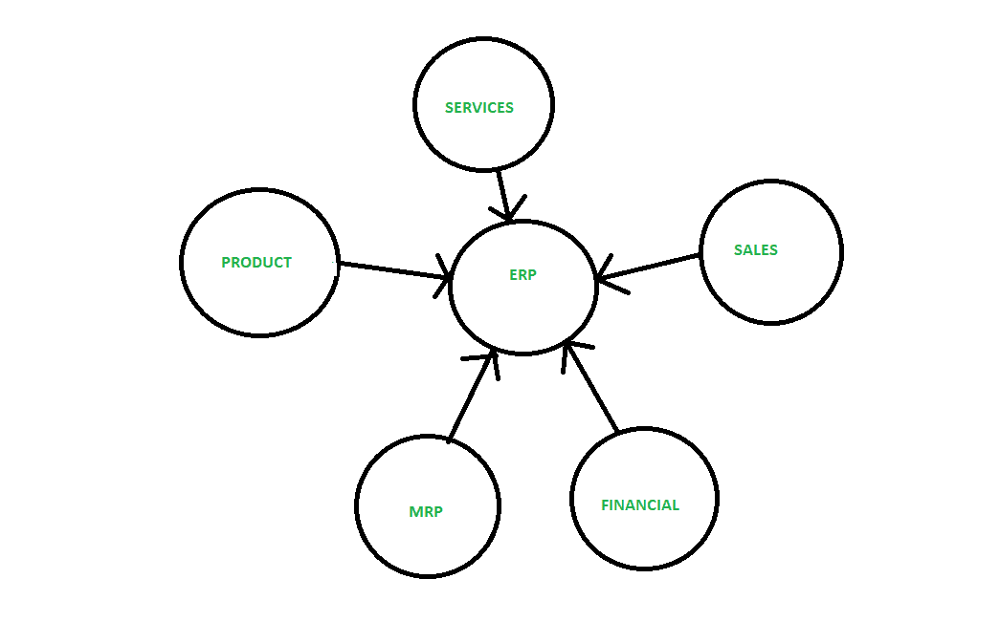

# 为什么 ERP 会成为组织的催化剂？

> 原文:[https://www . geesforgeks . org/why-ERP-充当组织的催化剂/](https://www.geeksforgeeks.org/why-erp-act-as-a-catalyst-for-an-organization/)

根据德勤咨询的说法，一个 [ERP](https://www.geeksforgeeks.org/introduction-to-erp/) 是一个打包的商业软件系统，允许公司“自动化和集成其大部分业务流程，在整个企业中共享公共数据和实践，在实时环境中产生和访问信息”。

**ERP 为什么是催化剂或激活剂:**

*   它提高了组织的完整性和灵活性。比如，如果一个组织建立了企业资源规划系统，那么员工、经理、人力资源、会计等等。访问同一个平台，每个用户的细节和功能是不同的。
*   它提高了速度和效率，每个用户都可以访问分配给他们的模块，他们可以毫无困难地高效工作。
*   它为客户提供更可靠的交付和更高的服务，并且两端(客户和服务提供商)工作人员在该系统上灵活工作。
*   它保持了管理层的参与和沟通。
*   一个 ERP 系统缩短吞吐量:

    ```
    Throughput = processing time + wait time + move time 
    ```

*   它改善了报告和计划时间。整个部门的实施和企业资源规划套件意味着本组织每个流程都有一个统一的报告系统。通过单一来源，它可以随时生成有用的报告和分析。

以上各点表明，企业资源规划系统是一个组织的催化剂。

这也可以用一个例子来解释:
一个企业资源规划充当催化剂这可以通过比较企业资源规划之前的系统和企业资源规划系统来解释。

**ERP 之前:**下图描述 ERP 之前的系统。


在这个场景中，这个系统的所有部门都有一个单独的数据库。在这种情况下，很难联系到其他部门，这意味着这是一项非常耗时的任务，因为一个部门必须等到其他部门不承认查询。

**带 ERP :** 下图描述了带 ERP 的系统。


在这个场景中，所有的部门都有一个公共的数据库。它形成了一个集成的系统，通过这个系统，不同的部门可以轻松地相互联系，而不会浪费任何时间。因此，从这一点可以获得以下好处。

*   更少的错误
*   提高产品可用性
*   扩大产品种类