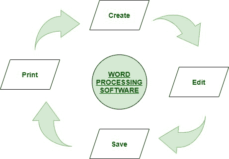
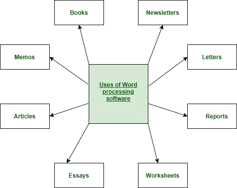

# 文字处理软件

> 原文:[https://www.geeksforgeeks.org/word-processing-software/](https://www.geeksforgeeks.org/word-processing-software/)

**文字处理软件:**
文字处理器这个词的意思是它处理有页面和段落的文字。文字处理器有三种类型，分别是电子的、机械的和软件的。

文字处理软件用于应用基本的编辑和设计，也有助于在您的页面上操作文本，而文字处理器是一种提供给定文本的编辑、输入、格式化和输出以及一些附加功能的设备。

它是一种计算机软件应用程序或电子设备。在当代，文字处理器已经成为运行在通用计算机上的文字处理软件或程序。

**文字处理软件的示例或应用:**

*   记事本
*   微软 Word
*   Lotus word pro
*   笔记本
*   WordPerfect(仅限 Windows)，
*   苹果公司(仅限苹果公司)，
*   工作页面
*   OpenOffice Writer

**特色:**T2】

1.  它们是专用于该功能的独立设备。
2.  他们的程序在通用计算机上运行
3.  它很容易使用
4.  有助于改变段落中字符的形状和样式
5.  像页眉和页脚、项目符号、编号这样的基本编辑都是由它来完成的。
6.  它有邮件合并和预览功能。

**功能:**

*   它有助于纠正语法和句子拼写
*   它有助于以新的方式存储和创建打印文档。
*   它提供了创建具有基本编辑、保存和打印功能的文档的功能。
*   它有助于复制文本以及在给定文档中移动、删除和粘贴文本。
*   它有助于格式化文本，如粗体、下划线、字体等。
*   它提供了创建和编辑表格格式的功能。
*   它有助于从其他类型的软件中插入各种元素。

**优势:**T2】

*   它有助于减少文书工作，有利于环境。
*   纸张和邮资浪费的成本正在降低。
*   它用于像处理报告一样处理文档文本
*   它提供各种工具，如复制、删除和格式化等。
*   它有助于识别用户界面特征
*   它将基本设计应用到你的页面上
*   它让你更容易执行重复的任务
*   这是一个功能齐全的桌面出版程序
*   它节省时间。
*   交换数据本质上是动态的。
*   它生成无错误的文档。
*   为我们的文件提供安全保护。

**劣势:**T2】

*   它不能让您完全控制文档的外观。
*   它不是从计算机技术中发展出来的。