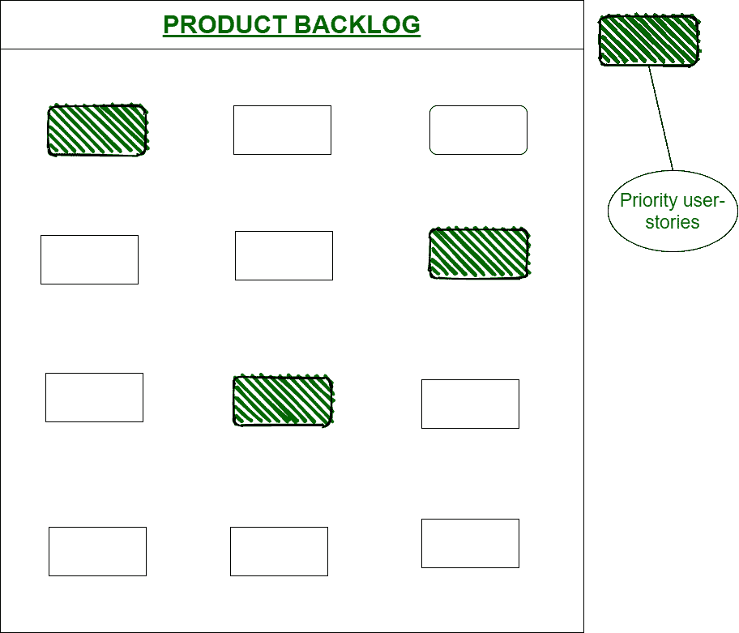
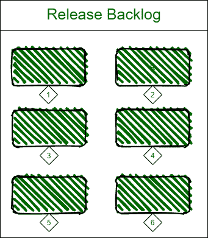
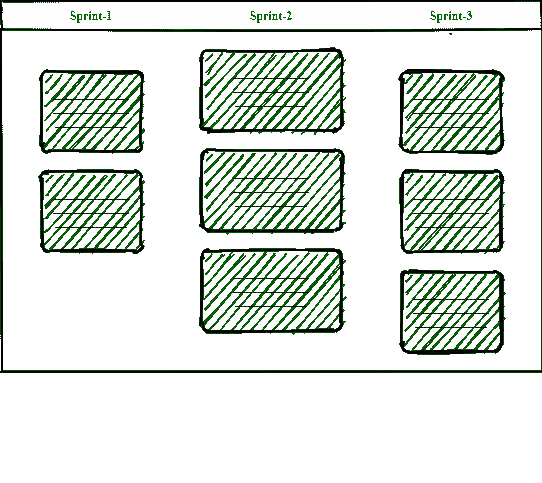

# Scrum 在组织中的工作

> 原文:[https://www . geeksforgeeks . org/work-of-scrum-in-organization/](https://www.geeksforgeeks.org/working-of-scrum-in-an-organization/)

先决条件–[Scrum(软件开发)](https://www.geeksforgeeks.org/scrum-software-development/)。

**Scrum 工作:**
假设我们需要构建一个产品“MyFirstProduct”。

首先，我们收集来自客户、主管甚至其他团队成员的所有需求和特性请求。基本上，在 Scrum 中，特性是从最终用户的角度出发的。众所周知，特写被写成“用户故事”。

**用户故事:**
这些用户故事统称为产品积压。根据最终用户的意愿，表示完整的列表。产品积压被创建。在此之后，用户故事优先级被分配给我们产品的特定版本(版本积压)。

1.  **产品负责人:**
    因此，产品负责人确保将适当的功能添加到待办事项中，因为这有助于确定产品发布的方向。
2.  **Scrum Master :**
    它不是项目的所有者，但它的工作是进行连续的流程，并保证完成工作所需的工具。它组织会议并监控 scrum 团队的所有工作和进度。
3.  **Scrum team/Development team :**
    By scrum team we mean, team is a cross-functional, little, and self-sorting out-group that claims aggregate obligation of creating, testing, and delivering Product increase. Also, different roles are there for a specific domain like developer, tester, executives, etc.

    

**发布计划:**
在这种情况下，团队首先对用户故事进行优先级排序，并估计每个用户故事的工作量。它让你知道完成整个项目/产品所需的总工作量(估计)。

用户故事按优先级划分，如:优先级-1、优先级-2、优先级-3 等。并且形成发布积压。现在，在发行版积压准备就绪后，冲刺就计划好了。Sprint 主要是在短时间内做出坚定的努力来处理大块的产品，并让它处于一个没有错误的就绪状态和一个完整的可发布的形式。

**为什么冲刺:**
冲刺可以是 2-3 周，也可以长达 1 个月。每个项目都不一样。如果你看到冲刺是发布积压的一个子集。这里的目标是在每次冲刺时发布一个完整的工作子集。Sprint 也是产品的一个实用/现实的代表。

**冲刺评审**有没有检查有没有东西剩下。在 sprint 回顾之后，这意味着团队检查是否有任何其他方法，以便我们可以通过基于以前的 sprint 解决问题来改进其他 sprint，从而增加 Sprint 的发布。

**燃耗图:**
用来检查每次冲刺的进度。使用这个我们计算生产率的速度和项目的大概完成日期。如果团队的工作少于图表，这只是意味着团队降低了工作速度，与燃烧图相比，将需要更多的完成日期。组织中的通用公式:剩余工时/比率等于完成天数。